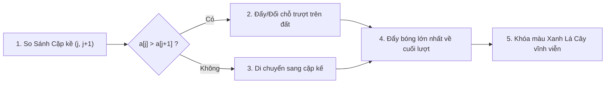
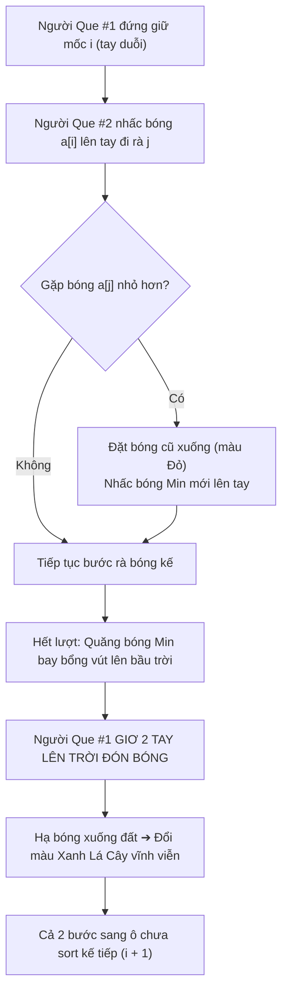

# 📘 TỔNG HỢP Ý TƯỞNG & KỊCH BẢN HÀNH ĐỘNG 2 THUẬT TOÁN SẮP XẾP
## BUBBLE SORT (NỔI BỌT) & SELECTION SORT (CHỌN)

> **Dự án**: StudyMaster Visualizer Lab — Mô Phỏng Trực Quan Thuật Toán Học Thuật  
> **Phong cách thiết kế**: Trực quan hóa nghệ thuật múa rối Người Que 2D (Stickman Choreography), màu sắc hiện đại Cyan/Sky/Teal/Emerald, mặt đất bằng phẳng tự nhiên.

---

## 🎨 1. BỘ MÀU VÀ SÂN SÂN TỔNG THỂ (MASTER DESIGN SYSTEM)

| Thành Phần | Quy Tắc Thiết Kế | Chi Tiết Kỹ Thuật |
| :--- | :--- | :--- |
| **Bộ Màu Chủ Đạo** | Electric Cyan, Sky Blue, Teal, Emerald Green | Sky Blue (`#38bdf8`), Cyan (`#22d3ee`), Teal (`#34d399`), Emerald (`#166534`) |
| **Mặt Đất (Ground)** | Mảnh đất bằng phẳng tự nhiên (*Mảnh đất bằng phẳng*) | Khối đất dẹt (`#1e293b` ➔ `#0f172a`), viền `#334155`, loại bỏ chữ index rườm rà |
| **Tạo Hình Người Que** | White Stickman 2x Large | Màu trắng thuần (`#ffffff`), độ dày nét `3.5px`, chiều cao `70px`, không gắn badge chữ |
| **Thứ Tự Render (Z-Index)** | Người que đứng SAU quả bóng | SVG render người que trước ➔ render các quả bóng 3D sau (bóng nằm đè phía trước) |
| **Trạng Thái Khóa (Sorted)** | Xanh Lá Cây Vĩnh Viễn | Bất kỳ quả bóng nào đã xếp xong sẽ chuyển sang Emerald Green (`#166534`, viền `#4ade80`) vĩnh viễn |

---

## 🫧 2. BUBBLE SORT (SẮP XẾP NỔI BỌT) — Ý TƯỞNG & HÀNH ĐỘNG

### 💡 Ý TƯỞNG CỐT LÕI
Phần tử có giá trị lớn nhất như một "bọt khí" mang trọng lượng nặng sẽ từng bước **nổi dần về phía cuối mảng** qua các phép so sánh cặp phần tử kề nhau `(j, j+1)`.

### 🎬 KỊCH BẢN & HÀNH ĐỘNG CHI TIẾT

1. **Hành Động So Sánh Cặp (Scan Pair `j` & `j+1`)**:
   - 2 Người Que đứng tại chỉ số `j` và `j+1`.
   - Cả 2 giơ tay kiểm tra 2 quả bóng tương ứng `a[j]` và `a[j+1]`.
   - Quả bóng đang so sánh phát sáng màu Cyan Blue (`#0284c7`).

2. **Hành Động Hoán Đổi (Swap Motion)**:
   - Nếu `a[j] > a[j+1]`: 2 Người Que cùng đẩy 2 quả bóng trượt nhịp nhàng qua lại trên mặt đất để đổi vị trí cho nhau.
   - Quả bóng lớn hơn tiếp tục được đẩy tiến về phía bên phải.

3. **Cố Định Vị Trí Vĩnh Viễn (Sorted Lock)**:
   - Cuối mỗi lượt duyệt, quả bóng lớn nhất đã nổi về đúng ô cuối mảng (`n - 1 - i`) sẽ đổi sang **màu Xanh Lá Cây vĩnh viễn** (`#166534`, viền `#4ade80`).
   - 2 Người Que lập tức lùi về đầu mảng để bắt đầu lượt nổi bọt mới.

---

## 🎯 3. SELECTION SORT (SẮP XẾP CHỌN) — Ý TƯỞNG & HÀNH ĐỘNG

### 💡 Ý TƯỞNG CỐT LÕI
Kịch bản kịch tính **"Săn Tìm Phần Tử Nhỏ Nhất (Min Hunter)"** với sự phối hợp ăn ý giữa 2 Người Que: 1 người đứng giữ mốc vị trí target `a[i]`, 1 người ôm bóng Min đi rà rà mảng và quăng bóng về đích.

### 🎬 KỊCH BẢN & HÀNH ĐỘNG CHI TIẾT

#### 👤 Nhân Vật 1: Người Que Mốc (`a[i]`)
- **Tư thế ban đầu**: Đứng tại ô target `i` với 2 tay duỗi thẳng xuống tự nhiên.
- **Tư thế đón bóng (`isStickman1CatchingBall`)**: Khi Người Que #2 quăng quả bóng Min sang, Người Que `a[i]` lập tức **giơ cả 2 tay giang rộng lên bầu trời** (`y2 = -68px`) để theo dõi và bắt lấy quả bóng đang rơi xuống!
- **Quy tắc di chuyển**: Ngay khi ô `i` được khóa màu Xanh Lá Cây, Người Que `a[i]` **lập tức bước sang ô chưa sort kế tiếp `i + 1`** (tuyệt đối không đứng che bóng xanh đã sort). Khi toàn bộ mảng hoàn thành 100%, 2 người que tự động ẩn đi (`opacity: 0`).

#### 🕵️ Nhân Vật 2: Người Que Săn Min (`Min Hunter j`)
- **Cầm bóng Min đi so sánh**: Người Que #2 nhấc quả bóng Min hiện tại (`arr[minIdx]`) nâng lên ngang ngực (`by = groundY - 48px`) và ôm quả bóng đó bước đi dọc mảng `j` để so sánh với các quả bóng ứng viên trên mặt đất.
- **Đổi bóng Min trực tiếp trên tay**: Khi phát hiện phần tử nhỏ hơn (`arr[j] < arr[minIdx]`), Người Que #2 **đặt quả bóng cũ xuống mặt đất** (chuyển sang màu Đỏ bẫy bị loại `#b91c1c`) và **nhấc ngay quả bóng Min mới nhỏ hơn lên tay**!

#### ☄️ Động Tác Quăng Bóng Cầu Vồng Bay Lên Trời (High Sky Parabolic Arc)
- **Công đoạn 1 (`SWAP_THROW_HIGH_ARC`)**: Người Que #2 quăng quả bóng Min **vút bay bổng cao lên giữa bầu trời** (`by = ballY - 80px`), tạo thành đường cong cầu vồng mềm mại nổi bật trên không trung (nhịp độ 0.8s êm ái).
- **Công đoạn 2 (`SWAP_CATCH_LAND`)**: Quả bóng Min từ trên trời đáp xuống êm ái vào **đôi tay giơ cao đón sẵn của Người Que `a[i]`**!
- **Công đoạn 3 (`SORTED_LOCK`)**: Người Que `a[i]` đặt bóng xuống mặt đất, quả bóng chuyển sang **màu Xanh Lá Cây vĩnh viễn** (`#166534`, viền `#4ade80`, hào quang Emerald).

---

## 📊 4. BẢNG SO SÁNH TỔNG HỢP HÀNH ĐỘNG DUAL SORT

| Tiêu Chí | Bubble Sort (Nổi Bọt) | Selection Sort (Sắp Xếp Chọn) |
| :--- | :--- | :--- |
| **Vị trí quả bóng Min/Max** | Nổi dần từng bước qua các cặp kề | Được Người Que #2 cầm trên tay đi rà dọc mảng |
| **Hành động hoán đổi** | Trượt song song 2 bóng kề nhau trên đất | Quăng bóng Min **bay bổng vút lên bầu trời** sang ô `i` |
| **Tư thế Người Que đón** | 2 người que đứng kiểm tra cặp bóng kề | Người Que `a[i]` **giơ cả 2 tay lên trời đón bóng** |
| **Màu phần tử đã xong** | Xanh Lá Cây vĩnh viễn | Xanh Lá Cây vĩnh viễn |
| **Vị trí đứng Người Que** | Rà cặp `j` & `j+1` | Tự động bước sang ô chưa sort kế tiếp `i+1` |
| **Khi hoàn thành mảng** | Đèn Confetti bắn mừng | Người Que tự động ẩn đi, lộ diện mảng Xanh hoàn hảo |

---

> 📝 *Tài liệu này được tự động biên soạn và lưu trữ chính thức tại kho tài nguyên của hệ thống.*
