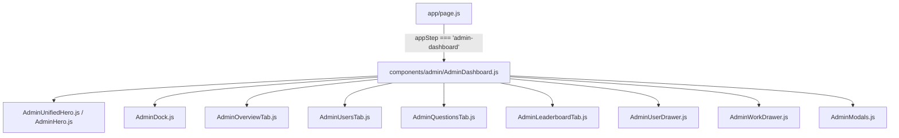

# THIẾT KẾ KIẾN TRÚC KỸ THUẬT (TDD) — ADMIN DASHBOARD
**Dự án:** StudyMaster Platform  
**Tài liệu:** Technical Architecture & Design Document (TDD)  
**Tác giả:** Dev Team / Tech Lead  
**Phiên bản:** v1.1.0 — Cập nhật: 2026-08-29 (Bổ sung Kiến trúc Cinematic Scroll Narrative)

> ⚠️ **CHANGELOG v1.1.0**: Bổ sung mục 4 — chuyển đổi mô hình điều hướng Tab-Switch sang Scroll Narrative, kèm luận cứ kỹ thuật (vì sao và các đánh đổi hiệu năng cần lưu ý) và giải pháp `IntersectionObserver` Lazy Mount để giữ nguyên NFR-1.

---

## 1. Cây Phân cấp Component (Component Hierarchy)

Hệ thống Admin Dashboard được xây dựng bằng kiến trúc phân rã module 12 cấp, không để dồn code vào một tệp nguyên khối:



### Chi tiết Phân công Trách nhiệm từng Component:
1. **`AdminDashboard.js` (Root Orchestrator)**:
   * Quản lý State tập trung: `adminTab` (`overview` | `users` | `questions` | `leaderboard`) — **(CẬP NHẬT v1.1.0)**: `adminTab` giờ mang ý nghĩa "section đang active theo Scrollspy" thay vì "section đang được mount duy nhất". Xem mục 4.
   * Quản lý danh sách Users (`users`), Nhật ký hệ thống (`logs`), và User đang chọn để mở Drawer (`selectedUser`).
   * Cung cấp các hàm dùng chung: `loadData()`, `writeAdminLog()`, `getStats()`.
2. **`AdminUnifiedHero.js`**: Hiển thị Banner tổng quan, nhịp tim hệ thống (Live pulsing badge) và 4 thẻ thống kê nhanh. **(CẬP NHẬT v1.1.0)**: Bổ sung lớp Gradient Scrim + chữ nền giảm opacity + Parallax GSAP — xem mục 4.3.
3. **`AdminDock.js`**: Điều hướng nổi. **(CẬP NHẬT v1.1.0)**: Chuyển từ "Tab Switcher" thuần sang "Scrollspy + Anchor Nav" — xem mục 4.1.
4. **`AdminOverviewTab.js`**: Dựng biểu đồ đường SVG Bézier động và biểu đồ Donut tỷ lệ học phần.
5. **`AdminUsersTab.js`**: Bảng dữ liệu người dùng, phân trang cục bộ, bộ lọc tìm kiếm và tích hợp thư viện `exceljs`. **(CẬP NHẬT v1.1.0)**: Hỗ trợ 2 chế độ hiển thị `preview` (5 dòng rút gọn) và `focus` (bảng đầy đủ) — xem mục 4.2.
6. **`AdminQuestionsTab.js`**: Trình kiểm định câu hỏi tự động, bộ lọc bẫy và thanh tra chi tiết `trickDetails`. Cùng cơ chế `preview`/`focus` như mục 5.
7. **`AdminLeaderboardTab.js`**: Bảng xếp hạng Top 3 bục Podium và danh sách điểm số.
8. **`AdminUserDrawer.js`**: Drawer trượt cạnh phải render biểu đồ Radar 6 trục bằng SVG.
9. **`AdminWorkDrawer.js`**: Drawer tác vụ nhanh và tình trạng sao lưu.
10. **`AdminModals.js`**: Hộp thoại thêm tài khoản, đổi mật khẩu.

---

## 2. Thiết kế Thuật toán & Logic Kỹ thuật Chuyên sâu

### 2.1. Thuật toán Vẽ Đường cong Bézier Bậc ba (Smooth Cubic Bézier Curve)
*(Không đổi so với v1.0.0)*

```javascript
const makeSmoothPath = (pts) => {
  if (pts.length === 0) return "";
  if (pts.length === 1) return `M ${pts[0].x} ${pts[0].y}`;

  let path = `M ${pts[0].x} ${pts[0].y}`;
  for (let i = 0; i < pts.length - 1; i++) {
    const p0 = pts[i === 0 ? 0 : i - 1];
    const p1 = pts[i];
    const p2 = pts[i + 1];
    const p3 = pts[i + 2 < pts.length ? i + 2 : i + 1];

    const cp1x = p1.x + (p2.x - p0.x) / 6;
    const cp1y = p1.y + (p2.y - p0.y) / 6;
    const cp2x = p2.x - (p3.x - p1.x) / 6;
    const cp2y = p2.y - (p3.y - p1.y) / 6;

    path += ` C ${cp1x} ${cp1y}, ${cp2x} ${cp2y}, ${p2.x} ${p2.y}`;
  }
  return path;
};
```

### 2.2. Thuật toán Kiểm định Luật Chống Đoán Bừa ($\Delta L \le 15$)
*(Không đổi so với v1.0.0)*

```javascript
const getLengthDelta = (q) => {
  if (!q.options || q.options.length === 0) return 0;
  const lengths = q.options.map((opt) => opt.length);
  const max = Math.max(...lengths);
  const min = Math.min(...lengths);
  return max - min;
};

const isViolated = getLengthDelta(q) > 15;
```

### 2.3. Quy trình Xuất Báo cáo Excel với `ExcelJS`
*(Không đổi so với v1.0.0 — xem sequence diagram gốc)*

---

## 3. Quản lý Trạng thái & Đồng bộ Dữ liệu (State & Persistence)

```
┌────────────────────────────────────────────────────────┐
│                   REACT COMPONENT STATE                │
│  (users, logs, selectedUser, isUserDrawerOpen, modals) │
└──────────────────────────┬─────────────────────────────┘
                           │ (Đọc/Ghi đồng bộ)
            ┌──────────────▼──────────────┐
            │        localStorage         │
            │   (studymaster_users,       │
            │    studymaster_admin_logs)  │
            └──────────────┬──────────────┘
                           │ (Pha tiếp theo: Đồng bộ đám mây)
            ┌──────────────▼──────────────┐
            │    Firebase Cloud Firestore │
            │   (collections: 'users',    │
            │    'rankings', 'logs')      │
            └─────────────────────────────┘
```

---

## 4. (MỚI v1.1.0) Kiến trúc Cinematic Scroll Narrative

### 4.0. Bối cảnh & Luận cứ Kỹ thuật
Yêu cầu chuyển từ Tab-Switch (4 view rời rạc, chỉ 1 view mount tại 1 thời điểm) sang mô hình 1 trang cuộn liên tục kiểu Winzy/StudyMaster Hero. Đây là thay đổi kiến trúc, **không chỉ là CSS**, vì kéo theo 2 rủi ro cần giải quyết chủ động:

1. **Rủi ro hiệu năng (đối lập trực tiếp với NFR-1)**: Nếu 4 section (Overview + Users + Questions + Leaderboard) đều mount đầy đủ dữ liệu nặng cùng lúc trong DOM để phục vụ Scrollspy, tổng tải render (2 SVG chart + 1 bảng phân trang + 1 trình kiểm định + 1 Podium) có nguy cơ vượt ngân sách 16ms/frame.
2. **Rủi ro trải nghiệm**: Các section có nghiệp vụ tương tác sâu (Users, Questions — tìm kiếm, phân trang, sửa/xóa) không phù hợp bị "cuộn lướt qua" như nội dung landing page tĩnh.

**Giải pháp kiến trúc**: Kết hợp 3 kỹ thuật — Scrollspy bằng `IntersectionObserver`, Lazy Mount theo section, và cơ chế `preview`/`focus` 2 tầng cho các section nặng nghiệp vụ.

### 4.1. `AdminDock.js` — Scrollspy & Anchor Navigation

**Không dùng** `window.addEventListener('scroll', ...)` kèm tính toán `scrollY` thủ công — cách này chạy trên main thread mỗi frame cuộn, dễ giật và khó đồng bộ chính xác với breakpoint responsive.

**Dùng `IntersectionObserver`** gắn vào 4 section gốc (`#section-overview`, `#section-users`, `#section-questions`, `#section-leaderboard`):

```javascript
useEffect(() => {
  const sections = document.querySelectorAll("[data-admin-section]");
  const observer = new IntersectionObserver(
    (entries) => {
      entries.forEach((entry) => {
        if (entry.isIntersecting) {
          setAdminTab(entry.target.dataset.adminSection);
        }
      });
    },
    { rootMargin: "-40% 0px -55% 0px", threshold: 0 } // "vùng kích hoạt" ở giữa viewport
  );
  sections.forEach((s) => observer.observe(s));
  return () => observer.disconnect();
}, []);

const scrollToSection = (id) => {
  document.getElementById(`section-${id}`)?.scrollIntoView({ behavior: "smooth", block: "start" });
};
```

* Bấm vào mục Dock → gọi `scrollToSection(id)`.
* Cuộn tay/chuột → `IntersectionObserver` tự cập nhật `adminTab` → Dock tự highlight Pill tương ứng.
* `rootMargin` âm 2 phía tạo ra một "dải kích hoạt" hẹp ở giữa màn hình, tránh tình trạng 2 section cùng active khi đang ở ranh giới giữa chúng.

### 4.2. Lazy Mount theo Section (Giữ NFR-1)

Mỗi section bọc trong 1 wrapper quan sát riêng, chỉ mount nội dung nặng khi section **sắp** vào viewport (nới trước `rootMargin` để tránh "nháy trắng" khi cuộn nhanh):

```javascript
function LazySection({ id, children }) {
  const ref = useRef(null);
  const [isNear, setIsNear] = useState(false);

  useEffect(() => {
    const observer = new IntersectionObserver(
      ([entry]) => setIsNear(entry.isIntersecting),
      { rootMargin: "200px 0px 200px 0px" } // nới trước 200px để mount sớm, mượt hơn
    );
    if (ref.current) observer.observe(ref.current);
    return () => observer.disconnect();
  }, []);

  return (
    <section id={`section-${id}`} data-admin-section={id} ref={ref} className="min-h-screen">
      {isNear ? children : <SectionSkeletonPlaceholder />}
    </section>
  );
}
```

* Đảm bảo tại 1 thời điểm chỉ có tối đa 1–2 section thực sự mount nội dung nặng (chart/bảng), giữ đúng tinh thần "1 view nặng tại 1 thời điểm" của kiến trúc Tab-Switch cũ, nhưng vẫn cho cảm giác cuộn liền mạch.
* `SectionSkeletonPlaceholder`: khung xám placeholder giữ đúng chiều cao section (tránh giật layout khi mount thật — layout shift).

### 4.3. `AdminUnifiedHero.js` — Scrim & Parallax

* **Lớp chữ nền trang trí**: `opacity: 0.08–0.12`, `mix-blend-mode: soft-light`, đặt ở `z-index` thấp nhất trong Hero.
* **Lớp Gradient Scrim** (bắt buộc, đặt trên ảnh nền, dưới nội dung): 
  ```css
  background: linear-gradient(to top, rgba(0,0,0,0.65) 0%, rgba(0,0,0,0.15) 50%, transparent 80%);
  ```
* **Bottom Band** duy nhất chứa toàn bộ KPI card + đồng hồ thời gian thực, dùng chung 1 glass-panel bao ngoài (`bg-white/10 backdrop-blur-xl`) thay vì 2 card tách biệt 2 góc màn hình.
* **Parallax**: dùng `@gsap/react` + `ScrollTrigger`, ảnh nền di chuyển 0.3–0.5x tốc độ cuộn nội dung. **Tắt hoàn toàn trên Mobile** (`< 768px`) theo NFR-3 cập nhật, để tránh giật khung hình trên thiết bị yếu — dùng `matchMedia` của GSAP để scope hiệu ứng theo breakpoint.

### 4.4. Cơ chế `preview` / `focus` cho Section Users & Questions

```javascript
// AdminUsersTab.js
const [viewMode, setViewMode] = useState("preview"); // "preview" | "focus"

useEffect(() => {
  document.body.style.overflow = viewMode === "focus" ? "hidden" : "";
  return () => { document.body.style.overflow = ""; };
}, [viewMode]);
```

* `preview`: render tối đa 5 dòng dữ liệu tiêu biểu, không mount logic phân trang/filter đầy đủ.
* `focus`: mount toàn bộ UI theo đặc tả FR-3/FR-4 gốc, khóa cuộn nền, có nút thoát (`✕` hoặc `Escape`).
* Đây là lớp bảo vệ hiệu năng thứ 2 (sau Lazy Mount) — đảm bảo bảng dữ liệu lớn (VD: 100+ học viên, 500+ câu hỏi) không bao giờ render toàn bộ trong chế độ cuộn thông thường.

---

## 5. Rủi ro Kỹ thuật Cần BA/Dev Thống nhất Thêm (Bổ sung v1.1.0)

1. **Chiều cao section không đồng đều**: Section Users (nhiều dòng dữ liệu) và Leaderboard (Podium cố định) có chiều cao tự nhiên khác nhau đáng kể. Cần thống nhất: ép mỗi section tối thiểu `min-h-screen` (đồng nhất cảm giác cuộn) hay để chiều cao tự nhiên (đúng dữ liệu nhưng mất nhịp cuộn đều)?
2. **SEO/Deep-link**: Trang scroll 1 khối có cần hỗ trợ URL hash (`/admin#users`) để mở thẳng vào section khi Admin dán link chia sẻ nội bộ không?
3. **Trạng thái Focus Mode & Back button**: Khi đang ở Focus Mode và người dùng bấm nút Back của trình duyệt, nên thoát Focus Mode hay thoát cả Admin Dashboard? Cần định nghĩa rõ để tránh mất dữ liệu form đang nhập dở (VD: đang thêm học viên).
