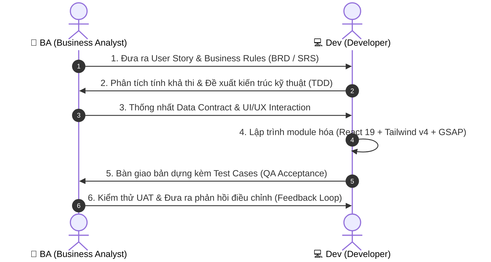

# BỘ TÀI LIỆU THIẾT KẾ VÀ ĐẶC TẢ ADMIN DASHBOARD 🧭
**Dự án:** StudyMaster Antigravity Platform  
**Kênh phối hợp:** BA (Business Analyst) 🤝 Dev (Developer / Tech Lead)  
**Phiên bản:** v1.0.0 — Cập nhật: 2026-08-29

---

## 📌 1. Mục đích của Bộ Tài liệu
Bộ tài liệu này đóng vai trò là **nguồn sự thật duy nhất (Single Source of Truth - SSOT)** cho việc thiết kế, xây dựng, kiểm thử và nghiệm thu phân hệ **Admin Dashboard** thuộc nền tảng StudyMaster.

Tài liệu được xây dựng để phục vụ quá trình trao đổi trực tiếp giữa:
* 👔 **BA (Business Analyst)**: Định nghĩa bài toán nghiệp vụ, luồng người dùng (User Flows), luật nghiệp vụ (Business Rules), và tiêu chí chấp nhận (Acceptance Criteria).
* 💻 **Dev (Developer / Tech Lead)**: Phản biện kỹ thuật, đề xuất kiến trúc (Architecture), thiết kế component, định nghĩa hợp đồng dữ liệu (Data Contracts), và thực thi mã nguồn.

---

## 📑 2. Danh mục Tài liệu trong Thư mục `admindashboardDoc/`

| Tệp tài liệu | Tên văn bản | Mục đích & Nội dung chính |
| :--- | :--- | :--- |
| **[`01_BRD_BUSINESS_REQUIREMENTS.md`](file:///d:/TT%20HCM/admindashboardDoc/01_BRD_BUSINESS_REQUIREMENTS.md)** | **Yêu cầu Nghiệp vụ (BRD)** | Bài toán kinh doanh, chân dung người dùng (Personas), phạm vi hệ thống (Scope) và mô hình phân quyền (RBAC). |
| **[`02_SRS_SYSTEM_REQUIREMENTS.md`](file:///d:/TT%20HCM/admindashboardDoc/02_SRS_SYSTEM_REQUIREMENTS.md)** | **Đặc tả Yêu cầu Hệ thống (SRS)** | Chi tiết các tính năng chức năng (Functional) của 4 Tab, Drawers, Modals và các yêu cầu phi chức năng (Non-Functional). |
| **[`03_TECHNICAL_ARCHITECTURE_DESIGN.md`](file:///d:/TT%20HCM/admindashboardDoc/03_TECHNICAL_ARCHITECTURE_DESIGN.md)** | **Kiến trúc Kỹ thuật (TDD)** | Cây component 12 module tại `components/admin/`, luồng quản lý State, Server Actions và cơ chế đồng bộ Firebase. |
| **[`04_DATA_MODELS_AND_CONTRACTS.md`](file:///d:/TT%20HCM/admindashboardDoc/04_DATA_MODELS_AND_CONTRACTS.md)** | **Mô hình Dữ liệu (Data Contracts)** | Cấu trúc Schema cho Users, Questions, Audit Logs, Exam Rankings và API payloads. |
| **[`05_UI_UX_INTERACTION_SPEC.md`](file:///d:/TT%20HCM/admindashboardDoc/05_UI_UX_INTERACTION_SPEC.md)** | **Đặc tả Giao diện & Tương tác** | Quy chuẩn màu sắc HSL, thiết kế Dock, biểu đồ đường Bézier SVG, hành vi trượt Drawer và responsive. |
| **[`06_QA_ACCEPTANCE_CRITERIA.md`](file:///d:/TT%20HCM/admindashboardDoc/06_QA_ACCEPTANCE_CRITERIA.md)** | **Tiêu chí Nghiệm thu & UAT** | Bộ kịch bản kiểm thử theo chuẩn Given-When-Then, kiểm định luật chống đoán bừa $\Delta L \le 15$ ký tự. |

---

## 🔄 3. Quy trình Phối hợp Làm việc (BA ⇋ Dev Workflow)

---

## 🎯 4. Các Vấn đề Kỹ thuật Cần BA Thống nhất Sớm
1. **Chiến lược Quản lý User**: Lưu trữ kết hợp `localStorage` (offline/demo) hay bắt buộc 100% qua `Firebase Auth + Firestore`?
2. **Quy tắc Phân quyền**: Admin có quyền xóa vĩnh viễn học viên hay chỉ chuyển cờ `isLocked = true` (Soft Delete)?
3. **Bộ lọc Đề bẫy & Câu hỏi**: Có cần tính năng thêm/sửa câu hỏi trực tiếp trên Web Admin thay vì qua tệp dữ liệu JS?
