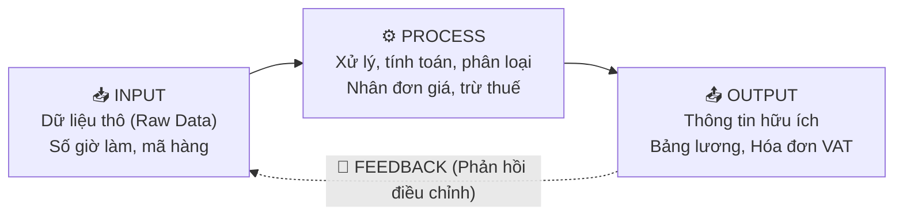

# 🛟 PHAO CỨU SINH ÔN NHANH TRƯỚC GIỜ THI — CHƯƠNG I
## MÔN: PHÂN TÍCH THIẾT KẾ VÀ YÊU CẦU (REQUIREMENTS ANALYSIS & DESIGN)
### CHỦ ĐỀ: TỔNG QUAN HỆ THỐNG THÔNG TIN, NGHỀ BA & VÒNG ĐỜI SDLC
*(Dành riêng cho sinh viên chưa kịp học bài — Đọc trong 10 phút, tự tin bước vào phòng thi!)*

---

> 💡 **LỜI NHẮC CỦA THỦ KHOA:**  
> Đề thi trắc nghiệm Chương 1 **không đánh đố về toán học**, mà đánh đố về **khả năng phân biệt ranh giới khái niệm**. Đọc kỹ phao này, bạn sẽ nắm trọn "bộ lọc tư duy" để loại trừ phương án nhiễu chỉ trong 3 giây!

---

## 🏛️ TRỤ CỘT 1: BÓC TRẦN HỆ THỐNG THÔNG TIN (INFORMATION SYSTEM - IS)

### 1.1 Bản chất của IS — Đừng để bị lừa!
* **Hỏi:** Hệ thống thông tin (IS) có phải chỉ là một cái máy tính hay phần mềm không?
* **Đáp ngay:** **KHÔNG BAO GIỜ!** Máy tính chỉ là cục sắt vô tri nếu không có con người và quy tắc vận hành.
* **Quy tắc 5 ngón tay (5 thành phần cấu thành IS):**
  1. 💻 **Hardware (Phần cứng):** Máy chủ, máy trạm, dây cáp mạng, chip, ổ cứng.
  2. 📱 **Software (Phần mềm):** Hệ điều hành (Windows, Linux), ứng dụng (App ngân hàng, POS).
  3. 📊 **Data (Dữ liệu):** Các con số, chữ cái, hình ảnh thô chưa xử lý.
  4. 👤 **People (Con người - Quan trọng nhất!):** Người dùng cuối (User), nhân viên nhập liệu, chuyên viên IT, quản lý.
  5. 📜 **Procedures (Quy trình / Thủ tục):** Bộ quy tắc, chính sách, hướng dẫn vận hành (ví dụ: *Quy trình duyệt vay tiền gồm 3 bước*).
> ⚠️ **BẪY THI:** Đề bài hỏi *"Thành phần nào quan trọng nhất quyết định sự thành bại của IS?"* $\rightarrow$ Khoanh ngay **People (Con người)** hoặc **Procedures (Quy trình)**, tuyệt đối không khoanh Phần cứng/Phần mềm!

---

### 1.2 Mô hình IPO (Input – Process – Output) trong 1 nốt nhạc

* **Input:** Thu thập nguyên liệu thô (quét mã vạch, bấm số tài khoản).
* **Process:** Nhào nặn dữ liệu (cộng, trừ, nhân, chia, lọc, sắp xếp).
* **Output:** Bưng món ăn ra bàn (báo cáo doanh thu, phiếu chuyển khoản).
* **Feedback:** Khách chê mặn $\rightarrow$ Đầu bếp nêm lại (Dữ liệu đầu ra quay lại điều chỉnh khâu nhập liệu/xử lý).

---

### 1.3 Chuỗi giá trị: Data ➔ Information ➔ Knowledge
*Rất nhiều người rớt môn vì nhầm 3 khái niệm này:*

| Cấp độ | Ví dụ siêu dễ hiểu | Bản chất học thuật | Dấu hiệu nhận biết trong đề thi |
| :--- | :--- | :--- | :--- |
| **Data** *(Dữ liệu thô)* | Số `39` hoặc chữ `Hà Nội` nằm trơ trọi | Sự kiện rời rạc, **chưa có ngữ cảnh**, chưa thể dùng để hành động | Đề cho một dãy số vô hồn, bảng số đo chưa ghi chú |
| **Information** *(Thông tin)* | *"Nhiệt độ cơ thể của bé An lúc này là 39°C"* | Dữ liệu **đã đặt vào ngữ cảnh**, có ý nghĩa và cấu trúc rõ ràng | Đề câu có câu chữ hoàn chỉnh, mang lại một thông điệp cụ thể |
| **Knowledge** *(Tri thức)* | *"39°C là sốt cao nguy hiểm, phải cho bé uống thuốc hạ sốt ngay!"* | Thông tin kết hợp **kinh nghiệm & hiểu biết** để ra quyết định | Đề nhắc đến "kinh nghiệm", "hành động", "quyết định xử lý" |

> 🧠 **MẸO NHỚ THẦN THÁNH:**  
> **Data** là *thóc* $\rightarrow$ **Information** là *gạo* $\rightarrow$ **Knowledge** là *nồi cơm niêu thơm phức dọn lên bàn ăn*!

---

### 1.4 Kim tự tháp 3 tầng IS — Ai dùng hệ thống nào?
*(Chắc chắn có ít nhất 2 câu trắc nghiệm rơi vào phần này)*

```
           / \
          /   \     [CẤP CHIẾN LƯỢC - Giám đốc, CEO, HĐQT]
         / ESS \    👉 Dùng: ESS / EIS (Executive Support System)
        /=======\   Đặc điểm: Nhìn xa trông rộng, vĩ mô, dự báo 5 năm, dữ liệu ngoài thị trường.
       /   MIS   \  
      /     &     \ [CẤP CHIẾN THUẬT / QUẢN LÝ - Trưởng phòng, Quản đốc]
     /     DSS     \👉 Dùng: MIS (Báo cáo tóm tắt định kỳ) + DSS (Phân tích kịch bản What-If)
    /===============\
   /       TPS       \ [CẤP TÁC NGHIỆP - Thu ngân, Giao dịch viên, Kế toán kho]
  /         &         \👉 Dùng: TPS (Transaction Processing System) + OAS (Văn phòng)
 /_________OAS_________\Đặc điểm: Cày cuốc hàng ngày, xử lý hàng triệu giao dịch, chi tiết từng đồng.
```

* **Bảng so sánh 10 giây giữa 3 hệ thống đỉnh nhất:**

| Hệ thống | Tên viết tắt | Đối tượng phục vụ | Nhiệm vụ chính | Ví dụ thực tế |
| :--- | :---: | :--- | :--- | :--- |
| **Executive Support System** | **ESS** *(hoặc EIS)* | CEO, Chủ tịch tập đoàn | Dự báo xu hướng, phân tích cơ hội đầu tư, xem dashboard tổng quan | Xem biểu đồ dự báo giá vàng 3 năm tới |
| **Decision Support System** | **DSS** | Trưởng phòng phân tích | Giải quyết bài toán **bán cấu trúc / phi cấu trúc**, mô hình "Nếu... thì sao?" | *"Nếu giảm giá 10% thì lợi nhuận tăng hay giảm?"* |
| **Management Info System** | **MIS** | Trưởng phòng kinh doanh | Báo cáo định kỳ tóm tắt từ dữ liệu nội bộ | Báo cáo doanh số bán hàng tháng 9/2026 |
| **Transaction Processing System**| **TPS** | Nhân viên thu ngân, thủ kho | Ghi nhận các giao dịch phát sinh tức thời, lặp đi lặp lại | Quẹt thẻ thanh toán tại quầy VinMart |

---

## 🌉 TRỤ CỘT 2: GIẢI MÃ NGHỀ BA (THE IT BUSINESS ANALYST)

### 2.1 BA là ai? — Vai trò "Thông dịch viên chiến lược"
* **Bên A (Khách hàng / Sếp kinh doanh):** Nói ngôn ngữ tiền bạc, quy trình rắc rối, than thở: *"Dạo này nhân viên kế toán than mệt quá, đơn hàng giao chậm, khách chửi suốt!"*
* **Bên B (Đội Lập trình viên / Dev):** Nói ngôn ngữ máy móc: *"Cần API gì? Dùng MySQL hay MongoDB? Viết Microservices hay Monolith?"*
* 👉 **BA đứng ở giữa làm chiếc cầu nối (Bridge):** Lắng nghe nỗi đau của bên A $\rightarrow$ biến thành văn bản yêu cầu kỹ thuật (Requirements) rõ ràng, chuẩn chỉnh cho bên B lập trình.

---

### 2.2 Năm trách nhiệm sống còn của BA (Vòng lặp Discovery)
1. **Elicit (Khơi gợi):** Đặt câu hỏi phỏng vấn, khảo sát để moi móc xem khách hàng thực sự *cần gì* (chứ không phải chỉ nghe họ bảo họ *muốn gì*).
2. **Analyze (Phân tích):** Bóc tách xem yêu cầu có bị mâu thuẫn không, có khả thi không, vẽ sơ đồ quy trình.
3. **Specify (Đặc tả):** Viết thành tài liệu chuẩn (BRD, SRS, Use Case Description, User Stories) để ai đọc cũng hiểu thống nhất.
4. **Validate (Xác thực):** Cầm tài liệu hỏi lại khách: *"Em viết thế này đúng ý anh chị chưa?"* $\rightarrow$ Khách gật đầu mới làm tiếp.
5. **Manage (Quản lý):** Theo dõi thay đổi, truy vết yêu cầu (Traceability) khi khách hàng đòi đổi ý giữa chừng.

---

### 2.3 Bốn nhóm kỹ năng của BA — Thước đo toàn diện
* 🛠️ **Technical Skills:** Đọc hiểu công nghệ, biết truy vấn SQL cơ bản, thành thạo vẽ biểu đồ UML, hiểu kiến trúc phần mềm.
* 💼 **Business Skills:** Hiểu biết sâu về ngành nghề (Domain knowledge: Ngân hàng, Bán lẻ, Y tế, Logistics).
* 🧠 **Analytical Skills:** Tư duy phản biện, kỹ năng giải quyết bài toán phức tạp, phân tích nguyên nhân gốc rễ (Root Cause Analysis - 5 Whys).
* 🤝 **Interpersonal Skills (Kỹ năng mềm):** Giao tiếp khéo léo, lắng nghe tích cực, đàm phán và giải quyết xung đột (Conflict Resolution) khi các phòng ban cãi nhau.

---

### 2.4 BA tham gia vào lúc nào trong vòng đời dự án?
* **Pha Planning & Analysis:** BA là **ngôi sao sáng nhất**, hoạt động 100% công suất.
* **Pha Design & Implementation:** BA lùi về hỗ trợ, làm rõ các thắc mắc của Dev và Designer (*"Chỗ này khách muốn bấm vào nút thì hiện ra cái gì?"*).
* **Pha Testing & Transition:** BA hỗ trợ viết kịch bản nghiệm thu người dùng (UAT - User Acceptance Testing) cùng khách hàng.
> ⚠️ **BẪY THI:** Nếu đề hỏi *"Giai đoạn nào BA dành nhiều thời gian nhất?"* $\rightarrow$ Chọn ngay **Requirements Analysis (hoặc Planning & Analysis)**!

---

## 🧰 TRỤ CỘT 3: BỘ TỨ QUYỀN LỰC — PHÂN BIỆT 100% KHÔNG LẪN LỘN

*Đề thi CỰC KỲ THÍCH gài bẫy 4 từ này. Hãy học thuộc bảng phân biệt sau:*

```
METHODOLOGY (Phương pháp luận)  👉 "Chiến lược hành quân tổng thể" (Waterfall, Scrum, Unified Process)
      ↓
  TECHNIQUE (Kỹ thuật nghiệp vụ) 👉 "Miếng võ tác chiến cụ thể" (Phỏng vấn, Quan sát, Workshop)
      ↓
    TOOL (Công cụ hỗ trợ)       👉 "Vũ khí cầm trên tay" (Jira, Draw.io, Enterprise Architect)
      ↓
    MODEL (Mô hình trừu tượng)  👉 "Bản đồ tác chiến" (Use Case Diagram, Class Diagram, ERD)
```

| Khái niệm | Định nghĩa dân dã | Ví dụ cụ thể chuẩn thi | Đề thi hay gài bẫy như thế nào? |
| :--- | :--- | :--- | :--- |
| **Methodology** | Khung triết lý và quy trình toàn diện từ đầu tới cuối | **Waterfall**, **Agile/Scrum**, **Unified Process (UP)** | Gài rằng "Phỏng vấn là một Methodology" $\rightarrow$ **SAI NGAY!** |
| **Model** | Bản vẽ đơn giản hóa thế giới thực để dễ hình dung | **Use Case Diagram**, **Activity Diagram**, **ERD** | Gài rằng "Draw.io là một Model" $\rightarrow$ **SAI** (Draw.io là Tool)! |
| **Tool** | Phần mềm máy tính hỗ trợ làm việc nhanh hơn | **Jira**, **Draw.io**, **Enterprise Architect**, **Postman** | Gài rằng "UML là một Tool" $\rightarrow$ **SAI** (UML là Ngôn ngữ mô hình hóa)! |
| **Technique** | Kỹ thuật, biện pháp tác nghiệp thực tế của con người | **Interview** (Phỏng vấn), **Observation** (Quan sát), **Prototyping** (Làm mẫu) | Gài rằng "Agile là một Technique" $\rightarrow$ **SAI** (Agile là Methodology)! |

---

## 🔄 TRỤ CỘT 4: VÒNG ĐỜI SDLC VS UNIFIED PROCESS (UP)

### 4.1 Traditional SDLC (5 Pha Thác nước kinh điển)
```
[1. Planning] ──► [2. Analysis] ──► [3. Design] ──► [4. Implementation] ──► [5. Support]
  (Tại sao làm?)    (Hệ thống làm gì?) (Làm như thế nào?)  (Viết mã & Kiểm thử)    (Vận hành & Sửa lỗi)
   (WHY?)             (WHAT?)             (HOW?)             (BUILD & TEST)           (OPERATE)
```
* **Đặc trưng:** Tuyến tính (Linear), pha trước xong mới làm pha sau.
* **Nhược điểm chí mạng:** Bàn giao sản phẩm kiểu "Big-Bang" (một lần duy nhất ở cuối cùng) $\rightarrow$ Khách hàng chỉ thấy phần mềm khi dự án gần xong, nếu sai ý thì sửa cực kỳ tốn kém!

---

### 4.2 Unified Process (UP) — 4 Pha hiện đại & Cột mốc vàng
*UP khắc phục Thác nước bằng triết lý **Iterative (Lặp)** và **Incremental (Tăng dần)**.*

| Pha trong UP | Nhiệm vụ trọng tâm | Cột mốc đánh dấu kết thúc (Milestone) |
| :--- | :--- | :--- |
| **1. Inception** *(Khởi động)* | Xác định sơ bộ phạm vi, nghiên cứu tính khả thi kinh doanh, ước lượng sơ lược chi phí | **LCO** *(Lifecycle Objective Milestone)* — Chốt mục tiêu dự án |
| **2. Elaboration** *(Tinh chế)* | Đào sâu yêu cầu chi tiết, **chốt kiến trúc phần mềm lõi**, triệt tiêu các rủi ro kỹ thuật lớn nhất | **LCA** *(Lifecycle Architecture Milestone)* — Chốt kiến trúc dự án |
| **3. Construction** *(Xây dựng)* | Lập trình hàng loạt các tính năng còn lại, tích hợp và kiểm thử | **IOC** *(Initial Operational Capability)* — Bản chạy thử ban đầu |
| **4. Transition** *(Chuyển giao)* | Thử nghiệm Beta, triển khai lên máy chủ thật, đào tạo người dùng | **Product Release** — Phát hành sản phẩm chính thức |

> 🧠 **MẸO NHỚ THỨ TỰ 4 PHA CỦA UP:**  
> **I - E - C - T** = **I**nception $\to$ **E**laboration $\to$ **C**onstruction $\to$ **T**ransition  
> *(Câu thần chú: **I** **E**m **C**ó **T**iền)*

---

## 🎯 TRỤ CỘT 5: BẢNG "NHÌN TỪ KHÓA CHỌN ĐÁP ÁN" & 10 CẠM BẪY PHÒNG THI

### 5.1 Tra cứu phản xạ 3 giây (Keywords Matching)

| Khi câu hỏi trắc nghiệm xuất hiện cụm từ... | ...Đáp án đúng chắc chắn là: |
| :--- | :--- |
| "Snapshot", "Mốc tham chiếu ổn định", "Ngăn chặn Scope Creep" | ➔ **Baseline** *(Mốc cơ sở)* |
| "Mục tiêu kinh doanh vĩ mô", "Dự báo dài hạn", "Hội đồng quản trị" | ➔ **ESS / EIS** |
| "Báo cáo định kỳ tóm tắt", "Dữ liệu hoạt động nội bộ" | ➔ **MIS** |
| "Phân tích What-If", "Quyết định phi cấu trúc / bán cấu trúc" | ➔ **DSS** |
| "Giao dịch hàng ngày", "Quẹt thẻ", "Khối lượng lớn dữ liệu tác nghiệp" | ➔ **TPS** |
| "Cầu nối giữa Business và Technical Team", "Chuyển hóa vấn đề" | ➔ **(IT) Business Analyst (BA)** |
| "Lặp đi lặp lại và tăng dần", "Iterative and Incremental" | ➔ **Unified Process (UP)** hoặc **Agile** |
| "Chốt kiến trúc hệ thống lõi", "Triệt tiêu rủi ro kỹ thuật cao nhất" | ➔ **Pha Elaboration** *(Cột mốc LCA)* |
| "Phỏng vấn", "Quan sát thực địa", "Làm mẫu thử Prototype" | ➔ **Technique** *(Kỹ thuật)* |
| "Jira", "Draw.io", "Enterprise Architect" | ➔ **Tool** *(Công cụ)* |
| "WHAT the system does", "Hộp đen Black-box", "Không dính mã nguồn" | ➔ **Behavioral Analysis** *(Phân tích hành vi)* |

---

### 5.2 Mười cạm bẫy phòng thi kinh điển — Đọc ngay để không mất điểm oan!

1. ❌ **Bẫy 1:** *Nghĩ rằng Information System chỉ bao gồm Máy tính và Phần mềm.*  
   👉 **Khắc phục:** Phải luôn nhớ đủ 5 yếu tố: Phần cứng, Phần mềm, Dữ liệu, **Con người (People)** và **Quy trình (Procedures)**!
2. ❌ **Bẫy 2:** *Nhầm con số thô là Information.*  
   👉 **Khắc phục:** Một con số đứng một mình (`200`, `15`) luôn luôn là **Data**. Khi nào có ngữ cảnh (`Doanh thu 200 triệu`) mới là **Information**.
3. ❌ **Bẫy 3:** *Tưởng cấp Giám đốc điều hành dùng hệ thống TPS.*  
   👉 **Khắc phục:** Giám đốc chỉ xem **ESS/EIS**; TPS là của nhân viên bán hàng/kế toán tác nghiệp!
4. ❌ **Bẫy 4:** *Đồng nhất Methodology với Technique.*  
   👉 **Khắc phục:** Waterfall/Scrum là Methodology (Chiến lược lớn); Interview/Survey là Technique (Biện pháp nhỏ).
5. ❌ **Bẫy 5:** *Tưởng BA là người tự mình đưa ra toàn bộ quyết định chức năng phần mềm.*  
   👉 **Khắc phục:** BA là người **khơi gợi và tạo điều kiện (Facilitator/Bridge)**, quyết định thuộc về các Stakeholders kinh doanh!
6. ❌ **Bẫy 6:** *Nghĩ rằng BA chỉ làm việc ở pha Analysis rồi nghỉ việc.*  
   👉 **Khắc phục:** BA hoạt động năng nổ nhất ở Analysis, nhưng vẫn phải hỗ trợ giải thích yêu cầu cho Dev/Tester ở suốt các pha sau.
7. ❌ **Bẫy 7:** *Lẫn lộn giữa 4 pha của Unified Process (UP) và 5 pha của SDLC Thác nước.*  
   👉 **Khắc phục:** Thác nước là *Planning - Analysis - Design - Implementation - Support*. Còn UP là *Inception - Elaboration - Construction - Transition*.
8. ❌ **Bẫy 8:** *Quên tên cột mốc của Elaboration.*  
   👉 **Khắc phục:** Cuối Inception là **LCO**; cuối Elaboration là **LCA** (chữ A viết tắt của Architecture - Kiến trúc).
9. ❌ **Bẫy 9:** *Cho rằng mô hình Thác nước (Waterfall) luôn luôn vô dụng và lạc hậu.*  
   👉 **Khắc phục:** Waterfall vẫn cực kỳ tối ưu cho các dự án có yêu cầu rõ ràng 100% từ đầu và đòi hỏi kiểm soát an toàn nghiêm ngặt (như phần mềm y tế, hàng không, quân sự).
10. ❌ **Bẫy 10:** *Nhầm lẫn giữa UML và Phần mềm vẽ biểu đồ.*  
    👉 **Khắc phục:** UML là **Ngôn ngữ chuẩn để mô hình hóa** (chuẩn ký hiệu), còn Draw.io hay Visual Paradigm mới là **Tool** để vẽ các ký hiệu đó.

---

## 🏆 TỔNG KẾT TRƯỚC KHI VÀO PHÒNG THI
* Giữ bình tĩnh, hít một hơi thật sâu!
* Đọc kỹ từng từ trong câu hỏi: chú ý các từ in hoa **SAI**, **KHÔNG ĐÚNG**, **NGOẠI TRỪ**.
* Áp dụng bảng tra cứu 3 giây và phương pháp loại trừ 2 phương án vô lý nhất trước.
* **Chúc bạn đạt điểm A+ môn Phân tích thiết kế và yêu cầu!** 🌟
