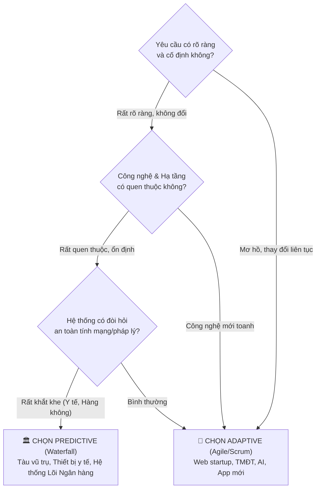

# 🛟 PHAO CỨU SINH ÔN NHANH TRƯỚC GIỜ THI — CHƯƠNG II
## MÔN: PHÂN TÍCH THIẾT KẾ VÀ YÊU CẦU (REQUIREMENTS ANALYSIS & DESIGN)
### CHỦ ĐỀ: SYSTEMS DEVELOPMENT LIFE CYCLE (SDLC) & BUSINESS MODELING
*(Dành riêng cho sinh viên chưa kịp học bài — Đọc trong 10-15 phút, tự tin ẵm trọn điểm cao!)*

---

> 💡 **BÍ KÍP CỦA THỦ KHOA:**  
> Đề thi Chương 2 luôn tập trung "bẫy" sinh viên ở 3 điểm nóng:  
> 1. Nhầm lẫn giữa **Predictive** và **Adaptive** trong 6 khía cạnh so sánh.  
> 2. Lẫn lộn giữa **Business Actor** (người ngoài) và **Business Worker** (nhân viên trong).  
> 3. Ký hiệu **Fork vs Join**, **Decision vs Merge** trong Activity Diagram.  
> Đọc kỹ phao cứu sinh này, bạn sẽ nắm trọn "bộ lọc phản xạ 3 giây" để giải quyết mọi câu hỏi!

---

## ⚔️ TRỤ CỘT 1: ĐẠI CHIẾN 2 TRƯỜNG PHÁI — PREDICTIVE VS ADAPTIVE SDLC

### 1.1 Khái niệm "Cái ô" (Umbrella Concept)
* **Hỏi:** SDLC và Methodology (Phương pháp luận) có phải là một không?
* **Đáp ngay:** **KHÔNG!**
* **Quy tắc Cái Ô:**
  - ☂️ **SDLC (Vòng đời phát triển hệ thống):** Là **Cái ô bao trùm (Umbrella Concept)** — định nghĩa các giai đoạn cần phải có từ lúc "thai nghén" đến lúc "khai tử" một hệ thống phần mềm.
  - 🚶 **Methodology (Phương pháp luận):** Là **Cách bạn đi dưới cái ô đó** (Waterfall, Scrum, Kanban, XP, Unified Process). Mỗi Methodology quy định thứ tự, cách lặp và tần suất thực hiện các pha của SDLC.

---

### 1.2 So sánh Predictive vs Adaptive — Xây nhà trọn gói vs Xây từng tầng

```
PREDICTIVE (Dự đoán / Kế hoạch trước)        ADAPTIVE (Thích ứng / Linh hoạt)
👉 "Plan the work, then work the plan"      👉 "Embrace change, deliver early & often"
👉 Giống: Xây nhà trọn gói chìa khóa trao tay 👉 Giống: Xây tầng 1 ở trước, sau đó xây tiếp tầng 2
```

* **Bảng so sánh 10 giây — 6 Chiều kích thước thần thánh:**

| Khía cạnh | Predictive Approach *(Thác nước)* | Adaptive Approach *(Agile / Scrum)* | Mẹo thi trắc nghiệm |
| :--- | :--- | :--- | :--- |
| **1. Triết lý cốt lõi** | Lập kế hoạch chi tiết từ đầu, tuân thủ nghiêm ngặt | Chào đón thay đổi, thích nghi liên tục theo phản hồi | Thấy *"Plan the work"* $\to$ Predictive; Thấy *"Embrace change"* $\to$ Adaptive |
| **2. Bàn giao sản phẩm** | **Big-Bang:** Bàn giao toàn bộ 1 lần duy nhất ở cuối | **Incremental:** Bàn giao phần mềm chạy được sau mỗi Sprint (2-4 tuần) | Thấy *"Big-bang / One-time delivery"* $\to$ Predictive |
| **3. Quản lý thay đổi** | Rất khắt khe, coi thay đổi là rủi ro và tốn kém | Coi thay đổi là tất yếu, linh hoạt điều chỉnh backlog | Thấy *"Change is restricted"* $\to$ Predictive |
| **4. Lập kế hoạch** | Kế hoạch toàn diện dài hạn từ ngày 1 đến ngày cuối | Kế hoạch thích ứng ngắn hạn theo từng chu kỳ Sprint | Thấy *"Detailed upfront planning"* $\to$ Predictive |
| **5. Vai trò khách hàng** | Tham gia nhiều ở đầu (chốt yêu cầu) và cuối (nghiệm thu) | Tham gia **liên tục, hàng ngày/hàng tuần** trong dự án | Thấy *"Customer involved continuously"* $\to$ Adaptive |
| **6. Tài liệu hóa** | Hồ sơ tài liệu đồ sộ, ký duyệt đóng dấu từng bước | Tài liệu vừa đủ (Just-enough), ưu tiên phần mềm chạy được | Thấy *"Heavy documentation"* $\to$ Predictive |

---

### 1.3 Khi nào chọn trường phái nào? (3 Tiêu chí quyết định)



---

## 🔄 TRỤ CỘT 2: CHI TIẾT 5 PHA SDLC — 5 CÂU HỎI & SẢN PHẨM BÀN GIAO

*Mỗi pha trong SDLC trả lời cho đúng một câu hỏi bản chất:*

```
[1. Planning] ────► [2. Analysis] ────► [3. Design] ────► [4. Implementation] ────► [5. Support]
   (WHY?)               (WHAT?)             (HOW?)             (BUILD & TEST)           (OPERATE)
Tại sao phải làm?    Hệ thống làm gì?   Làm như thế nào?     Viết mã & Triển khai     Giữ cho nó chạy tốt!
```

### Bảng tra cứu 5 Pha & Sản phẩm bàn giao (Deliverables) chuẩn thi:

| Pha SDLC | Câu hỏi cốt lõi | Nhiệm vụ chính của pha | Sản phẩm bàn giao then chốt (Deliverables) |
| :--- | :---: | :--- | :--- |
| **1. Planning** *(Lập kế hoạch)* | **WHY?** | Xác định bài toán kinh doanh, thẩm định tính khả thi, lập kế hoạch nguồn lực | **Project Plan, Feasibility Study, Business Case, Project Charter** |
| **2. Analysis** *(Phân tích)* | **WHAT?** | Tìm hiểu người dùng cần gì, phân tích quy trình hiện tại, mô hình hóa yêu cầu | **System Proposal, Requirements Spec (FRs & NFRs), Use Case Model** |
| **3. Design** *(Thiết kế)* | **HOW?** | Thiết kế kiến trúc giải pháp, thiết kế cơ sở dữ liệu, giao diện đồ họa (UI/UX) | **Architecture Design, Database Schema (ERD), Class Diagram, Wireframes** |
| **4. Implementation** *(Triển khai)* | **BUILD & DEPLOY** | Lập trình viết mã nguồn, kiểm thử hệ thống, đào tạo người dùng, chuyển đổi dữ liệu | **Working Software, Test Results, User Manuals, Training Materials** |
| **5. Support** *(Vận hành & Hỗ trợ)* | **KEEP IT RUNNING** | Trực hỗ trợ kỹ thuật, sửa lỗi phát sinh, cập nhật bản vá, tối ưu hiệu năng | **Maintenance Logs, Change Requests, Audit Reports, Performance Metrics** |

> ⚠️ **BẪY THI CỰC GẮT:**  
> - Đề hỏi: *"Pha nào trả lời câu hỏi HOW?"* $\rightarrow$ Chọn ngay **Design**!  
> - Đề hỏi: *"Tài liệu Use Case Model là sản phẩm bàn giao của pha nào?"* $\rightarrow$ Chọn ngay **Analysis**!  
> - Đề hỏi: *"Lược đồ cơ sở dữ liệu (Database Schema / ERD) thuộc về pha nào?"* $\rightarrow$ Chọn ngay **Design**!

---

## 🏢 TRỤ CỘT 3: BUSINESS MODELING — MÔ HÌNH HÓA DOANH NGHIỆP TRƯỚC PHẦN MỀM

### 3.1 Vì sao phải mô hình hóa doanh nghiệp trước khi viết phần mềm?
* **Quy tắc vàng:** *"Nếu bạn tự động hóa một quy trình rác, bạn sẽ nhận lại một quy trình rác chạy bằng máy tính với tốc độ ánh sáng!"* *(Automating a mess creates an automated mess!)*.
* BA phải hiểu rõ **Doanh nghiệp vận hành thế nào (Enterprise Boundary)** trước khi cắm đầu vào vẽ chức năng cho phần mềm **(System Boundary)**.

---

### 3.2 Bộ tứ khái niệm cốt lõi — Phân biệt 100% không lẫn lộn

*Hãy tưởng tượng một **Nhà hàng ẩm thực**:*

```
[Khách hàng đói bụng] ──(Gọi món)──► [Anh bồi bàn / Thu ngân] ──(Mang)──► [Hóa đơn & Món ăn]
   (BÊN NGOÀI)                             (BÊN TRONG)                         (VẬT THỂ DỮ LIỆU)
 👉 BUSINESS ACTOR                      👉 BUSINESS WORKER                   👉 BUSINESS ENTITY
        \_________________________________________________________________________/
                                              ↓
                             Quy trình phục vụ ăn uống hoàn chỉnh
                                   👉 BUSINESS USE CASE
```

| Khái niệm | Vị trí so với Doanh nghiệp | Bản chất đời thường | Ví dụ chuẩn giáo trình |
| :--- | :---: | :--- | :--- |
| **Business Actor** | **BÊN NGOÀI** doanh nghiệp | Người/tổ chức bên ngoài hưởng lợi hoặc tương tác với doanh nghiệp | **Khách hàng (Customer)**, **Nhà cung cấp (Supplier)**, **Ngân hàng**, **Cơ quan Thuế** |
| **Business Worker** | **BÊN TRONG** doanh nghiệp | Nhân viên, phòng ban hưởng lương thực hiện công việc nội bộ | **Thu ngân (Cashier)**, **Nhân viên bán hàng (Sales Clerk)**, **Thủ kho**, **Bác sĩ** |
| **Business Use Case** | Toàn bộ quy trình | Chuỗi hành động mang lại giá trị trọn vẹn cho Business Actor | **Mua hàng trực tuyến**, **Mở tài khoản tiết kiệm**, **Xử lý bồi thường bảo hiểm** |
| **Business Entity** | Tài sản dữ liệu | Tài liệu, chứng từ, vật phẩm được quản lý hoặc tạo ra trong quy trình | **Hóa đơn (Invoice)**, **Đơn đặt hàng (Purchase Order)**, **Hợp đồng**, **Bản ghi bệnh án** |

> ⚠️ **BẪY THI KINH ĐIỂN:**  
> Đề bài hỏi: *"Nhân viên thu ngân (Cashier) trong siêu thị đóng vai trò là gì trong mô hình hóa doanh nghiệp?"*  
> - A. Business Actor ❌ *(Sai! Thu ngân là người ăn lương nội bộ)*  
> - B. **Business Worker** ✅ *(Đúng 100%!)*

---

### 3.3 Ký hiệu gạch chéo `/` (Slash Notation)
* Trong chuẩn UML Business Modeling: Để phân biệt biểu đồ doanh nghiệp với biểu đồ phần mềm, người ta thêm một **dấu gạch chéo `/`** bên cạnh ký hiệu.
  - Hình người có gạch chéo $\rightarrow$ **Business Actor / Business Worker**.
  - Hình elip có gạch chéo $\rightarrow$ **Business Use Case**.

---

## 🚦 TRỤ CỘT 4: GIAI ĐOẠN KHỞI ĐỘNG (INITIATION PHASE) & TÍNH KHẢ THI 3 CHIỀU

### 4.1 Cổng kiểm soát dự án (Go / No-Go Decision Gate)
* Pha Khởi động (Initiation) là lúc dự án đứng trước **Cổng kiểm soát sinh tử**:
  - **Go:** Đề án khả thi, rót tiền làm tiếp!
  - **No-Go:** Không khả thi hoặc rủi ro quá lớn, dẹp bỏ ngay để đỡ tốn tiền!

---

### 4.2 Đánh giá tính khả thi 3 khía cạnh (Feasibility Analysis)

*Để qua được cổng "Go", dự án phải vượt qua 3 bài sát hạch:*

```
                   ┌──────────────────────────────────────────────┐
                   │    FEASIBILITY ANALYSIS (TÍNH KHẢ THI)       │
                   └──────────────────────┬───────────────────────┘
          ┌───────────────────────────────┼───────────────────────────────┐
          ▼                               ▼                               ▼
💰 ECONOMIC (Kinh tế)           🔧 TECHNICAL (Kỹ thuật)       👥 ORGANIZATIONAL (Tổ chức)
  "Làm có LỜI không?"            "Đội ngũ có LÀM ĐƯỢC không?"    "Người dùng có CHỊU XÀI không?"
  - Lợi nhuận vs Chi phí          - Quen thuộc công nghệ          - Văn hóa doanh nghiệp
  - ROI (Tỷ suất sinh lời)        - Rủi ro hạ tầng & phần cứng    - Quản trị thay đổi (Change Mgmt)
  - NPV (Giá trị hiện tại ròng)   - Năng lực kỹ sư lập trình      - Sự ủng hộ của lãnh đạo
  - Payback Period (Hoàn vốn)     - Rủi ro tích hợp hệ thống cũ   - Rào cản tâm lý ngại đổi mới
```

> ⚠️ **BẪY THI:** Đề bài hỏi *"Hiện tượng nhân viên tẩy chay phần mềm mới vì sợ mất việc thuộc về khía cạnh khả thi nào?"* $\rightarrow$ Khoanh ngay **Organizational Feasibility (Khả thi tổ chức/vận hành)**!

---

## 🔀 TRỤ CỘT 5: GIẢI MÃ KÝ HIỆU ACTIVITY DIAGRAM & 10 CẠM BẪY PHÒNG THI

### 5.1 Bảng giải mã toàn bộ ký hiệu Activity Diagram trong 1 nốt nhạc

```
  KÝ HIỆU UML                     TÊN GỌI               BẢN CHẤT NGỮ NGHĨA
  ───────────                     ───────               ──────────────────
     ●                        Initial Node          Điểm xuất phát bắt đầu quy trình
     
  ┌────────┐
  │ Action │                  Activity/Action       Một bước hành động hoặc thao tác cụ thể
  └────────┘
     ◇ (1 vào -> nhiều ra)    Decision Node         Rẽ nhánh điều kiện (kèm nhãn Guard [Đúng/Sai])
     
     ◇ (nhiều vào -> 1 ra)    Merge Node            Gộp nhiều nhánh rẽ về lại một luồng chung
     
     ━━━━ (1 vào -> nhiều ra) Fork Node             Tách 1 luồng thành NHIỀU LUỒNG SONG SONG
     
     ━━━━ (nhiều vào -> 1 ra) Join Node             ĐỒNG BỘ HÓA: Chờ TẤT CẢ các luồng song song xong
     
     ◉                        Activity Final Node   Kết thúc TOÀN BỘ quy trình hoạt động
     
     ⊗                        Flow Final Node       Kết thúc MỘT NHÁNH luồng riêng lẻ (luồng khác vẫn chạy)
     
  | Làn 1 | Làn 2 |           Swimlanes (Làn bơi)   Phân định TRÁCH NHIỆM của từng phòng ban/vai trò
```

* **Phân biệt cặp song sinh sát thủ:**
  - **Decision vs Fork:** Cả hai đều từ 1 mũi tên tách ra nhiều mũi tên! Nhưng **Decision chỉ chọn 1 đường duy nhất** (hoặc A hoặc B); còn **Fork là chạy TẤT CẢ các đường cùng lúc song song**.
  - **Merge vs Join:** Cả hai đều gộp nhiều mũi tên thành 1! Nhưng **Merge là bất kỳ nhánh nào đến trước thì đi tiếp ngay**; còn **Join là người gác cổng khó tính, bắt TẤT CẢ các luồng song song phải đến đủ thì mới cho đi tiếp**!
  - **Swimlanes (Làn bơi):** Nhìn vào biểu đồ có chia cột dọc hoặc ngang như đường đua bể bơi $\rightarrow$ Đó là **Swimlanes**, dùng để trả lời câu hỏi *"Ai chịu trách nhiệm làm bước này?"*.

---

### 5.2 Bảng tra cứu phản xạ 3 giây (Keywords Matching Chương 2)

| Thấy cụm từ xuất hiện trong câu hỏi... | ...Đáp án đúng chắc chắn là: |
| :--- | :--- |
| "Plan the work, then work the plan", "Bàn giao một lần Big-bang" | ➔ **Predictive Approach** |
| "Embrace change", "Bàn giao tăng dần sau mỗi Sprint" | ➔ **Adaptive Approach** |
| "SDLC là khái niệm bao trùm", "Methodology là cách triển khai" | ➔ **Umbrella Concept** |
| "Trả lời câu hỏi WHY?", "Nghiên cứu tính khả thi Feasibility" | ➔ **Pha Planning** |
| "Trả lời câu hỏi WHAT?", "Use Case Model", "Yêu cầu chức năng" | ➔ **Pha Analysis** |
| "Trả lời câu hỏi HOW?", "Database Schema / ERD", "Kiến trúc hệ thống" | ➔ **Pha Design** |
| "Tác nhân bên ngoài doanh nghiệp", "Khách hàng", "Nhà cung cấp" | ➔ **Business Actor** |
| "Nhân viên bên trong doanh nghiệp", "Thu ngân", "Bồi bàn" | ➔ **Business Worker** |
| "ROI, NPV, Payback Period", "Chi phí và Lợi nhuận" | ➔ **Economic Feasibility** |
| "Rào cản văn hóa", "Người dùng phản đối", "Sự ủng hộ của sếp" | ➔ **Organizational Feasibility** |
| "Tách 1 luồng thành nhiều luồng chạy song song đồng thời" | ➔ **Fork Node** *(Thanh ngang)* |
| "Đồng bộ hóa các luồng song song trước khi đi tiếp" | ➔ **Join Node** *(Thanh ngang)* |
| "Phân định trách nhiệm của các phòng ban trong quy trình" | ➔ **Swimlanes (Làn bơi)** |

---

### 5.3 Mười cạm bẫy phòng thi kinh điển của Chương 2

1. ❌ **Bẫy 1:** *Nghĩ rằng SDLC chỉ dành riêng cho mô hình Thác nước (Waterfall).*  
   👉 **Khắc phục:** SDLC là cái ô chung! Cả Waterfall lẫn Agile/Scrum đều là cách triển khai các pha của SDLC.
2. ❌ **Bẫy 2:** *Nhầm lẫn giữa Business Actor và Business Worker.*  
   👉 **Khắc phục:** Người ăn lương bên trong công ty $\rightarrow$ Worker; Người đứng ngoài cửa giao dịch $\rightarrow$ Actor!
3. ❌ **Bẫy 3:** *Tưởng pha Analysis trả lời câu hỏi "Làm như thế nào?".*  
   👉 **Khắc phục:** Analysis trả lời **WHAT** (Hệ thống làm gì); **Design** mới trả lời **HOW** (Làm như thế nào)!
4. ❌ **Bẫy 4:** *Cho rằng Database Design (ERD) được làm ở pha Analysis.*  
   👉 **Khắc phục:** Thiết kế cơ sở dữ liệu chi tiết là sản phẩm của pha **Design**, không phải Analysis!
5. ❌ **Bẫy 5:** *Nhầm lẫn giữa Decision Node và Fork Node.*  
   👉 **Khắc phục:** Cả 2 đều rẽ nhánh, nhưng **Decision là RẼ HOẶC (chỉ đi 1 đường)**, còn **Fork là CHẠY SONG SONG (đi tất cả các đường)**.
6. ❌ **Bẫy 6:** *Nhầm lẫn giữa Merge Node và Join Node.*  
   👉 **Khắc phục:** **Merge** là bất kỳ luồng nào tới trước thì đi luôn; **Join** là bắt buộc tất cả các nhánh song song phải đến đủ mới mở cửa.
7. ❌ **Bẫy 7:** *Tưởng Activity Final và Flow Final là một.*  
   👉 **Khắc phục:** Activity Final ($\odot$) dừng **toàn bộ biểu đồ**; Flow Final ($\otimes$) chỉ dừng **một nhánh luồng con**.
8. ❌ **Bẫy 8:** *Cho rằng dự án lớn luôn luôn phải chọn Agile.*  
   👉 **Khắc phục:** Dự án tối mật, y tế, quân sự đòi hỏi an toàn tuyệt đối và quy trình nghiệm thu chặt chẽ vẫn ưu tiên **Predictive**!
9. ❌ **Bẫy 9:** *Quên mất chữ viết tắt của ROI và NPV.*  
   👉 **Khắc phục:** ROI = *Return on Investment* (Tỷ suất sinh lời); NPV = *Net Present Value* (Giá trị hiện tại ròng). Cả 2 đều thuộc **Economic Feasibility**.
10. ❌ **Bẫy 10:** *Nghĩ rằng Business Use Case có ký hiệu giống hệt System Use Case.*  
    👉 **Khắc phục:** Business Use Case bắt buộc phải có **dấu gạch chéo `/`** trên hình elip và hình người.

---

## 🏆 CHÚC BẠN TỰ TIN CHIẾN THẮNG BÀI THI CHƯƠNG II! 🌟
* Bình tĩnh đọc kỹ câu hỏi.
* Chú ý các từ phủ định: **SAI**, **KHÔNG ĐÚNG**, **NGOẠI TRỪ**.
* Nhớ bảng từ khóa 3 giây để loại suy đáp án nhiễu!
