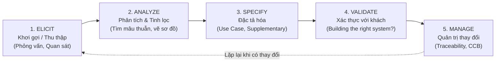

# 🛟 PHAO CỨU SINH ÔN NHANH TRƯỚC GIỜ THI — CHƯƠNG IV
## MÔN: PHÂN TÍCH THIẾT KẾ VÀ YÊU CẦU (REQUIREMENTS ANALYSIS & DESIGN)
### CHỦ ĐỀ: DISCOVERY PHASE I — BASELINE, ELICITATION & USE CASE FOUNDATIONS
*(Dành riêng cho sinh viên chưa kịp học bài — Đọc trong 10-15 phút, tự tin ẵm trọn điểm cao!)*

---

> 💡 **BÍ KÍP CỦA THỦ KHOA:**  
> Đề thi Chương 4 thường gài bẫy sinh viên ở 3 điểm mấu chốt:  
> 1. Nhầm lẫn giữa **Preconditions** (điều kiện trước) và **Postconditions** (điều kiện sau).  
> 2. Phân biệt **3 cấp độ mô tả Use Case**: Brief vs Casual vs Fully-Dressed.  
> 3. Cạm bẫy **UI Pollution** (đưa nút bấm, màu sắc, textbox giao diện vào Use Case).  
> Đọc kỹ phao cứu sinh này, bạn sẽ nắm trọn "bộ phản xạ 3 giây" để loại trừ đáp án nhiễu cực nhanh!

---

## 📌 TRỤ CỘT 1: THIẾT LẬP MỐC CƠ SỞ (SET BASELINE) & CHỐNG BÃI LẦY "SCOPE CREEP"

### 1.1 Baseline là gì? — Ẩn dụ cắm cọc ranh giới đất
* **Hỏi:** Baseline là cái gì mà dự án nào cũng đòi làm?
* **Đáp ngay câu thần chú:** Là một **ẢNH CHỤP TRẠNG THÁI (Snapshot)** đã được tất cả các bên liên quan chính thức ký tên đồng thuận $\to$ Làm **mốc tham chiếu ổn định (Stable Reference)** để theo dõi tiến độ và kiểm soát thay đổi.
* **Ẩn dụ đời thường:** Giống như lúc bạn mua đất, hai bên mời địa chính đến đo đạc và **cắm cọc bê tông mốc giới**. Cọc đã cắm thì không ai được tự ý lấn chiếm!

---

### 1.2 Ba thành tố cấu thành hồ sơ Baseline ban đầu
1. 🎯 **Project Scope (Phạm vi dự án):** Vạch rõ cái gì **SẼ LÀM (In Scope)** và cái gì **DỨT KHOÁT KHÔNG LÀM (Out of Scope)**.
2. 👁️ **Vision (Tầm nhìn nghiệp vụ):** Mục tiêu kinh doanh cốt lõi mà phần mềm này hướng tới.
3. 📝 **Initial Requirements (Tập yêu cầu ban đầu):** Danh sách các tính năng ứng viên cấp cao chốt với khách hàng.

---

### 1.3 Bốn giá trị sống còn của Baseline & Cạm bẫy Scope Creep

| Giá trị cốt lõi | Ý nghĩa thực tế | Bẫy thi trắc nghiệm cần nhớ |
| :--- | :--- | :--- |
| **1. Ngăn chặn Scope Creep** | Tránh hiện tượng khách hàng *"tiện tay đòi thêm tính năng"* làm dự án vỡ trận | Thấy *"Phình to phạm vi không kiểm soát"* $\to$ Đó là **Scope Creep**! |
| **2. Thước đo tiến độ** | Cung cấp mốc chuẩn để so sánh xem dự án đang chạy nhanh hay chậm hơn kế hoạch | Thấy *"Metric for progress / Stable reference"* $\to$ **Baseline** |
| **3. Căn chỉnh kỳ vọng** | Giúp khách hàng và đội Dev nhìn về cùng một hướng, không ai cãi ai | Tránh hiểu lầm: *"Tưởng tính năng đó bên em làm miễn phí!"* |
| **4. Cơ sở pháp lý hợp đồng** | Căn cứ chính thức để nghiệm thu bàn giao và thanh toán tiền | Là tài liệu tham chiếu khi xảy ra tranh chấp hợp đồng |

> ⚠️ **BẪY THI CỰC KỲ QUAN TRỌNG:**  
> Đề hỏi: *"Baseline có phải là tài liệu đóng băng vĩnh viễn không được sửa đổi không?"*  
> 👉 **ĐÁP ÁN:** **KHÔNG!** Baseline không phải đóng băng bất di bất dịch. Nếu muốn thay đổi, bắt buộc phải qua **Quy trình kiểm soát thay đổi (Change Control)** và được **Hội đồng CCB (Change Control Board)** phê duyệt!

---

## 🔍 TRỤ CỘT 2: GIAI ĐOẠN KHÁM PHÁ (DISCOVERY PHASE) & CHU TRÌNH 5 HOẠT ĐỘNG

### 2.1 Vị trí của Discovery Phase trong Unified Process
* Nằm ở giai đoạn **bản lề chuyển tiếp** từ **cuối pha Inception** sang **đầu pha Elaboration**.
* **Mục tiêu tối thượng:** Đào sâu vào miền bài toán (Problem Domain) để biến các ý tưởng mơ hồ của khách hàng thành đặc tả kỹ thuật rõ như ban ngày.

---

### 2.2 Chu trình lặp 5 hoạt động Discovery (The Iterative Cycle)



* **Bảng so sánh 10 giây giữa 5 hoạt động:**

| Hoạt động | Bản chất hành động | Kỹ thuật / Công cụ thực hiện | Dấu hiệu câu hỏi thi |
| :--- | :--- | :--- | :--- |
| **1. Elicit** *(Khơi gợi)* | Chủ động tìm kiếm, moi móc các nhu cầu tiềm ẩn của người dùng | Phỏng vấn (**Interview**), Hội thảo (**JAD Workshop**), Khảo sát (**Survey**), Quan sát (**Observation**) | Đề nhắc đến "thu thập", "gặp gỡ người dùng", "tìm kiếm yêu cầu" |
| **2. Analyze** *(Phân tích)* | Bóc tách yêu cầu, phát hiện mâu thuẫn, phân loại chức năng | Mô hình hóa quy trình, phân tích nguyên nhân gốc rễ, phân giải mâu thuẫn | Đề nhắc đến "phát hiện xung đột", "tìm điểm bất hợp lý", "tinh lọc" |
| **3. Specify** *(Đặc tả)* | Ghi chép chính thức các yêu cầu thành văn bản kỹ thuật chuẩn | Viết Use Case Descriptions, SRS, Supplementary Specification | Đề nhắc đến "soạn thảo tài liệu", "viết biểu mẫu 9 trường" |
| **4. Validate** *(Xác thực)* | Hỏi lại khách hàng xem đã viết đúng ý họ chưa (*Building the right system*) | Walkthrough, Đọc rà soát tài liệu (Review), Nghiệm thu mẫu thử (Prototype demo) | Đề nhắc đến "kiểm chứng với khách", "xác nhận tính đúng đắn" |
| **5. Manage** *(Quản lý)* | Quản trị các yêu cầu thay đổi và đảm bảo tính truy vết | Ma trận truy vết yêu cầu (Traceability Matrix), Xử lý phiếu CR | Đề nhắc đến "theo dõi biến động", "truy vết nguồn gốc yêu cầu" |

---

### 2.3 Tài liệu Đặc tả bổ sung (Supplementary Specification) chứa cái gì?
* Use Case chỉ mô tả **Yêu cầu chức năng (Functional Requirements - FRs)**.
* Còn tất cả các **Yêu cầu phi chức năng (Non-Functional Requirements - NFRs)** như: *Tốc độ tải trang dưới 2 giây, Bảo mật mã hóa RSA, Chịu tải 100.000 người đồng thời, Tiêu chuẩn pháp lý GDPR* $\rightarrow$ Đều được gom vào **Supplementary Specification**!

---

## 🎭 TRỤ CỘT 3: BEHAVIORAL ANALYSIS & USE-CASE DIAGRAM NHƯ "MỤC LỤC"

### 3.1 Phân tích hành vi (Behavioral) vs Phân tích cấu trúc (Structural)
* ⬛ **Behavioral Analysis (Phân tích hành vi - WHAT):**  
  - Xem hệ thống là **Hộp đen (Black-box)**.
  - Chỉ quan tâm hệ thống làm **CÁI GÌ (WHAT)** cho người dùng, hoàn toàn **ĐỘC LẬP VỚI CÔNG NGHỆ** bên trong (không dính dáng đến code, database, ngôn ngữ lập trình).
  - *Công cụ đại diện:* **Use Case Diagram, Use Case Description**.
* ⬜ **Structural Analysis (Phân tích cấu trúc - HOW):**  
  - Xem hệ thống là **Hộp trắng (White-box)**.
  - Mổ xẻ cấu trúc bên trong xem hệ thống được xây dựng **NHƯ THẾ NÀO (HOW)**.
  - *Công cụ đại diện:* **Class Diagram, Entity Relationship Diagram (ERD)**.

---

### 3.2 Ẩn dụ cuốn sách: Use Case Diagram là "Mục lục" (Table of Contents)
* **Use Case Diagram** giống như trang **Mục lục của cuốn sách**:  
  - Nhìn vào là biết cuốn sách có bao nhiêu chương, phạm vi rộng đến đâu mà không bị "bội thực" chữ.
* **Use Case Descriptions** giống như **Nội dung chi tiết từng trang sách**:  
  - Mô tả cặn kẽ từng bước đi, từng nhánh rẽ và từng kịch bản xử lý lỗi của ca sử dụng đó.

---

## 📝 TRỤ CỘT 4: BA CẤP ĐỘ MÔ TẢ & KHUÔN MẪU 9 TRƯỜNG FULLY-DRESSED

### 4.1 Ba cấp độ mô tả Use Case Description (Alistair Cockburn)

```
[1. BRIEF] ─────────────────► [2. CASUAL] ─────────────────► [3. FULLY-DRESSED]
(Đoạn văn ngắn 2-3 câu)      (Vài đoạn văn xuôi tự do)      (Bảng mẫu 9 trường chi tiết nhất)
👉 Giống: Trailer phim 30s    👉 Giống: Bài review phim      👉 Giống: Kịch bản phân cảnh quay phim
```

| Cấp độ | Định dạng trình bày | Mức độ chi tiết | Thường dùng khi nào? |
| :--- | :--- | :--- | :--- |
| **Brief** | 1 đoạn văn ngắn súc tích từ 2 đến 3 câu | Chỉ nêu: Actor chính, Mục tiêu và Luồng hành vi chủ đạo | Đầu pha Inception, lúc phác thảo nhanh phạm vi |
| **Casual** | Vài đoạn văn xuôi tự do không chia bảng | Bao quát kịch bản chính và một vài kịch bản rẽ nhánh | Giai đoạn thảo luận sơ bộ trước khi viết chi tiết |
| **Fully-Dressed** | Khuôn mẫu bảng chuẩn từ 9 đến 10 trường | Chi tiết từng bước, điều kiện tiên quyết, hậu quả và ngoại lệ | Pha Elaboration, làm tài liệu chuẩn cho Dev & QA |

---

### 4.2 Giải mã 9 trường vàng trong Fully-Dressed Use Case Template

*Cực kỳ hay thi nhận diện trường dữ liệu! Hãy học thuộc bảng sau:*

| Tên trường dữ liệu | Bản chất học thuật | Ví dụ thực tế cho Use Case "Place Order" |
| :--- | :--- | :--- |
| **1. Use Case Name** | Bắt đầu bằng Động từ + Cụm danh từ | `Place Order` *(Đặt đơn hàng)* |
| **2. Primary Actor** | Vai trò khởi xướng ca sử dụng | `Registered Customer` *(Khách hàng đã đăng ký)* |
| **3. Stakeholders & Interests** | Các bên liên quan và lợi ích mong đợi | Khách muốn mua hàng nhanh; Kế toán muốn số tiền khớp |
| **4. Preconditions** *(Điều kiện tiên quyết)* | Điều kiện bắt buộc hệ thống phải bảo đảm **LUÔN ĐÚNG TRƯỚC KHI BẮT ĐẦU** | Khách hàng **đã đăng nhập thành công** và giỏ hàng **có ít nhất 1 sản phẩm** |
| **5. Postconditions** *(Điều kiện sau thành công)* | Cam kết trạng thái dữ liệu hệ thống đạt được **SAU KHI KẾT THÚC THÀNH CÔNG** | Đơn hàng đã tạo ở trạng thái `Pending`; Hàng đã trừ kho; Email xác nhận đã gửi |
| **6. Trigger** *(Sự kiện kích hoạt)* | Hành động cụ thể châm ngòi cho ca sử dụng chạy | Khách hàng bấm nút `"Thanh toán & Đặt hàng"` |
| **7. Main Success Scenario (Happy Path)** | Kịch bản lý tưởng nhất khi **MỌI THỨ DIỄN RA HOÀN HẢO** không có lỗi | Bước 1: Khách chọn địa chỉ $\to$ Bước 2: Hệ thống tính phí $\to$ Bước 3: Trừ tiền thành công |
| **8. Alternative Flows** | Các nhánh rẽ nghiệp vụ hợp lệ khác để vẫn về đích thành công | Khách đổi từ thanh toán Thẻ sang thanh toán COD (Nhận hàng trả tiền) |
| **9. Exception Flows** | Kịch bản xử lý lỗi khi ca sử dụng **BỊ THẤT BẠI GIỮA CHỪNG** | Thẻ tín dụng bị từ chối; Sản phẩm vừa hết hàng trong kho |

> ⚠️ **BẪY THI TỬ THẦN:**  
> - **Preconditions:** Những gì phải có **TRƯỚC** (chưa đăng nhập thì cấm không cho vào Use Case!).  
> - **Postconditions:** Những gì hệ thống cam kết **SAU KHI XONG** (tiền đã trừ, hóa đơn đã sinh).  
> Đề thi rất hay gài: *"Khách hàng nhập mã OTP thành công là Precondition hay Postcondition?"* $\rightarrow$ Đó là một bước trong luồng, không phải Precondition!

---

### 4.3 Tách rời Quy tắc nghiệp vụ (Business Rules Decoupling)
* **Hỏi:** Tại sao không viết công thức tính thuế VAT hay chính sách giảm giá Black Friday thẳng vào từng bước của Use Case?
* **Đáp ngay:** Vì chính sách khuyến mãi đổi liên tục! Nếu nhúng cứng vào Use Case, mỗi lần đổi chính sách sẽ phải viết lại Use Case.  
👉 **Chuẩn mực BA:** Trong Use Case chỉ ghi tham chiếu: *`"Hệ thống tính thuế theo [BR-01: VAT Policy]"`*. Chi tiết công thức để riêng ra bảng Business Rules.

---

## 📚 TRỤ CỘT 5: BÀI TẬP THƯ VIỆN, KỸ NGHỆ NÂNG CAO & 10 CẠM BẪY PHÒNG THI

### 5.1 Bài tập Hệ thống Thư viện (Library System) — So sánh Borrow vs Reserve

```
    CUỐN SÁCH CẦN ĐỌC
           │
           ├─► Sách ĐANG CÓ SẴN trên giá ──► Dùng Use Case: [Borrow Book] (Mượn trực tiếp)
           │
           └─► Sách ĐÃ BỊ MƯỢN HẾT (Checked Out) ──► Dùng Use Case: [Reserve Book] (Đặt chỗ trước)
```

* **Borrow Book (Mượn sách):** Precondition là sách phải **có sẵn trên kệ (Available)** và thẻ độc giả không bị khóa.
* **Reserve Book (Đặt giữ sách trước):** Precondition bắt buộc là sách **đang bị mượn hết bởi người khác (Checked Out)**.
> ⚠️ **BẪY THI:** Đề bài hỏi *"Độc giả có được phép Reserve Book khi sách đang còn 10 cuốn trên giá không?"* $\rightarrow$ **KHÔNG!** Sách còn trên giá thì phải đến mượn trực tiếp (Borrow), không ai cho Reserve khi sách đang rảnh rỗi!

---

### 5.2 Kỹ nghệ nâng cao: Named Extension Points & Phân gói Packages
* 🏷️ **Named Extension Points:** Là một vị trí được đặt tên tường minh trong Base Case (ví dụ: `At point: [Payment Options]`). Nhờ có điểm này mà ca sử dụng mở rộng (`Apply Coupon`) mới biết chính xác mình cần chèn hành vi vào đâu mà không làm hỏng kịch bản gốc.
* 📦 **Packaging Use Cases:** Trong hệ thống lớn có hàng trăm Use Case, BA gom nhóm chúng thành các **Package phân hệ nghiệp vụ** (ví dụ: *Package Quản lý kho, Package Bán hàng, Package Chăm sóc khách hàng*) để phân bổ cho các nhóm lập trình độc lập.

---

### 5.3 Bảng tra cứu phản xạ 3 giây (Keywords Matching Chương 4)

| Thấy cụm từ xuất hiện trong câu hỏi... | ...Đáp án đúng chắc chắn là: |
| :--- | :--- |
| "Snapshot", "Mốc tham chiếu ổn định", "Ngăn chặn Scope Creep" | ➔ **Baseline** *(Mốc cơ sở)* |
| "Phê duyệt các yêu cầu thay đổi sau Baseline" | ➔ **Change Control Board (CCB)** |
| "Bản lề chuyển tiếp giữa cuối Inception và đầu Elaboration" | ➔ **Discovery Phase** |
| "Hộp đen Black-box", "WHAT the system does", "Độc lập công nghệ" | ➔ **Behavioral Analysis** |
| "Hộp trắng White-box", "HOW it is built", "Class / ERD" | ➔ **Structural Analysis** |
| "Biểu đồ Use Case đóng vai trò như Mục lục của tài liệu" | ➔ **Table of Contents Concept** |
| "Đoạn văn ngắn 2-3 câu tóm tắt Actor, Goal và luồng chính" | ➔ **Brief Description** |
| "Văn xuôi tự do nhiều đoạn văn chưa chia bảng" | ➔ **Casual Description** |
| "Khuôn mẫu bảng chuẩn 9-10 trường chi tiết nhất" | ➔ **Fully-Dressed Description** |
| "Điều kiện bắt buộc phải đúng TRƯỚC KHI ca sử dụng bắt đầu" | ➔ **Preconditions** |
| "Cam kết trạng thái hệ thống SAU KHI kết thúc thành công" | ➔ **Postconditions / Success Guarantees** |
| "Kịch bản lý tưởng nhất khi không có bất kỳ lỗi nào" | ➔ **Happy Path / Main Success Scenario** |
| "Sách đã bị mượn hết, độc giả đăng ký vào danh sách chờ" | ➔ **Use Case 'Reserve Book'** |
| "Vị trí được định danh rõ trong Base Case để chèn hành vi mở rộng"| ➔ **Named Extension Point** |

---

### 5.4 Mười cạm bẫy phòng thi kinh điển của Chương 4

1. ❌ **Bẫy 1: Cạm bẫy UI Pollution (Làm ô nhiễm giao diện).**  
   👉 Ghi chi tiết *"Bấm nút Submit màu xanh", "Nhập text vào ô họ tên"* vào kịch bản Use Case $\rightarrow$ **SAI!** Use Case phải độc lập với giao diện đồ họa.
2. ❌ **Bẫy 2: Nhầm Preconditions với các bước kiểm tra trong kịch bản.**  
   👉 Preconditions là điều kiện hệ thống đã thỏa mãn **từ trước khi bấm nút chạy Use Case** (ví dụ: đã đăng nhập thành công).
3. ❌ **Bẫy 3: Cho rằng Baseline là cố định và không bao giờ được thay đổi.**  
   👉 Baseline vẫn được thay đổi nếu có lý do chính đáng và được Hội đồng **CCB phê duyệt**.
4. ❌ **Bẫy 4: Nhầm sản phẩm bàn giao của Discovery Phase là Mã nguồn phần mềm.**  
   👉 Discovery Phase bàn giao **Use Case Model, Use Case Descriptions, Supplementary Specs**, chưa phải mã nguồn!
5. ❌ **Bẫy 5: Nhầm lẫn giữa Brief Description và Casual Description.**  
   👉 Brief là **1 đoạn văn ngắn 2-3 câu**; Casual là **nhiều đoạn văn xuôi tự do**.
6. ❌ **Bẫy 6: Cho phép Reserve Book khi sách đang rảnh rỗi trên kệ.**  
   👉 Reserve Book **chỉ áp dụng khi sách đã bị mượn hết** (Checked Out).
7. ❌ **Bẫy 7: Để Base Use Case chứa mã nguồn phụ thuộc vào Extension Use Case.**  
   👉 Base Case **hoàn toàn độc lập** và không hề biết về sự tồn tại của Extension Case.
8. ❌ **Bẫy 8: Nhúng cứng quy tắc kinh doanh phức tạp vào từng bước Happy Path.**  
   👉 Phải áp dụng **Business Rules Decoupling** (để công thức ra tài liệu quy tắc riêng).
9. ❌ **Bẫy 9: Nhầm Actor trong bài toán Thư viện là Thủ thư cho mọi ca sử dụng.**  
   👉 Độc giả (Patron) mới là Primary Actor của các ca tìm sách, mượn sách, đặt sách; Thủ thư (Librarian) chỉ quản lý kho và làm nghiệp vụ bàn giao.
10. ❌ **Bẫy 10: Tưởng Supplementary Specification chỉ là tài liệu phụ không quan trọng.**  
    👉 Supplementary Specification là nơi duy nhất lưu trữ các **Yêu cầu phi chức năng (NFRs)** sống còn như bảo mật, tốc độ, tải trọng của hệ thống!

---

## 🏆 CHÚC BẠN TỰ TIN ĐẠT ĐIỂM TỐI ĐA CHƯƠNG IV! 🌟
* Hít thở sâu và đọc kỹ từng câu hỏi thi.
* Cảnh giác cao độ với các từ phủ định: **SAI**, **KHÔNG ĐÚNG**, **NGOẠI TRỪ**.
* Nhớ kỹ: *Brief là trailer phim, Fully-Dressed là kịch bản chi tiết; Precondition là trước, Postcondition là sau!*
