# CẨM NANG ÔN THI CẤP TỐC HỆ CƠ SỞ DỮ LIỆU
# CHƯƠNG 1: TỔNG QUAN VÀ GIỚI THIỆU HỆ CƠ SỞ DỮ LIỆU

> **Môn học**: Hệ Cơ sở Dữ liệu (Database Systems)  
> **Chương**: Chương 1 — Tổng quan và Giới thiệu Hệ CSDL  
> **Mục tiêu**: Nắm chắc 100% lý thuyết nền tảng, bóc tách toàn bộ bẫy thi trắc nghiệm, hiểu sâu qua ví dụ trực quan và đạt điểm tối đa các câu hỏi thuộc Chương 1.

---

## PHẦN I. BẢN ĐỒ KHÁI NIỆM CỐT LÕI (MINDMAP)

```mermaid
flowchart TD
    subgraph S1["1. SỰ CẦN THIẾT CỦA CSDL"]
        FP["Hệ Tập Tin Truyền Thống<br/>(File Processing - 60s-80s)"]
        FP -->|Nhược điểm chí mạng| Flaws["Dư thừa dữ liệu (Redundancy)<br/>Không nhất quán (Inconsistency)<br/>Mất tính nguyên tố (Atomicity)<br/>Vi phạm toàn vẹn (Integrity)<br/>Cô lập & Xung đột đồng thời"]
        Flaws -->|Giải pháp khắc phục| DBMS["Hệ Quản Trị CSDL (DBMS)"]
    end

    subgraph S2["2. KIẾN TRÚC 3 MỨC ANSI-SPARC"]
        EXT["Mức Ngoài (External / Views)<br/>Khung nhìn riêng của từng người dùng"]
        CON["Mức Quan Niệm (Conceptual Level)<br/>Toàn bộ cấu trúc logic, bảng, khóa, ràng buộc"]
        INT["Mức Trong (Internal / Physical Level)<br/>Tổ chức lưu trữ vật lý, file, chỉ mục index, băm"]
        EXT <-->|Ánh xạ Ngoài - Quan niệm| CON
        CON <-->|Ánh xạ Quan niệm - Trong| INT
    end

    subgraph S3["3. TÍNH ĐỘC LẬP DỮ LIỆU"]
        LDI["Độc lập Logic (Logical Data Independence)<br/>Đổi Conceptual KHÔNG đổi External"]
        PDI["Độc lập Vật lý (Physical Data Independence)<br/>Đổi Internal KHÔNG đổi Conceptual"]
    end

    subgraph S4["4. PHÂN LOẠI NGƯỜI DÙNG"]
        DBA["DBA (Quản trị viên CSDL)<br/>Kỹ thuật, cấp quyền, backup, tuning"]
        DA["DA (Quản trị viên Dữ liệu)<br/>Chính sách kinh doanh, từ điển dữ liệu"]
        DEV["Lập trình viên ứng dụng (Programmers)"]
        END["Người dùng cuối (End-users: Naive vs Sophisticated)"]
    end

    subgraph S5["5. CÁC MÔ HÌNH DỮ LIỆU"]
        M1["Mô hình Quan hệ (Relational - Codd 1970)"]
        M2["Mô hình Thực thể - Liên kết (ER Model - Chen 1976)"]
        M3["Mô hình Mạng (Network - Đồ thị có hướng/Set type)"]
        M4["Mô hình Phân cấp (Hierarchical - Cây/1 cha)"]
        M5["Mô hình Hướng đối tượng (Object-Oriented - OID/Kế thừa)"]
    end

    DBMS --> S2
    S2 --> S3
    DBMS --> S4
    DBMS --> S5
```



---

## PHẦN II. TÓM TẮT LÝ THUYẾT THỰC CHIẾN (CORE THEORY)

### 1. Hệ thống Xử lý Tập tin (File Processing) vs Hệ CSDL (DBMS)

#### a. Bối cảnh & Ưu điểm hạn hẹp của File Processing
- **Khái niệm**: Dữ liệu lưu trữ phân tán dưới dạng các tập tin riêng rẽ (như `.txt`, `.dat`, `.csv`). Mỗi chương trình ứng dụng tự định nghĩa và quản lý tập tin riêng của mình.
- **Ưu điểm** *(Vẫn có ưu điểm, đề thi hay bẫy chỗ này)*:
  - Thời gian triển khai rất ngắn cho các bài toán quy mô siêu nhỏ.
  - Chi phí đầu tư ban đầu thấp (không cần mua bản quyền DBMS đắt đỏ, không cần phần cứng chuyên dụng).
  - Phù hợp cho xử lý cá nhân, độc lập cục bộ.

#### b. 6 Nhược điểm chí mạng của Hệ thống Tập tin
1. **Dư thừa dữ liệu (Data Redundancy)**: Cùng một thông tin (ví dụ: Địa chỉ sinh viên) bị lưu lặp đi lặp lại ở file Phòng Đào tạo, file Phòng KTX, file Thư viện $\rightarrow$ Lãng phí dung lượng đĩa và công sức nhập liệu.
2. **Không nhất quán dữ liệu (Data Inconsistency)**: Hệ quả trực tiếp của dư thừa dữ liệu. Khi sinh viên đổi địa chỉ, Phòng Đào tạo cập nhật nhưng KTX không cập nhật $\rightarrow$ Cùng một sinh viên nhưng có 2 địa chỉ khác nhau tại cùng một thời điểm.
3. **Khó khăn trong việc truy xuất dữ liệu (Difficulty in Accessing Data)**: Mỗi khi cần một báo cáo mới (ví dụ: "Tìm sinh viên quê Hà Nội có ĐTB > 8.0"), lập trình viên bắt buộc phải viết một chương trình mới toanh để quét file.
4. **Cô lập dữ liệu (Data Isolation)**: Dữ liệu phân tán ở nhiều file có cấu trúc và định dạng khác nhau (file nhị phân, file text) $\rightarrow$ Cực kỳ khó khăn khi cần viết ứng dụng liên kết dữ liệu giữa các file.
5. **Vấn đề toàn vẹn (Integrity Problems)**: Các ràng buộc nghiệp vụ (ví dụ: `SoTinChi > 0`, `DiemTB` từ 0 đến 10) bị "hard-code" cứng bên trong mã nguồn chương trình ứng dụng thay vì nằm ở dữ liệu $\rightarrow$ Khi thêm ràng buộc mới phải sửa và biên dịch lại toàn bộ code.
6. **Vấn đề an toàn & Xung đột đồng thời (Security & Concurrency Issues)**:
   - *An toàn*: Khó phân quyền chi tiết (chỉ có quyền mở hoặc không mở được file hệ điều hành, không thể phân quyền xem cột Lương hay không xem cột Lương).
   - *Tính nguyên tố (Atomicity)*: Không có cơ chế rollback (All-or-Nothing). Đang chuyển tiền thì mất điện $\rightarrow$ Tài khoản gửi đã trừ nhưng tài khoản nhận chưa cộng.
   - *Xung đột đồng thời*: Hai người cùng ghi đè vào một file cùng lúc dẫn đến mất mát dữ liệu (Lost Update).

---

### 2. Định nghĩa CSDL & Hệ Quản trị CSDL (DBMS)

| Thuật ngữ | Định nghĩa Chuẩn Giáo trình | Bản chất Cần Nhớ |
| :--- | :--- | :--- |
| **Cơ sở Dữ liệu (Database - DB)** | Là một tập hợp dữ liệu **có liên quan logic với nhau**, được lưu trữ có cấu trúc, có tính **dùng chung** và phục vụ nhu cầu của nhiều người dùng trong tổ chức. | Là **TÀI NGUYÊN DỮ LIỆU** (Data). |
| **Hệ Quản trị CSDL (DBMS)** | Là hệ thống **phần mềm** cung cấp các dịch vụ để định nghĩa, xây dựng, thao tác, bảo mật và chia sẻ CSDL giữa nhiều người dùng/ứng dụng. | Là **CÔNG CỤ PHẦN MỀM** (Software) như Oracle, SQL Server, MySQL, PostgreSQL. |
| **Hệ Cơ sở Dữ liệu (Database System)** | Bao gồm: **CSDL + Phần mềm DBMS + Phần mềm ứng dụng + Phần cứng + Người dùng**. | Là **TOÀN BỘ HỆ SINH THÁI**. |

---

### 3. Kiến trúc 3 Mức ANSI-SPARC

Kiến trúc chuẩn nhằm mục đích tối thượng: **Ngăn cách ứng dụng của người dùng với cơ sở dữ liệu vật lý bên dưới**.

```text
[ Người dùng 1 (Sinh viên) ]        [ Người dùng 2 (Giảng viên) ]       [ Người dùng 3 (Kế toán) ]
            \                                   |                                  /
             \                                  |                                 /
        +-----------------------------------------------------------------------------+
        |                 MỨC NGOÀI (External Level / View Level)                     |
        |  View 1 (Xem điểm cá nhân)       View 2 (Nhập điểm)        View 3 (Học phí) |
        +-----------------------------------------------------------------------------+
                                               ▲
                                               │ (Ánh xạ Ngoài - Quan niệm)
                                               ▼
        +-----------------------------------------------------------------------------+
        |                MỨC QUAN NIỆM (Conceptual Level / Logical)                    |
        |  Toàn bộ cấu trúc logic của hệ thống: Bảng SINHVIEN, MONHOC, KETQUA,         |
        |  Khóa chính, Khóa ngoại, Mối liên kết, Ràng buộc toàn vẹn, Quy tắc an toàn.  |
        +-----------------------------------------------------------------------------+
                                               ▲
                                               │ (Ánh xạ Quan niệm - Trong)
                                               ▼
        +-----------------------------------------------------------------------------+
        |                MỨC TRONG (Internal Level / Physical Level)                  |
        |  Cấu trúc lưu trữ vật lý trên đĩa cứng: Cây B-Tree, Hash Index, Kiểu cấp    |
        |  phát block dữ liệu, Mã hóa nhị phân, Nén dữ liệu, Đường dẫn lưu trữ.        |
        +-----------------------------------------------------------------------------+
```

#### Phân tích chi tiết 3 mức:
1. **Mức ngoài (External Level / View Level)**:
   - Là mức gần người dùng nhất.
   - Mỗi nhóm người dùng chỉ nhìn thấy **một phần** CSDL liên quan đến công việc của họ (gọi là *Khung nhìn / View*).
   - Giúp đơn giản hóa giao diện và bảo mật dữ liệu nhạy cảm (Sinh viên không xem được bảng lương của giảng viên).
2. **Mức quan niệm (Conceptual Level / Logical Level)**:
   - Mô tả **toàn bộ dữ liệu** được lưu trữ trong CSDL và các mối quan hệ giữa chúng: Thực thể là gì? Bảng gồm những cột nào? Kiểu dữ liệu gì? Ràng buộc toàn vẹn nào?
   - Chỉ có **DUY NHẤT MỘT** lược đồ quan niệm cho toàn bộ CSDL.
   - Che giấu hoàn toàn chi tiết cấu trúc lưu trữ vật lý (không quan tâm dữ liệu nằm ở ổ đĩa C hay D, dùng giải thuật băm hay cây B-Tree).
3. **Mức trong (Internal Level / Physical Level)**:
   - Mô tả dữ liệu được lưu trữ thực sự như thế nào trên thiết bị lưu trữ thứ cấp (HDD/SSD).
   - Bao gồm: Cấu trúc bản ghi vật lý, phương pháp cấp phát không gian trang đĩa (pages/blocks), giải thuật đánh chỉ mục (Index B-Tree, Hash), phương thức nén và mã hóa bit.

---

### 4. Hai Mức Độc lập Dữ liệu (Data Independence)

Đây là thành tựu quan trọng nhất của kiến trúc ANSI-SPARC:

$$\begin{aligned}
\text{Độc lập Dữ liệu Logic} &\Longleftrightarrow \text{Sửa Conceptual} \not\rightarrow \text{Không ảnh hưởng External / Code Ứng dụng} \\
\text{Độc lập Dữ liệu Vật lý} &\Longleftrightarrow \text{Sửa Internal} \not\rightarrow \text{Không ảnh hưởng Conceptual / Code Ứng dụng}
\end{aligned}$$

| Tiêu chí | Độc lập Dữ liệu Logic (Logical Data Independence) | Độc lập Dữ liệu Vật lý (Physical Data Independence) |
| :--- | :--- | :--- |
| **Định nghĩa** | Khả năng thay đổi **Lược đồ Quan niệm** mà không cần phải thay đổi các **Lược đồ Ngoài (Views)** hay các chương trình ứng dụng hiện có. | Khả năng thay đổi **Lược đồ Trong (Vật lý)** mà không cần phải thay đổi **Lược đồ Quan niệm** và các chương trình ứng dụng. |
| **Ví dụ thực tế** | Thêm một bảng mới `DIEM_DANH`, hoặc thêm một cột mới `Email` vào bảng `SINHVIEN` $\rightarrow$ Các ứng dụng cũ (In thẻ sinh viên, Tra cứu điểm) vẫn chạy bình thường. | Nâng cấp từ ổ cứng HDD sang SSD, thay đổi cấu trúc bảng từ Heap sang Clustered Index, phân vùng ổ đĩa $\rightarrow$ Câu lệnh SQL và cấu trúc bảng logic giữ nguyên 100%. |
| **Mức độ khó** | **Khó đạt được hơn rất nhiều** (vì cấu trúc logic gắn liền với nghiệp vụ người dùng). | **Dễ đạt được hơn** (chỉ thay đổi tầng lưu trữ bên dưới). |

---

### 5. Phân loại Người dùng trong Hệ CSDL

Giảng viên rất hay gài bẫy phân biệt giữa **DBA** và **DA**:

```text
┌────────────────────────────────────────────────────────────────────────┐
│                   PHÂN CẤP QUẢN TRỊ DỮ LIỆU                             │
├───────────────────────────────────┬────────────────────────────────────┤
│   DATA ADMINISTRATOR (DA)         │   DATABASE ADMINISTRATOR (DBA)     │
│   (Quản trị viên Dữ liệu)         │   (Quản trị viên Cơ sở dữ liệu)    │
├───────────────────────────────────┼────────────────────────────────────┤
│ • Thiên về NGHIỆP VỤ & QUẢN LÝ    │ • Thiên về KỸ THUẬT & HỆ THỐNG     │
│ • Định nghĩa ý nghĩa dữ liệu      │ • Thiết kế vật lý, tạo bảng, index │
│ • Thiết lập chính sách bảo mật    │ • Cấp quyền tài khoản (GRANT/REVOKE│
│ • Thống nhất từ điển dữ liệu      │ • Giám sát hiệu năng (Tuning)      │
│ • Không can thiệp kỹ thuật sâu    │ • Sao lưu và Phục hồi (Backup/Rest)│
└───────────────────────────────────┴────────────────────────────────────┘
```

- **Lập trình viên ứng dụng (Application Programmers)**: Viết các chương trình ứng dụng (Java, C#, Python, Next.js) kết nối vào CSDL thông qua câu lệnh thao tác dữ liệu (DML/SQL).
- **Người dùng cuối (End-users)**:
  - *Người dùng ngẫu nhiên / chuyên nghiệp (Sophisticated / Casual users)*: Nắm rõ ngôn ngữ truy vấn, tự viết câu lệnh SQL phức tạp trên Workbench để phân tích số liệu.
  - *Người dùng không chuyên / theo mẫu (Naive / Parametric users)*: Chiếm số lượng đông nhất; thao tác thông qua giao diện có sẵn (Form nhập liệu, nút bấm trên Web/App; ví dụ: thu ngân quét mã vạch, sinh viên bấm xem điểm).

---

### 6. Cấu trúc Toán học & Bản chất của 5 Mô hình Dữ liệu

| Mô hình Dữ liệu | Kiến trúc Cấu trúc Toán học | Đặc trưng Cốt lõi & Hạn chế |
| :--- | :--- | :--- |
| **Mô hình Quan hệ** *(Codd 1970)* | **Bảng 2 chiều** (Tập các bộ / Tuples, đại số quan hệ) | Đơn giản, tính độc lập dữ liệu cao nhất, phổ biến nhất hiện nay. Hạn chế: Khó biểu diễn dữ liệu phi cấu trúc phức tạp. |
| **Mô hình Thực thể - Liên kết (ER)** *(Chen 1976)* | **Đồ thị Thực thể - Mối kết hợp** (Entity - Relationship) | Dùng ở bước **thiết kế mức quan niệm ban đầu**, trực quan cho con người, không cài đặt trực tiếp trên máy tính. |
| **Mô hình Mạng (Network Model)** | **Đồ thị có hướng (Directed Graph)**, Bản ghi (Record type) & Tập hợp (Set type) | Một bản ghi con có thể có **NHIỀU BẢN GHI CHA**. Rất nhanh nhờ dùng con trỏ (Pointers), nhưng cực kỳ phức tạp khi bảo trì. |
| **Mô hình Phân cấp (Hierarchical)** | **Cấu trúc Cây (Tree)** | Một bản ghi con chỉ được phép có **DUY NHẤT 1 BẢN GHI CHA** (Quan hệ 1:N). Nút gốc (Root) không có cha. Không biểu diễn tự nhiên được quan hệ N:M. |
| **Mô hình Hướng đối tượng (OODM)** | **Đối tượng (Objects), Lớp (Classes), Định danh (OID)** | Hỗ trợ kế thừa, đóng gói (Encapsulation), phương thức (Methods), kiểu dữ liệu phức tạp (đa phương tiện, GIS). |

---

## PHẦN III. TRỌNG TÂM RA THI & BẪY KINH ĐIỂN (TRAP BUSTERS)

Dưới đây là 5 bẫy điển hình trích xuất từ ngân hàng câu hỏi bẫy [`data/questions-db-ch1-trick1.js`](file:///d:/TT%20HCM/data/questions-db-ch1-trick1.js) và [`data/questions-db-ch1-trick2.js`](file:///d:/TT%20HCM/data/questions-db-ch1-trick2.js):

### 🎯 Bẫy 1: Phủ định tuyệt đối về Hệ thống Tập tin
- ⚠️ **Hiện tượng sập bẫy**: Thí sinh nghĩ phương pháp File Processing đã lỗi thời nên chọn câu nói "Hệ tập tin hoàn toàn không có bất kỳ ưu điểm nào".
- ❌ **Sai lầm**: Nhầm lẫn giữa *nhược điểm lớn khi mở rộng* với *ưu điểm bài toán nhỏ*.
- 🎯 **Từ khóa bẫy**: `"Hoàn toàn không có ưu điểm"`, `"Luôn luôn kém hơn CSDL"`.
- 💡 **Mẹo 15 giây**: Nhớ quy tắc: File Processing **vẫn có 2 ưu điểm lớn**: Chi phí đầu tư ban đầu cực thấp và thời gian triển khai rất ngắn cho ứng dụng nhỏ, cá nhân.

### 🎯 Bẫy 2: Đảo ngược nguyên nhân - kết quả giữa Dư thừa và Không nhất quán
- ⚠️ **Hiện tượng sập bẫy**: Đề hỏi: *"Khẳng định nào đúng về quan hệ giữa Dư thừa dữ liệu (Redundancy) và Không nhất quán dữ liệu (Inconsistency)?"*
- ❌ **Sai lầm**: Chọn phương án cho rằng "Không nhất quán sinh ra Dư thừa".
- 🎯 **Bản chất**: 
  $$\text{Dư thừa dữ liệu (Lặp lại ở nhiều nơi)} \xrightarrow{\text{Cập nhật một nơi nhưng quên nơi khác}} \text{Không nhất quán dữ liệu (Giá trị đá nhau)}$$
- 💡 **Mẹo 15 giây**: Dư thừa là **NGUYÊN NHÂN**, Không nhất quán là **HẬU QUẢ**.

### 🎯 Bẫy 3: Hoán đổi Độc lập Logic vs Độc lập Vật lý
- ⚠️ **Hiện tượng sập bẫy**: Đề hỏi: *"Khi DBA tạo thêm chỉ mục B-Tree trên cột MaSV để tăng tốc truy vấn mà không làm ảnh hưởng đến câu lệnh SQL của lập trình viên, đây là minh chứng cho tính chất gì?"*
  - Phương án A: Độc lập dữ liệu logic.
  - Phương án B: Độc lập dữ liệu vật lý. *(ĐÁP ÁN ĐÚNG)*
- ❌ **Sai lầm**: Thấy câu lệnh SQL không đổi liền vội vàng chọn "Độc lập logic".
- 🎯 **Bản chất**: Index thuộc **Mức trong (Physical/Internal)**. Thay đổi mức trong mà mức quan niệm/ngoài không đổi chính là **Độc lập vật lý**!
- 💡 **Mẹo 15 giây**:
  - Đụng tới: Ổ cứng, Index, File, Nén, Phân vùng, Thuật toán băm $\longrightarrow$ **Độc lập VẬT LÝ**.
  - Đụng tới: Thêm bảng, Thêm cột, Tách bảng, Đổi ràng buộc logic $\longrightarrow$ **Độc lập LOGIC**.

### 🎯 Bẫy 4: Trách nhiệm của DBA vs DA
- ⚠️ **Hiện tượng sập bẫy**: Câu hỏi: *"Ai là người chịu trách nhiệm chính trong việc cấp phát quyền truy cập tài khoản (GRANT/REVOKE) và tối ưu hóa hiệu năng câu truy vấn (Query Tuning)?"*
  - Thí sinh phân vân giữa DA và DBA.
- 🎯 **Bản chất**: 
  - Có chữ *Database* + Kỹ thuật/Hệ thống (User, Permission, Backup, Performance, Index) $\longrightarrow$ **DBA**.
  - Có chữ *Data* + Chính sách/Nghiệp vụ (Chính sách doanh nghiệp, Từ điển dữ liệu, Phân loại thông tin) $\longrightarrow$ **DA**.
- 💡 **Mẹo 15 giây**: "DBA xách cờ-lê vặn ốc hệ thống; DA ngồi phòng họp quyết định chính sách".

### 🎯 Bẫy 5: Nhầm lẫn mô hình CSDL Phân cấp vs Mô hình Mạng
- ⚠️ **Hiện tượng sập bẫy**: Câu hỏi: *"Mô hình dữ liệu nào cho phép một bản ghi con có thể liên kết trực tiếp với NHIỀU bản ghi cha khác nhau?"*
  - A. Mô hình Phân cấp (Hierarchical)
  - B. Mô hình Mạng (Network) *(ĐÁP ÁN ĐÚNG)*
- 💡 **Mẹo 15 giây**:
  - Cây gia phả (Phân cấp): 1 con chỉ có **1 cha** duy nhất.
  - Mạng nhện (Network): 1 nút có thể nối tới **nhiều cha**.

---

## PHẦN IV. VÍ DỤ TRỰC QUAN TỪNG BƯỚC (STEP-BY-STEP WALKTHROUGH)

### Ví dụ 1: Mô phỏng Dị thường Cập nhật (Update Anomaly) do Dư thừa Dữ liệu

Giả sử hệ thống xử lý tập tin lưu thông tin sinh viên và ngành học chung trong một tệp `SinhVien_File.dat`:

| MaSV | HoTen | MaKhoa | TenKhoa | TruongKhoa |
| :---: | :---: | :---: | :---: | :---: |
| `SV01` | Nguyễn Văn A | `CNTT` | Công nghệ Thông tin | TS. Lê Hoàng |
| `SV02` | Trần Thị B | `CNTT` | Công nghệ Thông tin | TS. Lê Hoàng |
| `SV03` | Lê Văn C | `CNTT` | Công nghệ Thông tin | TS. Lê Hoàng |
| `SV04` | Phạm Thị D | `KT` | Kế toán | ThS. Trần Mai |

#### 3 Sự cố Dị thường (Anomalies) xảy ra trên file:
1. **Dị thường Cập nhật (Update Anomaly)**:
   - Khoa CNTT đổi Trưởng khoa thành *PGS. Võ Minh*.
   - Nếu chương trình chỉ cập nhật dòng `SV01` và `SV02` mà gặp sự cố không cập nhật dòng `SV03` $\rightarrow$ File rơi vào trạng thái **Không nhất quán**: Cùng Khoa CNTT nhưng lúc thì Trưởng khoa là Lê Hoàng, lúc là Võ Minh!
2. **Dị thường Xóa (Delete Anomaly)**:
   - Sinh viên duy nhất của khoa Kế toán là `SV04` tốt nghiệp ra trường và bị xóa dòng.
   - **Hậu quả**: Toàn bộ thông tin về Khoa Kế toán (`KT`, Kế toán, ThS. Trần Mai) **bị xóa sạch khỏi hệ thống** dù khoa vẫn đang hoạt động!
3. **Dị thường Thêm (Insert Anomaly)**:
   - Nhà trường mở khoa mới: `AI` — Trí tuệ nhân tạo, nhưng chưa tuyển được sinh viên nào.
   - **Hậu quả**: Không thể thêm thông tin khoa `AI` vào tệp vì thuộc tính `MaSV` (khóa) bị để trống!

$\Longrightarrow$ **Giải pháp trong CSDL Quan hệ**: Tách thành 2 bảng riêng biệt liên kết qua Khóa ngoại: Bảng `KHOA(MaKhoa, TenKhoa, TruongKhoa)` và Bảng `SINHVIEN(MaSV, HoTen, MaKhoa)`.

---

### Ví dụ 2: Ánh xạ 3 Mức ANSI-SPARC Trên Hệ Thống Quản Lý Đào Tạo

```text
========================================================================================
[1. MỨC NGOÀI - EXTERNAL VIEWS]
----------------------------------------------------------------------------------------
View dành cho Sinh viên (V_SinhVien):
  SELECT MaSV, HoTen, NgaySinh, TenLop FROM SINHVIEN_VIEW;
  --> Ẩn hoàn toàn: Điểm rèn luyện chi tiết, Ghi chú kỷ luật, Học phí nợ.

View dành cho Phòng Tài chính (V_HocPhi):
  SELECT MaSV, HoTen, SoTienDaDong, SoTienConNo FROM HOCPHI_VIEW;
  --> Chỉ xem số tiền, không xem thông tin gia đình hay học tập.

========================================================================================
[2. MỨC QUAN NIỆM - CONCEPTUAL LEVEL] (Lược đồ Logic Toàn bộ Hệ thống)
----------------------------------------------------------------------------------------
Bảng SINHVIEN:
  - MaSV: VARCHAR(10) PRIMARY KEY
  - HoTen: NVARCHAR(50) NOT NULL
  - NgaySinh: DATE
  - MaLop: VARCHAR(10) FOREIGN KEY REFERENCES LOP(MaLop)
  - TinhTrangHocTap: NVARCHAR(20) DEFAULT 'Đang học'
  - Ràng buộc: NgaySinh <= GETDATE() - 365*17 (Ít nhất 17 tuổi)

========================================================================================
[3. MỨC TRONG - INTERNAL/PHYSICAL LEVEL] (Cấu trúc Lưu trữ Ổ cứng)
----------------------------------------------------------------------------------------
- Cấu trúc file: Data file `QLDT.mdf`, Log file `QLDT.ldf`.
- Cấp phát: B-Tree Clustered Index trên cột `MaSV` để tìm kiếm nhị phân $O(\log N)$.
- Non-Clustered Index trên cột `MaLop` để tăng tốc độ JOIN giữa SinhVien và Lop.
- Dữ liệu lưu dưới dạng các Data Page kích thước 8KB.
========================================================================================
```

---

## PHẦN V. BẢNG TRA CỨU CỨU SINH TRƯỚC GIỜ THI (CHEAT SHEET)

| Khái niệm / Câu hỏi | Từ khóa Đáp án Ngắn | Ghi chú Cốt lõi |
| :--- | :--- | :--- |
| **Khác biệt File vs DBMS** | DBMS quản lý **tập trung**, giảm **dư thừa**, bảo đảm **nhất quán**. | File có ưu điểm duy nhất: Rẻ & triển khai nhanh cho bài toán nhỏ. |
| **Nguyên nhân Không nhất quán** | Do **Dư thừa dữ liệu** (Redundancy). | Không cập nhật đồng bộ các bản sao lưu lặp. |
| **Mục đích ANSI-SPARC** | **Ngăn cách ứng dụng khỏi CSDL vật lý**. | Cung cấp tính độc lập dữ liệu. |
| **Mức trong (Internal)** | Lưu trữ vật lý, file, khối đĩa, **Index**, giải thuật băm. | Gần phần cứng đĩa cứng nhất. |
| **Mức quan niệm (Conceptual)** | **Toàn bộ cấu trúc logic**, bảng, quan hệ, ràng buộc. | Toàn hệ thống chỉ có **DUY NHẤT 1** mức quan niệm. |
| **Mức ngoài (External)** | Khung nhìn (**View**), che giấu dữ liệu nhạy cảm. | Có thể có **NHIỀU** mức ngoài khác nhau. |
| **Độc lập dữ liệu Vật lý** | Thay đổi **Internal** $\not\to$ Không đổi **Conceptual**. | Ví dụ: Đổi HDD sang SSD, tạo thêm B-Tree Index. Dễ đạt được. |
| **Độc lập dữ liệu Logic** | Thay đổi **Conceptual** $\not\to$ Không đổi **External/App**. | Ví dụ: Thêm bảng mới, thêm cột mới. Khó đạt được hơn. |
| **DBA (Database Administrator)** | Kỹ thuật, phân quyền user, hiệu năng, backup/restore. | "Thợ kỹ thuật tối cao của CSDL". |
| **DA (Data Administrator)** | Nghiệp vụ, chính sách công ty, từ điển dữ liệu. | "Nhà quản lý kinh doanh dữ liệu". |
| **Mô hình Phân cấp** | Cấu trúc **Cây (Tree)**, 1 con chỉ có **1 cha**. | Root không có cha. |
| **Mô hình Mạng** | Cấu trúc **Đồ thị (Graph)**, 1 con có **nhiều cha**. | Dùng Record type & Set type, dùng con trỏ pointer. |
| **Mô hình Quan hệ** | **Bảng 2 chiều** (Tập các bộ / Tuples). | E.F. Codd (1970). Nền tảng của SQL. |
| **Thành phần DBMS** | **Query Processor** (xử lý truy vấn) + **Storage Manager** (quản lý lưu trữ). | DDL Compiler sinh ra Metadata lưu vào Data Dictionary. |
| **Data Dictionary (System Catalog)** | **CSDL chứa siêu dữ liệu (Metadata - Dữ liệu về dữ liệu)**. | Chứa định nghĩa bảng, cột, kiểu dữ liệu, quyền hạn. |
