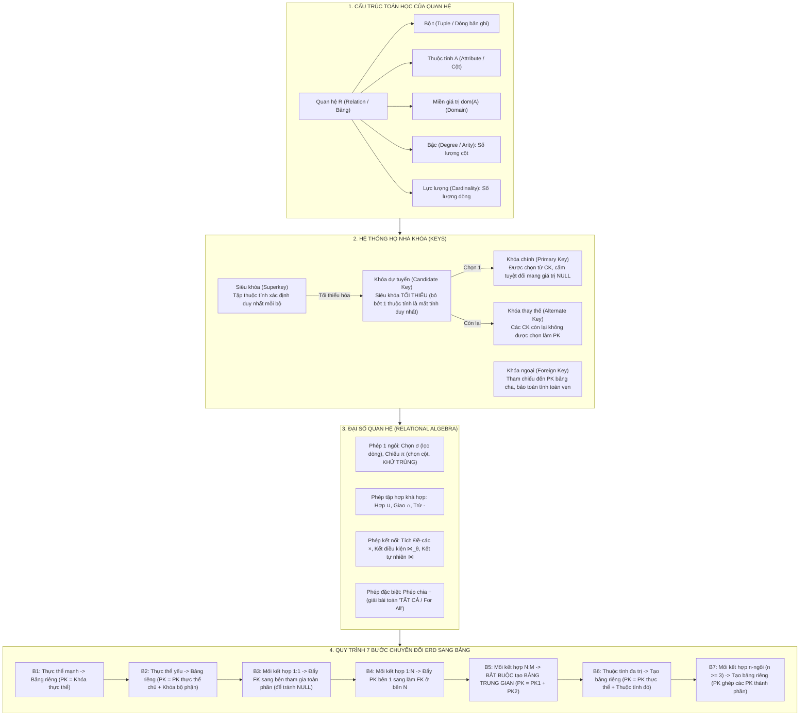
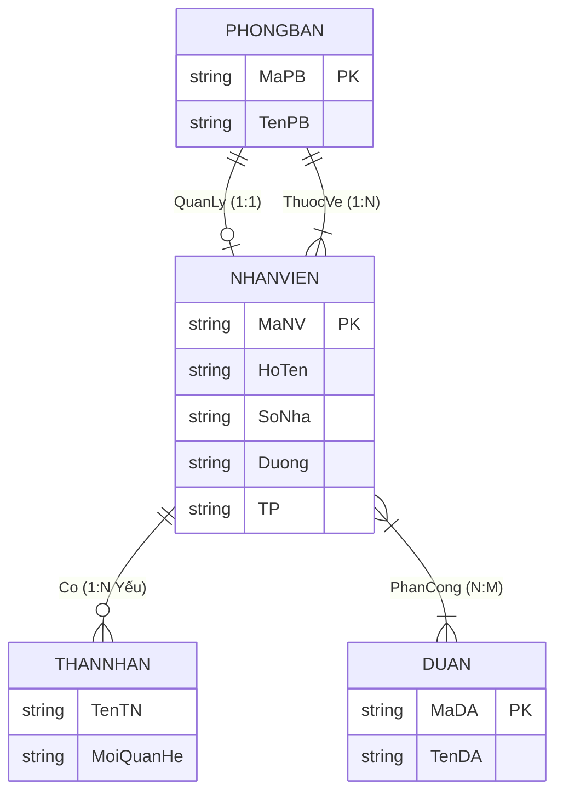

# CẨM NANG ÔN THI CẤP TỐC HỆ CƠ SỞ DỮ LIỆU
# CHƯƠNG 2: MÔ HÌNH DỮ LIỆU QUAN HỆ, ĐẠI SỐ QUAN HỆ & QUY TRÌNH 7 BƯỚC CHUYỂN ĐỔI ERD

> **Môn học**: Hệ Cơ sở Dữ liệu (Database Systems)  
> **Chương**: Chương 2 — Mô hình Quan hệ (Relational Model), Đại số Quan hệ & Chuyển đổi ERD  
> **Mục tiêu**: Làm chủ 100% bản chất toán học của cấu trúc quan hệ, phân biệt chính xác họ nhà Khóa, giải quyết triệt để các bài toán Đại số quan hệ ($\sigma, \pi, \bowtie, \div$) và thành thạo Quy trình vàng 7 bước chuyển đổi ERD sang bảng quan hệ.

---

## PHẦN I. BẢN ĐỒ KHÁI NIỆM CỐT LÕI (MINDMAP)



---

## PHẦN II. TÓM TẮT LÝ THUYẾT THỰC CHIẾN (CORE THEORY)

### 1. Giải phẫu Bảng k-bộ & Định nghĩa Toán học

Mô hình dữ liệu quan hệ được **E.F. Codd** đề xuất năm **1970/1971**, đặt nền tảng dựa trên **lý thuyết tập hợp**.

- **Tập thuộc tính (Attributes)**: $U = \{A_1, A_2, \dots, A_n\}$. Mỗi $A_i$ có một miền giá trị $\text{dom}(A_i)$ (Domain).
- **Tích Đề-các của các miền giá trị**: $D_1 \times D_2 \times \dots \times D_n$.
- **Quan hệ $R$ (Relation)**: Về mặt toán học, $R$ là một **tập con của tích Đề-các** các miền giá trị:
  $$R \subseteq \text{dom}(A_1) \times \text{dom}(A_2) \times \dots \times \text{dom}(A_n)$$
- **Bộ (Tuple - $t$)**: Là một phần tử $t \in R$, tương ứng với một dòng bản ghi (record).
- **Bậc của quan hệ (Degree / Arity)**: Số lượng thuộc tính (số cột) của quan hệ. Không đổi theo thời gian.
- **Lực lượng của quan hệ (Cardinality)**: Số lượng bộ (số dòng) hiện có trong quan hệ. Thay đổi liên tục khi thêm/xóa/sửa dữ liệu.

#### 4 Tính chất vàng của Quan hệ trong Mô hình Quan hệ:
1. **Các bộ là phân biệt**: Không bao giờ tồn tại hai bộ giống hệt nhau trên mọi thuộc tính (vì quan hệ là một tập hợp toán học).
2. **Thứ tự các bộ không quan trọng**: Đổi chỗ dòng 1 và dòng 2 không làm thay đổi bản chất CSDL.
3. **Thứ tự các cột không quan trọng**: Thuộc tính được nhận diện qua tên cột, không phụ thuộc vị trí đứng trước hay sau.
4. **Tính nguyên tử của giá trị (Atomic Value - Dạng chuẩn 1NF)**: Mọi ô giao giữa dòng và cột chỉ chứa duy nhất một giá trị đơn nguyên tố, không chứa mảng, danh sách hay tập hợp lặp.

---

### 2. Hệ thống "Họ Nhà Khóa" (Keys Hierarchy)

Khóa là công cụ cốt lõi để nhận diện duy nhất từng bản ghi và duy trì tính toàn vẹn:

```text
┌────────────────────────────────────────────────────────────────────────┐
│                   HỆ THỐNG PHÂN CẤP CÁC LOẠI KHÓA                      │
│                                                                        │
│   ┌──────────────────────────────────────────────────────────────┐     │
│   │  SIÊU KHÓA (SUPERKEY - K)                                    │     │
│   │  Tập thuộc tính bất kỳ phân biệt được mọi bộ trong bảng.     │     │
│   │                                                              │     │
│   │   ┌──────────────────────────────────────────────────────┐   │     │
│   │   │  KHÓA DỰ TUYỂN (CANDIDATE KEY - CK)                  │   │     │
│   │   │  Siêu khóa TỐI THIỂU: Không chứa tập con thực sự nào │   │     │
│   │   │  cũng là một siêu khóa.                              │   │     │
│   │   │                                                      │   │     │
│   │   │   ┌────────────────────┐   ┌─────────────────────┐   │   │     │
│   │   │   │ KHÓA CHÍNH (PK)    │   │ KHÓA THAY THẾ (AK)  │   │   │     │
│   │   │   │ Được chọn làm định │   │ Các CK còn lại      │   │   │     │
│   │   │   │ danh chính thức.   │   │ không được chọn     │   │   │     │
│   │   │   │ CẤM TUYỆT ĐỐI NULL │   │ làm khóa chính      │   │   │     │
│   │   │   └────────────────────┘   └─────────────────────┘   │   │     │
│   │   └──────────────────────────────────────────────────────┘   │     │
│   └──────────────────────────────────────────────────────────────┘     │
└────────────────────────────────────────────────────────────────────────┘
```

- **Siêu khóa (Superkey)**: Tập con thuộc tính $K \subseteq U$ sao cho không có 2 bộ khác nhau mà có cùng giá trị trên $K$. Ví dụ: `{MaSV}`, `{MaSV, HoTen}`, `{MaSV, NgaySinh, DiaChi}` đều là siêu khóa.
- **Khóa dự tuyển (Candidate Key)**: Là siêu khóa có tính **tối thiểu (minimality)**: Nếu bớt đi bất kỳ một thuộc tính nào thì phần còn lại không còn là siêu khóa nữa.
- **Khóa chính (Primary Key - PK)**: Được DBA/Người thiết kế chọn ra từ tập các khóa dự tuyển. Bắt buộc tuân thủ **Toàn vẹn thực thể (Entity Integrity)**: Không được phép chứa giá trị `NULL`.
- **Khóa ngoại (Foreign Key - FK)**: Tập thuộc tính của quan hệ $R_1$ tham chiếu đến khóa chính của quan hệ $R_2$. Bắt buộc tuân thủ **Toàn vẹn tham chiếu (Referential Integrity)**: Giá trị của khóa ngoại hoặc phải bằng `NULL`, hoặc phải khớp chính xác với một giá trị khóa chính đang tồn tại ở bảng $R_2$.

---

### 3. Động cơ Đại số Quan hệ (Relational Algebra)

Đại số quan hệ là một ngôn ngữ truy vấn hình thức mang tính **thủ tục (procedural)**, định nghĩa chuỗi các phép toán áp dụng trên các quan hệ để tạo ra quan hệ kết quả mới.

#### a. Các phép toán 1 ngôi (Unary Operators)
1. **Phép chọn (Select - $\sigma_{\text{điều kiện}}(R)$)**:
   - Lọc ra các **dòng (bộ)** thỏa mãn điều kiện logic.
   - Bậc kết quả giữ nguyên: $\text{deg}(\sigma(R)) = \text{deg}(R)$.
   - Lực lượng kết quả: $\text{card}(\sigma(R)) \le \text{card}(R)$.
2. **Phép chiếu (Project - $\pi_{\text{danh sách thuộc tính}}(R)$)**:
   - Chọn ra các **cột** mong muốn từ quan hệ $R$.
   - ⚠️ **ĐẶC ĐIỂM SỐNG CÒN**: Trong lý thuyết đại số quan hệ, **phép chiếu luôn tự động loại bỏ các bộ trùng lặp (Duplicate Elimination)**!
   - Bậc kết quả bằng số thuộc tính chiếu.
3. **Phép đổi tên (Rename - $\rho_{S}(R)$ hoặc $\rho_{S(B_1, \dots, B_n)}(R)$)**:
   - Đổi tên quan hệ và/hoặc tên các thuộc tính để tránh nhập nhằng khi tự kết nối (Self-join).

#### b. Các phép toán tập hợp (Set Operators)
> ⚠️ **Điều kiện tiên quyết**: Hai quan hệ $R$ và $S$ phải **Khả hợp (Union-compatible)**:
> 1. Có cùng bậc (cùng số lượng thuộc tính: $n = m$).
> 2. Miền giá trị của các thuộc tính tương ứng theo thứ tự phải tương thích: $\text{dom}(A_i) = \text{dom}(B_i)$ với mọi $i$.

1. **Phép hợp (Union - $R \cup S$)**: Tập các bộ thuộc về $R$ hoặc thuộc về $S$ hoặc cả hai (tự khử trùng lặp).
2. **Phép giao (Intersection - $R \cap S$)**: Tập các bộ vừa thuộc $R$, vừa thuộc $S$. Công thức tương đương: $R \cap S = R - (R - S)$.
3. **Phép trừ (Difference / Except - $R - S$)**: Tập các bộ thuộc $R$ nhưng không thuộc $S$. Lưu ý: $R - S \neq S - R$.

#### c. Các phép toán kết nối (Join Operators)
1. **Phép tích Đề-các (Cartesian Product - $R \times S$)**:
   - Ghép từng bộ của $R$ với mọi bộ của $S$.
   - Bậc: $\text{deg}(R \times S) = \text{deg}(R) + \text{deg}(S)$.
   - Lực lượng: $\text{card}(R \times S) = \text{card}(R) \times \text{card}(S)$.
2. **Phép kết có điều kiện (Theta Join - $R \bowtie_{\theta} S$)**:
   - Là phép tích Đề-các đi kèm một điều kiện lọc $\theta$: $R \bowtie_{\theta} S = \sigma_{\theta}(R \times S)$.
3. **Phép kết tự nhiên (Natural Join - $R \bowtie S$)**:
   - Tự động so khớp bằng trên **tất cả các thuộc tính có cùng tên** giữa $R$ và $S$, đồng thời **chỉ giữ lại 1 bản sao** của thuộc tính trùng tên đó trong kết quả.
4. **Phép kết ngoài (Outer Joins)**:
   - Trái ($R \leftouterjoin S$): Giữ lại tất cả các dòng của $R$, dòng nào không khớp với $S$ thì điền `NULL`.
   - Phải ($R \rightouterjoin S$): Giữ lại tất cả các dòng của $S$.
   - Đầy đủ ($R \fullouterjoin S$): Giữ lại toàn bộ dòng của cả $R$ và $S$.

#### d. Phép toán đặc biệt: Phép chia (Division - $R \div S$)
- Ứng dụng để trả lời các câu hỏi chứa mệnh đề phổ quát **"TẤT CẢ" (FOR ALL)**.
- Cho quan hệ $R(A, B)$ và $S(B)$. Phép chia $R \div S$ cho ra quan hệ $T(A)$ gồm các giá trị $a$ sao cho với **mọi** giá trị $b \in S$, cặp $(a, b)$ đều xuất hiện trong $R$.

---

### 4. Quy Trình Vàng 7 Bước Chuyển Đổi ERD Sang Mô Hình Quan Hệ

Quy trình chuẩn kỹ thuật để chuyển đổi từ mô hình thực thể liên kết (ERD) sang tập các bảng quan hệ:

| Bước | Thành phần trên ERD | Quy tắc Chuyển đổi sang Bảng Quan hệ | Khóa chính (PK) & Khóa ngoại (FK) |
| :---: | :--- | :--- | :--- |
| **1** | **Tập Thực thể Mạnh** | Tạo 1 bảng độc lập tương ứng, lấy tất cả các thuộc tính đơn. Với thuộc tính tổng hợp (Họ tên), chỉ lấy các thành phần nguyên tố (Họ, Tên). | $\text{PK} =$ Thuộc tính khóa của thực thể. |
| **2** | **Tập Thực thể Yếu (Weak Entity)** | Tạo 1 bảng riêng. Lấy tất cả thuộc tính đơn của thực thể yếu + **lấy Khóa chính của thực thể chủ (Owner Entity)** đưa sang làm Khóa ngoại. | $\text{PK} =$ [PK thực thể chủ] + [Khóa bộ phận của thực thể yếu]. |
| **3** | **Mối kết hợp 1 : 1** | **Cách tốt nhất**: Lấy PK của thực thể bên tham gia bộ phận (tùy chọn) đưa sang làm **Khóa ngoại (FK)** ở bên tham gia toàn phần (bắt buộc) để **hạn chế tối đa ô bị NULL**. Đưa cả thuộc tính của mối kết hợp (nếu có) sang bên này. | Bổ sung thêm ràng buộc `UNIQUE` cho cột khóa ngoại này. |
| **4** | **Mối kết hợp 1 : N** | Lấy PK của thực thể bên **$1$** (bên cha) đưa sang làm **Khóa ngoại (FK)** ở bảng bên **$N$** (bên con). Đưa thuộc tính của mối kết hợp vào bảng bên $N$. | Bảng bên $N$ có thêm 1 cột FK trỏ về PK bảng bên $1$. |
| **5** | **Mối kết hợp N : M** | **BẮT BUỘC tạo một BẢNG TRUNG GIAN mới**. Đưa PK của 2 thực thể tham gia sang làm 2 Khóa ngoại. Đưa thuộc tính của mối kết hợp vào bảng này. | $\text{PK} =$ Tổ hợp cả 2 khóa ngoại [PK1, PK2]. |
| **6** | **Thuộc tính Đa trị** *(VD: `SoDienThoai`)* | **BẮT BUỘC tách thành một bảng mới**. Bảng gồm: PK của thực thể sở hữu (làm FK) + Thuộc tính đa trị đó. | $\text{PK} =$ Cả 2 cột ghép lại: [PK_ThựcThể, ThuộcTínhĐaTrị]. |
| **7** | **Mối kết hợp $n$-ngôi** *($n \ge 3$)* | Tạo một bảng trung gian mới. Đưa PK của tất cả $n$ thực thể tham gia vào làm các khóa ngoại. | $\text{PK} =$ Thường là tổ hợp tất cả các PK thành phần (trừ khi có ràng buộc cardinality đặc thù). |

---

## PHẦN III. TRỌNG TÂM RA THI & BẪY KINH ĐIỂN (TRAP BUSTERS)

Dưới đây là 6 bẫy "sát thủ" được trích xuất trực tiếp từ 2 bộ đề thi bẫy [`tong-hop-2-de-thi-bay-chuong-2-co-so-du-lieu.md`](file:///d:/TT%20HCM/tong-hop-2-de-thi-bay-chuong-2-co-so-du-lieu.md):

### 🎯 Bẫy 1: Phép Chiếu ($\pi$) tự động khử trùng lặp
- ⚠️ **Hiện tượng sập bẫy**: Quan hệ $R$ có 100 dòng sinh viên, trong đó có 40 sinh viên quê ở Hà Nội, 30 ở Đà Nẵng, 30 ở TP.HCM. Đề hỏi: *"Lực lượng của kết quả phép chiếu $\pi_{\text{QueQuan}}(R)$ là bao nhiêu?"*
  - Rất nhiều bạn nhanh nhảu trả lời: 100 dòng!
- ❌ **Sai lầm**: Nhầm lẫn phép chiếu đại số quan hệ toán học với câu lệnh `SELECT QueQuan FROM R` trong SQL (SQL mặc định không khử trùng lặp nếu không có chữ `DISTINCT`).
- 🎯 **Bản chất**: Trong Đại số quan hệ toán học, quan hệ là **tập hợp**, mà tập hợp thì **không chứa phần tử lặp**.
- 💡 **Mẹo 15 giây**: Kết quả chỉ còn đúng **3 dòng** (`Hà Nội`, `Đà Nẵng`, `TP.HCM`)! Thấy $\pi$ chiếu trên cột không phải khóa $\longrightarrow$ Lực lượng luôn $\le$ ban đầu!

### 🎯 Bẫy 2: Nhầm lẫn bản chất giữa Siêu khóa và Khóa dự tuyển
- ⚠️ **Hiện tượng sập bẫy**: Đề hỏi: *"Khẳng định nào sau đây là ĐÚNG?"*
  - A. Mọi siêu khóa đều là khóa dự tuyển.
  - B. Mọi khóa dự tuyển đều là siêu khóa. *(ĐÁP ÁN ĐÚNG)*
  - C. Khóa dự tuyển có thể chứa giá trị NULL.
  - D. Khóa chính không phải là khóa dự tuyển.
- ❌ **Sai lầm**: Nhầm thứ tự bao hàm.
- 💡 **Mẹo 15 giây**: Nhớ câu thần chú: **"Khóa dự tuyển là Siêu khóa tối thiểu"**. Vậy tập Siêu khóa là cha, Khóa dự tuyển là con $\longrightarrow$ Mọi Khóa dự tuyển đều là Siêu khóa, nhưng chiều ngược lại là SAI!

### 🎯 Bẫy 3: Điều kiện Khả hợp (Union-compatible) của các phép toán tập hợp
- ⚠️ **Hiện tượng sập bẫy**: Có hai bảng $R(A, B)$ và $S(C, D)$. Đề hỏi: *"Điều kiện để thực hiện được phép toán $R \cup S$ là gì?"*
  - Thí sinh chọn nhầm: "Các thuộc tính của $R$ và $S$ bắt buộc phải cùng tên ($A=C, B=D$)".
- ❌ **Sai lầm**: Nhầm lẫn giữa *cùng tên* và *cùng miền giá trị*.
- 🎯 **Bản chất**: Phép hợp/giao/trừ **KHÔNG YÊU CẦU CÙNG TÊN THUỘC TÍNH**. Chỉ yêu cầu cùng bậc (số cột bằng nhau) và miền giá trị của cột tương ứng phải tương thích ($\text{dom}(A) = \text{dom}(C)$ và $\text{dom}(B) = \text{dom}(D)$).
- 💡 **Mẹo 15 giây**: Bảng `GiaoVien(MaGV, TenGV)` và `SinhVien(MaSV, HoTen)` hoàn toàn hợp được với nhau vì cùng là (Chuỗi, Chuỗi), dù tên cột khác nhau!

### 🎯 Bẫy 4: Vị trí đặt Khóa ngoại trong Mối kết hợp 1 : 1
- ⚠️ **Hiện tượng sập bẫy**: Thực thể `NhanVien` có liên kết $1:1$ với `XeCong`. Mỗi nhân viên *có thể có hoặc không có* xe công (tham gia bộ phận - partial), nhưng mỗi xe công *bắt buộc phải có* đúng một nhân viên quản lý (tham gia toàn phần - total). Đề hỏi: *"Nên đặt khóa ngoại ở bảng nào?"*
- ❌ **Sai lầm**: Đặt khóa ngoại ở bảng `NhanVien`. Hậu quả: Đa số nhân viên không có xe công nên cột `MaXe` trong bảng `NhanVien` sẽ bị tràn ngập giá trị `NULL`, gây lãng phí bộ nhớ và khó truy vấn.
- 💡 **Mẹo 15 giây**: Quy tắc tránh NULL cho quan hệ 1:1: **Đẩy khóa ngoại sang bảng nào tham gia BẮT BUỘC (Toàn phần)**. Ở đây, đặt `MaNV` làm khóa ngoại ở bảng `XeCong`, đảm bảo 100% dòng xe công đều có mã nhân viên, không dòng nào bị NULL!

### 🎯 Bẫy 5: Nhận diện biểu thức Phép Chia ($\div$) trong bài toán thực tế
- ⚠️ **Hiện tượng sập bẫy**: Đề cho câu hỏi nghiệp vụ: *"Tìm các khách hàng đã mua TẤT CẢ các sản phẩm do công ty SamSung sản xuất."* Đề hỏi dùng phép toán nào ngắn nhất?
- 💡 **Mẹo 15 giây**: Thấy chữ **"TẤT CẢ" (ALL / EVERY)** gắn liền với việc so khớp trọn bộ một tập danh sách con $\longrightarrow$ Chọn ngay **PHÉP CHIA ($\div$)**.

### 🎯 Bẫy 6: Khóa chính của Thực thể Yếu sau khi chuyển đổi
- ⚠️ **Hiện tượng sập bẫy**: Thực thể yếu `NguoiPhuThuoc` có khóa bộ phận là `TenNPT`, liên kết với thực thể chủ `NhanVien(MaNV)`. Đề hỏi: *"Khóa chính của bảng NguoiPhuThuoc sau khi chuyển đổi là gì?"*
  - A. `TenNPT`
  - B. `MaNV`
  - C. Cặp thuộc tính `(MaNV, TenNPT)` *(ĐÁP ÁN ĐÚNG)*
- ❌ **Sai lầm**: Chọn chỉ `TenNPT` (vì hai nhân viên khác nhau hoàn toàn có thể có người phụ thuộc trùng tên nhau, ví dụ cùng có con tên "An", nên một mình `TenNPT` không thể đảm bảo tính duy nhất).
- 💡 **Mẹo 15 giây**: Thực thể yếu sinh ra không tự đứng một mình được, khóa chính của nó **luôn luôn là khóa ghép gồm: [Khóa của chủ] + [Khóa bộ phận]**!

---

## PHẦN IV. VÍ DỤ TRỰC QUAN TỪNG BƯỚC (STEP-BY-STEP WALKTHROUGH)

### 1. Ví dụ Thực hành Đại số Quan hệ trên Dữ liệu Cụ thể

Cho 2 quan hệ $R$ và $S$ như sau:

#### Bảng $R$:
| A | B | C |
| :-: | :-: | :-: |
| 1 | 2 | 3 |
| 4 | 5 | 6 |
| 1 | 2 | 4 |

#### Bảng $S$:
| B | C | D |
| :-: | :-: | :-: |
| 2 | 3 | 7 |
| 5 | 8 | 9 |

---

#### a. Phép chọn: $\sigma_{A=1}(R)$
- **Mục tiêu**: Lọc các dòng có $A = 1$.
- **Kết quả**:
  | A | B | C |
  | :-: | :-: | :-: |
  | 1 | 2 | 3 |
  | 1 | 2 | 4 |

---

#### b. Phép chiếu: $\pi_{A, B}(R)$
- **Mục tiêu**: Chọn cột $A$ và $B$, **tự động khử trùng lặp**.
- Dòng 1 cho cặp `(1, 2)`. Dòng 2 cho cặp `(4, 5)`. Dòng 3 cũng cho cặp `(1, 2)` (bị trùng với dòng 1 nên bị loại bỏ).
- **Kết quả** (chỉ còn đúng 2 dòng):
  | A | B |
  | :-: | :-: |
  | 1 | 2 |
  | 4 | 5 |

---

#### c. Phép kết tự nhiên: $R \bowtie S$
- **Mục tiêu**: Thuộc tính chung giữa $R(A, B, C)$ và $S(B, C, D)$ là cặp $(B, C)$. Ta tìm các dòng có cùng giá trị $(B, C)$ ở cả 2 bảng.
- So sánh:
  - Dòng 1 của $R$ có $(B=2, C=3)$, khớp với dòng 1 của $S$ có $(B=2, C=3) \longrightarrow$ Ghép thành `(A=1, B=2, C=3, D=7)`.
  - Dòng 2 của $R$ có $(B=5, C=6)$, không khớp dòng nào của $S$.
  - Dòng 3 của $R$ có $(B=2, C=4)$, không khớp dòng nào của $S$.
- **Kết quả** (gồm 4 cột, chỉ có 1 dòng):
  | A | B | C | D |
  | :-: | :-: | :-: | :-: |
  | 1 | 2 | 3 | 7 |

---

### 2. Ví dụ Toàn diện: Chuyển đổi Sơ đồ ERD Quản lý Dự án sang Quan hệ

Xét bài toán ERD công ty gồm:
- Thực thể mạnh `PHONGBAN`: có `MaPB` (khóa), `TenPB`.
- Thực thể mạnh `NHANVIEN`: có `MaNV` (khóa), `HoTen`, `DiaChi` (thuộc tính tổng hợp: `SoNha`, `Duong`, `TP`), thuộc tính đa trị `SDT`.
- Thực thể yếu `THANNHAN`: có khóa bộ phận `TenTN`, `MoiQuanHe`. Phụ thuộc vào `NHANVIEN`.
- Thực thể mạnh `DUAN`: có `MaDA` (khóa), `TenDA`.
- Mối kết hợp:
  - `QuanLy` ($1 : 1$): 1 nhân viên quản lý tối đa 1 phòng ban (tham gia bộ phận), 1 phòng ban bắt buộc có 1 trưởng phòng (tham gia toàn phần). Có thuộc tính `NgayNhamChuc`.
  - `PhanCong` ($N : M$): Nhân viên tham gia dự án, có thuộc tính `SoGio`.



---

#### Áp dụng 7 bước chuyển đổi:

##### 1. Chuyển thực thể mạnh `DUAN` (Bước 1):
$$\mathbf{DUAN}(\underline{\text{MaDA}}, \text{TenDA})$$

##### 2. Chuyển thực thể mạnh `NHANVIEN` (Bước 1 + Tách thuộc tính tổng hợp):
$$\mathbf{NHANVIEN}(\underline{\text{MaNV}}, \text{HoTen}, \text{SoNha}, \text{Duong}, \text{TP}, \text{MaPB})$$
*(Lưu ý: Cột `MaPB` là khóa ngoại từ liên kết 1:N `ThuocVe` được kéo sang theo Bước 4)*.

##### 3. Chuyển thực thể mạnh `PHONGBAN` & Liên kết 1:1 `QuanLy` (Bước 1 + Bước 3):
- Vì phòng ban tham gia bắt buộc phải có trưởng phòng, ta đẩy `MaNV` (Trưởng phòng) và `NgayNhamChuc` sang bảng `PHONGBAN`:
$$\mathbf{PHONGBAN}(\underline{\text{MaPB}}, \text{TenPB}, \text{MaNV\_TruongPhong}, \text{NgayNhamChuc})$$
*(Trong đó: `MaNV_TruongPhong` là Khóa ngoại trỏ về `NHANVIEN(MaNV)` và có ràng buộc `UNIQUE`)*.

##### 4. Chuyển thực thể yếu `THANNHAN` (Bước 2):
- Lấy khóa chính của thực thể chủ (`MaNV`) ghép với khóa bộ phận (`TenTN`):
$$\mathbf{THANNHAN}(\underline{\text{MaNV}, \text{TenTN}}, \text{MoiQuanHe})$$
*(Khóa chính là cặp `(MaNV, TenTN)`, trong đó `MaNV` đồng thời là Khóa ngoại trỏ về `NHANVIEN`)*.

##### 5. Chuyển mối kết hợp N:M `PhanCong` (Bước 5):
- Bắt buộc tạo bảng mới `PHANCONG`, lấy khóa chính của 2 bảng ghép lại:
$$\mathbf{PHANCONG}(\underline{\text{MaNV}, \text{MaDA}}, \text{SoGio})$$
*(Khóa chính là cặp `(MaNV, MaDA)`. Cả 2 đều là Khóa ngoại)*.

##### 6. Chuyển thuộc tính đa trị `SDT` của `NHANVIEN` (Bước 6):
- Bắt buộc tách thành bảng mới:
$$\mathbf{NV\_SDT}(\underline{\text{MaNV}, \text{SDT}})$$

---

## PHẦN V. BẢNG TRA CỨU CỨU SINH TRƯỚC GIỜ THI (CHEAT SHEET)

| Khái niệm / Tình huống | Từ khóa Cốt lõi / Công thức | Bẫy Cần Tránh |
| :--- | :--- | :--- |
| **Bậc (Degree)** | **Số lượng cột (Thuộc tính)** | Không nhầm với Lực lượng. Cố định không đổi. |
| **Lực lượng (Cardinality)** | **Số lượng dòng (Bộ / Tuples)** | Biến thiên khi INSERT/DELETE. |
| **Phép chọn ($\sigma$)** | Lọc **DÒNG** thỏa điều kiện | Không làm thay đổi số lượng cột. |
| **Phép chiếu ($\pi$)** | Lọc **CỘT** & **TỰ ĐỘNG KHỬ TRÙNG LẶP** | Kết quả luôn có số dòng $\le$ bảng ban đầu. |
| **Tích Đề-các ($R \times S$)** | $\text{deg} = n + m$, $\text{card} = r \times s$ | Dòng nhân dòng, cột cộng cột. |
| **Khả hợp (Union-compatible)** | **Cùng bậc + Cùng miền giá trị tương ứng** | Không đòi hỏi thuộc tính phải cùng tên! |
| **Phép chia ($R \div S$)** | Xử lý bài toán **"TẤT CẢ" (FOR ALL)** | Tìm $X$ có quan hệ với toàn bộ các phần tử của $S$. |
| **Siêu khóa vs Khóa dự tuyển** | CK là Siêu khóa **Tối thiểu** | Mọi CK là Siêu khóa. Chiều ngược lại SAI. |
| **Khóa chính (PK)** | Thuộc tính định danh, **CẤM NULL** | Vi phạm nếu mang giá trị NULL (Toàn vẹn thực thể). |
| **Khóa ngoại (FK)** | Trỏ về PK bảng cha, **ĐƯỢC PHÉP NULL** | Nếu không NULL thì phải khớp 100% với PK bảng cha. |
| **ERD: Thực thể yếu** | Hình chữ nhật **viền đôi**, khóa gạch **đứt** | Khóa chính sau chuyển đổi = PK chủ + Khóa bộ phận. |
| **ERD: Liên kết 1:1** | Đẩy FK sang bên **Toàn phần (bắt buộc)** | Để triệt tiêu tối đa các ô mang giá trị NULL. |
| **ERD: Liên kết 1:N** | Khóa ngoại luôn nằm ở **BÊN N** | Đưa PK của bên 1 sang làm FK ở bên N. |
| **ERD: Liên kết N:M** | **BẮT BUỘC TẠO BẢNG TRUNG GIAN** | PK bảng trung gian = Cặp [PK1, PK2]. |
| **ERD: Thuộc tính đa trị** | **BẮT BUỘC TẠO BẢNG RIÊNG** | PK bảng riêng = [PK thực thể + Thuộc tính đó]. |
