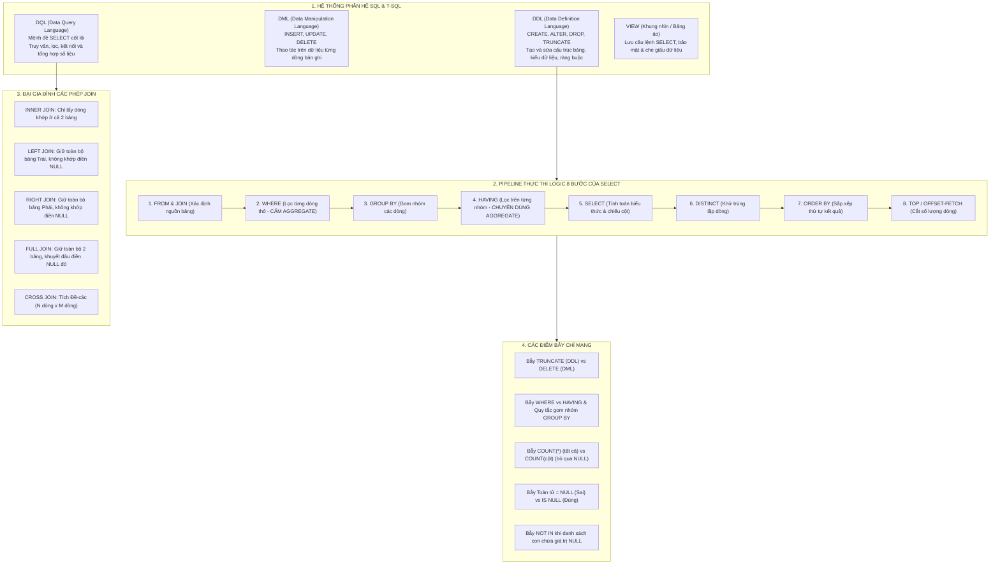

# CẨM NANG ÔN THI CẤP TỐC HỆ CƠ SỞ DỮ LIỆU
# CHƯƠNG 3: NGÔN NGỮ TRUY VẤN SQL (T-SQL, DDL, DML, DQL & BÀI TẬP QLBANHANG)

> **Môn học**: Hệ Cơ sở Dữ liệu (Database Systems)  
> **Chương**: Chương 3 — Ngôn ngữ SQL (Structured Query Language / T-SQL)  
> **Mục tiêu**: Làm chủ toàn diện các phân hệ DDL, DML, DQL; nắm chắc thứ tự thực thi logic 8 bước của câu lệnh `SELECT`; bẻ khóa các bẫy gom nhóm, bẫy giá trị `NULL`, bẫy các phép `JOIN`, bẫy truy vấn lồng `NOT IN` và giải quyết trọn vẹn các bài toán CSDL Quản Lý Bán Hàng.

---

## PHẦN I. BẢN ĐỒ KHÁI NIỆM CỐT LÕI (MINDMAP)



---

## PHẦN II. TÓM TẮT LÝ THUYẾT THỰC CHIẾN (CORE THEORY)

### 1. Phân loại 3 Phân Hệ Ngôn Ngữ & Kiểu Dữ Liệu T-SQL

| Phân hệ | Tên đầy đủ | Lệnh tiêu biểu | Đặc điểm thi cử cần nhớ |
| :--- | :--- | :--- | :--- |
| **DDL** | Data Definition Language | `CREATE`, `ALTER`, `DROP`, `TRUNCATE` | Tác động lên **cấu trúc** đối tượng; `TRUNCATE` thuộc DDL (giải phóng trang, reset `IDENTITY`, cấm xóa nếu có FK trỏ tới). |
| **DML** | Data Manipulation Language | `INSERT`, `UPDATE`, `DELETE` | Tác động lên **dữ liệu dòng**; `DELETE` thuộc DML (xóa từng dòng, ghi log đầy đủ, dùng được `WHERE`, kích hoạt trigger). |
| **DQL** | Data Query Language | `SELECT` | Truy vấn và trích xuất thông tin mà không làm thay đổi dữ liệu gốc trong bảng. |

#### Hệ thống kiểu dữ liệu T-SQL thường gặp:
- **Số nguyên**: `TINYINT` (1 byte, không dấu: $0 \to 255$, **cấm số âm**), `SMALLINT` (2 bytes: $-32.768 \to 32.767$), `INT` (4 bytes: $\approx \pm 2$ tỷ), `BIGINT` (8 bytes).
- **Số thực**: `FLOAT`, `DECIMAL(p, s)` hoặc `NUMERIC(p, s)` ($p$: tổng số chữ số, $s$: số chữ số thập phân sau dấu phẩy).
- **Chuỗi ký tự Non-Unicode (1 byte/ký tự, tối đa 8000)**:
  - `CHAR(n)`: Độ dài cố định, tự chèn khoảng trắng cho đủ $n$.
  - `VARCHAR(n)`: Độ dài biến đổi linh hoạt theo chuỗi thực tế.
- **Chuỗi ký tự Unicode (2 bytes/ký tự, hỗ trợ tiếng Việt có dấu, tối đa 4000)**:
  - `NCHAR(n)`: Cố định Unicode.
  - `NVARCHAR(n)`: Biến đổi Unicode (khi gán hằng chuỗi bắt buộc có tiền tố **$N$**, ví dụ: `N'Nguyễn Văn A'`).
- **Thời gian**: `DATETIME` (độ chính xác $3.33\text{ ms}$), `SMALLDATETIME` (chính xác đến phút).
- **Logic**: `BIT` (chỉ nhận giá trị `0`, `1` hoặc `NULL`).

---

### 2. Định Nghĩa DDL & 6 Ràng Buộc Toàn Vẹn Cốt Lõi

Cú pháp tạo bảng chuẩn mực kèm 6 loại ràng buộc:

```sql
CREATE TABLE SINHVIEN (
    MaSV        VARCHAR(10)     NOT NULL,
    HoTen       NVARCHAR(50)    NOT NULL,
    NgaySinh    DATETIME        NULL,
    GioiTinh    BIT             DEFAULT 1,                          -- 1: DEFAULT
    DiemTB      NUMERIC(4, 2)   NULL,
    Email       VARCHAR(100)    NULL,
    MaLop       VARCHAR(10)     NOT NULL,

    CONSTRAINT PK_SinhVien PRIMARY KEY (MaSV),                      -- 2: PRIMARY KEY
    CONSTRAINT UQ_Email UNIQUE (Email),                             -- 3: UNIQUE
    CONSTRAINT CK_DiemTB CHECK (DiemTB >= 0.0 AND DiemTB <= 10.0),  -- 4: CHECK
    CONSTRAINT FK_SV_Lop FOREIGN KEY (MaLop) REFERENCES LOP(MaLop)  -- 5: FOREIGN KEY
        ON DELETE CASCADE                                           -- Xóa cha thì con tự xóa
        ON UPDATE CASCADE                                           -- Đổi mã cha thì con tự đổi
);
```

#### Phân biệt PRIMARY KEY vs UNIQUE:
| Tiêu chí | `PRIMARY KEY` | `UNIQUE` |
| :--- | :--- | :--- |
| **Số lượng trên 1 bảng** | **Chỉ có DUY NHẤT 1** khóa chính. | Có thể có **NHIỀU** ràng buộc UNIQUE. |
| **Chấp nhận giá trị `NULL`** | **CẤM TUYỆT ĐỐI** (`NOT NULL`). | Trong SQL Server, cho phép **tối đa 1 ô NULL**. |
| **Loại chỉ mục mặc định** | Tạo `CLUSTERED INDEX` (Chỉ mục cụm). | Tạo `NON-CLUSTERED INDEX` (Chỉ mục không cụm). |

---

### 3. Pipeline Thực Thi Logic 8 Bước của Câu Lệnh `SELECT`

> ⚠️ **BÍ MẬT SỐ 1 CỦA ĐỀ THI**: Thứ tự viết trong mã nguồn khác hoàn toàn với **thứ tự biên dịch và thực thi logic** của RDBMS!

$$\begin{aligned}
\text{Thứ tự VIẾT:} \quad &\mathbf{SELECT} \to \mathbf{FROM} \to \mathbf{WHERE} \to \mathbf{GROUP\ BY} \to \mathbf{HAVING} \to \mathbf{ORDER\ BY} \\
\text{Thứ tự CHẠY:} \quad &\mathbf{FROM} \to \mathbf{WHERE} \to \mathbf{GROUP\ BY} \to \mathbf{HAVING} \to \mathbf{SELECT} \to \mathbf{DISTINCT} \to \mathbf{ORDER\ BY} \to \mathbf{TOP}
\end{aligned}$$

#### Chi tiết 8 bước thực thi:
1. `FROM & JOIN`: Nạp các bảng vào bộ nhớ, tính toán tích Đề-các và áp dụng điều kiện kết nối `ON`.
2. `WHERE`: **Lọc từng dòng thô (Row-level filter)** trước khi gom nhóm.
   - ❌ **CẤM DÙNG HÀM GOM NHÓM** (`SUM`, `COUNT`, `AVG`, `MIN`, `MAX`) ở mệnh đề `WHERE` vì lúc này nhóm chưa được hình thành!
3. `GROUP BY`: Gom các dòng có cùng giá trị trên các cột được chỉ định thành một nhóm.
   - ⚠️ **QUY TẮC SỐNG CÒN**: Mọi cột xuất hiện ở `SELECT` mà **không nằm trong hàm gom nhóm** thì **BẮT BUỘC PHẢI XUẤT HIỆN** trong mệnh đề `GROUP BY`!
4. `HAVING`: **Lọc trên từng nhóm (Group-level filter)** sau khi đã gom nhóm.
   - Chuyên dùng điều kiện chứa hàm gom nhóm (ví dụ: `HAVING COUNT(*) >= 5`).
5. `SELECT`: Tính toán các biểu thức số học, gọi các hàm gom nhóm và chiếu ra các cột mong muốn.
6. `DISTINCT`: Khử bỏ các dòng kết quả trùng lặp.
7. `ORDER BY`: Sắp xếp dòng kết quả (`ASC`: tăng dần mặc định, `DESC`: giảm dần). Lúc này có thể dùng bí danh (Alias) đã đặt ở `SELECT`!
8. `TOP / OFFSET-FETCH`: Cắt lấy $N$ dòng đầu tiên của kết quả cuối cùng.

---

### 4. Bản Chất Các Phép JOIN trong SQL

Cho 2 bảng: $A$ (bảng Trái) và $B$ (bảng Phải):

```text
       INNER JOIN                      LEFT JOIN
      ┌─────────┐                     ┌─────────┐
    ┌─┼───┐     │                   ┌─┼───┐     │
    │ █ █ │     │                   │ █ █ │     │
    │ █ █ █ █ █ │                   │ █ █ █ █ █ │
    │   │ █ █ █ │                   │ █ █ │     │
    └───┼─┘     │                   └───┼─┘     │
        └───────┘                       └───────┘
     Chỉ lấy phần giao                Lấy hết Trái,
                                   khuyết Phải điền NULL

       RIGHT JOIN                      FULL JOIN
      ┌─────────┐                     ┌─────────┐
      │     ┌───┼─┐                 ┌─┼───┐     │
      │     │ █ █ │                 │ █ █ │ █ █ │
      │   █ █ █ █ │                 │ █ █ █ █ █ │
      │     │ █ █ │                 │ █ █ │ █ █ │
      │     └───┼─┘                 └───┼─┘     │
      └─────────┘                       └───────┘
     Lấy hết Phải,                    Lấy sạch cả hai,
  khuyết Trái điền NULL             khuyết đâu điền NULL
```

- **CROSS JOIN**: Tích Đề-các. Bảng $A$ có 5 dòng, bảng $B$ có 4 dòng $\rightarrow$ Kết quả có đúng $5 \times 4 = 20$ dòng.

---

### 5. Khung Nhìn (View) — Bảng Ảo

- **Định nghĩa**: View là một **bảng ảo (Virtual Table)** có cấu trúc gồm các cột và dòng giống hệt bảng thật, nhưng **không chiếm không gian lưu trữ dữ liệu trên đĩa**. View chỉ lưu câu lệnh `SELECT` định nghĩa trong System Catalog.
- **Cú pháp**:
  ```sql
  CREATE VIEW V_SinhVienGioi AS
  SELECT MaSV, HoTen, DiemTB, MaLop
  FROM SINHVIEN
  WHERE DiemTB >= 8.0;
  ```
- **3 Lợi ích vàng của View**:
  1. **Bảo mật dữ liệu**: Che giấu các cột nhạy cảm (Lương, Mật khẩu) hoặc chỉ cho xem dữ liệu thuộc phòng ban của họ.
  2. **Đơn giản hóa câu lệnh**: Đóng gói các câu truy vấn phức tạp (kết nối 4 - 5 bảng) thành một View đơn giản để người dùng chỉ cần `SELECT * FROM TenView`.
  3. **Độc lập dữ liệu logic**: Khi cấu trúc bảng bên dưới thay đổi (ví dụ: tách 1 bảng thành 2 bảng), DBA chỉ cần cập nhật lại câu lệnh trong View mà không làm hỏng ứng dụng của người dùng.

---

## PHẦN III. TRỌNG TÂM RA THI & BẪY KINH ĐIỂN (TRAP BUSTERS)

Trích xuất trực tiếp từ 2 bộ đề thi bẫy [`tong-hop-2-de-thi-bay-chuong-3-co-so-du-lieu.md`](file:///d:/TT%20HCM/tong-hop-2-de-thi-bay-chuong-3-co-so-du-lieu.md):

### 🎯 Bẫy 1: TRUNCATE TABLE vs DELETE
- ⚠️ **Hiện tượng sập bẫy**: Đề hỏi: *"Lệnh nào sau đây xóa toàn bộ dữ liệu nhưng KHÔNG kích hoạt Trigger DELETE và THIẾT LẬP LẠI giá trị cột IDENTITY về ban đầu?"*
  - A. `DELETE FROM TableName`
  - B. `TRUNCATE TABLE TableName` *(ĐÁP ÁN ĐÚNG)*
  - C. `DROP TABLE TableName`
- ❌ **Sai lầm**: Nhầm tưởng `TRUNCATE` là lệnh DML giống `DELETE`.
- 💡 **Mẹo 15 giây**:
  - `DELETE`: DML, có `WHERE`, xóa từng dòng, ghi log đầy đủ, kích hoạt Trigger, **KHÔNG reset IDENTITY**.
  - `TRUNCATE`: DDL, không `WHERE`, xóa bằng cách thu hồi Data Page (siêu nhanh), **RESET IDENTITY**, không kích hoạt Trigger, bị chặn nếu có bảng khác đặt FK trỏ tới!

### 🎯 Bẫy 2: Dùng bí danh (Alias) đặt ở SELECT tại mệnh đề WHERE
- ⚠️ **Hiện tượng sập bẫy**:
  ```sql
  SELECT DonGia * SoLuong AS ThanhTien
  FROM CTHD
  WHERE ThanhTien > 1000000; -- BÁO LỖI NGAY LẬP TỨC!
  ```
- ❌ **Nguyên nhân**: Nhìn lại **Pipeline thực thi logic**: `WHERE` chạy ở Bước 2, trong khi `SELECT` chạy ở Bước 5! Lúc `WHERE` đang chạy thì cái tên `ThanhTien` **hoàn toàn chưa tồn tại**!
- 💡 **Mẹo 15 giây**: Ở `WHERE`, bắt buộc phải viết lại biểu thức gốc: `WHERE DonGia * SoLuong > 1000000`. Chỉ có mệnh đề `ORDER BY` (chạy ở Bước 7) mới được dùng bí danh `ThanhTien`!

### 🎯 Bẫy 3: Vi phạm quy tắc vàng của cột trong `GROUP BY`
- ⚠️ **Hiện tượng sập bẫy**: Câu truy vấn sau có hợp lệ không?
  ```sql
  SELECT MaLop, HoTen, COUNT(MaSV) AS SiSo
  FROM SINHVIEN
  GROUP BY MaLop; -- LỖI BIÊN DỊCH!
  ```
- ❌ **Sai lầm**: Cột `HoTen` xuất hiện ở `SELECT` nhưng lại không nằm trong hàm gom nhóm và cũng **không có mặt trong mệnh đề GROUP BY**. Hệ thống không biết một lớp có 40 sinh viên thì phải hiển thị họ tên của ai!
- 💡 **Mẹo 15 giây**: Kiểm tra: Mọi cột không có hàm `COUNT/SUM/AVG/MIN/MAX` bọc ngoài $\longrightarrow$ **Bắt buộc phải nằm trong GROUP BY**!

### 🎯 Bẫy 4: Bẫy giá trị `NULL` trong phép toán và phép so sánh
- ⚠️ **Hiện tượng sập bẫy**:
  1. `WHERE DiemTB = NULL` $\longrightarrow$ **LUÔN SAI (Trả về rỗng)**! Mọi so sánh `=`, `<>`, `>` với NULL đều cho kết quả `UNKNOWN`.
  2. Bắt buộc phải viết: `WHERE DiemTB IS NULL` hoặc `WHERE DiemTB IS NOT NULL`.
  3. `COUNT(*)` đếm mọi dòng (kể cả dòng có chứa NULL).
  4. `COUNT(DiemTB)` **bỏ qua tất cả các dòng có DiemTB mang giá trị NULL**!
  5. Phép cộng với NULL: `100 + NULL = NULL` (không phải bằng 100). Muốn an toàn phải dùng: `ISNULL(DiemTB, 0)`.

### 🎯 Bẫy 5: Cái bẫy chết người của toán tử `NOT IN` khi có `NULL`
- ⚠️ **Hiện tượng sập bẫy**: Đề hỏi: *"Tìm các khách hàng chưa từng mua hàng bao giờ."*
  ```sql
  SELECT MaKH FROM KHACHHANG
  WHERE MaKH NOT IN (SELECT MaKH FROM HOADON);
  ```
  - Nếu bảng `HOADON` có một dòng chứa `MaKH` là `NULL` $\longrightarrow$ **Câu lệnh trên trả về KẾT QUẢ RỖNG 100%**!
- 🎯 **Bản chất**: `x NOT IN (1, 2, NULL)` tương đương `(x <> 1) AND (x <> 2) AND (x <> NULL)`. Vì `x <> NULL` luôn bằng `UNKNOWN` nên toàn bộ biểu thức logic `AND` bị kéo về `UNKNOWN/FALSE`!
- 💡 **Mẹo 15 giây**: Khi làm bài phủ định, **ƯU TIÊN DÙNG `NOT EXISTS`** thay vì `NOT IN`:
  ```sql
  WHERE NOT EXISTS (SELECT 1 FROM HOADON WHERE HOADON.MaKH = KHACHHANG.MaKH)
  ```

### 🎯 Bẫy 6: Ký tự đại diện của toán tử `LIKE`
- `%`: Đại diện cho chuỗi gồm **0 hoặc nhiều** ký tự bất kỳ.
- `_`: Đại diện cho **đúng 1 ký tự** duy nhất.
- `[A-D]`: Ký tự nằm trong khoảng từ A đến D.
- `[^A-D]`: Ký tự **không** nằm trong khoảng từ A đến D.
- 💡 **Ví dụ bẫy**: `LIKE '_A%'` nghĩa là ký tự thứ 2 bắt buộc là chữ `A`.

---

## PHẦN IV. BÀI TẬP THỰC CHIẾN CSDL QUẢN LÝ BÁN HÀNG (QLBANHANG)

### Lược đồ CSDL Chuẩn Mẫu:
- $\mathbf{KHACHHANG}(\underline{\text{MaKH}}, \text{TenKH}, \text{DiaChi}, \text{SoDT})$
- $\mathbf{SANPHAM}(\underline{\text{MaSP}}, \text{TenSP}, \text{DVT}, \text{DonGia})$
- $\mathbf{HOADON}(\underline{\text{SoHD}}, \text{NgayHD}, \text{MaKH})$
- $\mathbf{CTHD}(\underline{\text{SoHD}, \text{MaSP}}, \text{SoLuong})$

---

### Dạng 1: Truy vấn có Gom nhóm & Điều kiện HAVING
**Đề bài**: *Hiển thị mã khách hàng, tên khách hàng và tổng số hóa đơn họ đã mua, chỉ lấy những khách hàng đã mua từ 3 hóa đơn trở lên.*

```sql
SELECT 
    KH.MaKH, 
    KH.TenKH, 
    COUNT(HD.SoHD) AS TongSoHoaDon
FROM KHACHHANG KH
INNER JOIN HOADON HD ON KH.MaKH = HD.MaKH
GROUP BY 
    KH.MaKH, 
    KH.TenKH
HAVING 
    COUNT(HD.SoHD) >= 3;
```
> 🔍 **Phân tích trace**: `INNER JOIN` gom khách hàng với hóa đơn; `GROUP BY` gom theo mã và tên khách hàng; `HAVING` lọc ra nhóm có số lượng hóa đơn $\ge 3$.

---

### Dạng 2: Truy vấn Tìm Giá trị Cực đại (MAX / TOP 1)
**Đề bài**: *Tìm thông tin sản phẩm (MaSP, TenSP, DonGia) có đơn giá đắt nhất.*

**Cách 1 (Dùng Subquery - Chuẩn toán học)**:
```sql
SELECT MaSP, TenSP, DonGia
FROM SANPHAM
WHERE DonGia = (SELECT MAX(DonGia) FROM SANPHAM);
```

**Cách 2 (Dùng TOP 1 WITH TIES của T-SQL)**:
```sql
SELECT TOP 1 WITH TIES MaSP, TenSP, DonGia
FROM SANPHAM
ORDER BY DonGia DESC;
```
> 💡 *Mẹo*: Dùng `WITH TIES` để nếu có 2 sản phẩm cùng đắt nhất bằng nhau thì lấy cả 2, không bị sót!

---

### Dạng 3: Truy vấn Phủ định ("Chưa bao giờ...")
**Đề bài**: *Tìm những sản phẩm chưa từng được bán trong bất kỳ hóa đơn nào.*

```sql
-- Dùng NOT EXISTS (Khuyên dùng - Nhanh và tránh bẫy NULL)
SELECT SP.MaSP, SP.TenSP
FROM SANPHAM SP
WHERE NOT EXISTS (
    SELECT 1 
    FROM CTHD CT 
    WHERE CT.MaSP = SP.MaSP
);
```

---

### Dạng 4: Bài toán Phép Chia ("Đã mua TẤT CẢ sản phẩm")
**Đề bài**: *Tìm mã và tên những khách hàng đã mua TẤT CẢ các sản phẩm có đơn vị tính là 'Hộp'.*

```sql
SELECT KH.MaKH, KH.TenKH
FROM KHACHHANG KH
WHERE NOT EXISTS (
    -- Tập tất cả các sản phẩm có ĐVT là 'Hộp'
    SELECT SP.MaSP 
    FROM SANPHAM SP
    WHERE SP.DVT = N'Hộp'
    AND NOT EXISTS (
        -- Khách hàng này có mua sản phẩm đó không?
        SELECT 1 
        FROM HOADON HD 
        INNER JOIN CTHD CT ON HD.SoHD = CT.SoHD
        WHERE HD.MaKH = KH.MaKH AND CT.MaSP = SP.MaSP
    )
);
```
> 💡 **Bản chất**: 2 lần `NOT EXISTS` lồng nhau chính là cách viết biểu thức **Phép chia ($R \div S$)** trong SQL! Nghĩa là: "Không tồn tại sản phẩm hộp nào mà khách hàng này KHÔNG mua".

---

## PHẦN V. BẢNG TRA CỨU CỨU SINH TRƯỚC GIỜ THI (CHEAT SHEET)

| Khái niệm / Tình huống | Cú pháp / Từ khóa Chuẩn | Bẫy Cần Tránh |
| :--- | :--- | :--- |
| **Thứ tự chạy của SQL** | $\text{FROM} \to \text{WHERE} \to \text{GROUP BY} \to \text{HAVING} \to \text{SELECT} \to \text{ORDER BY}$ | Không dùng Alias của `SELECT` trong `WHERE`. |
| **WHERE vs HAVING** | `WHERE` lọc dòng (trước gom); `HAVING` lọc nhóm (sau gom). | Cấm viết hàm gom nhóm `COUNT/SUM` trong `WHERE`. |
| **Quy tắc GROUP BY** | Cột ở `SELECT` không có hàm $\longrightarrow$ **Bắt buộc có trong GROUP BY**. | Thiếu cột trong `GROUP BY` là lỗi cú pháp ngay. |
| **TRUNCATE vs DELETE** | `TRUNCATE` là DDL (nhanh, reset identity); `DELETE` là DML. | `TRUNCATE` bị chặn nếu bảng có khóa ngoại trỏ tới. |
| **So sánh với NULL** | Bắt buộc dùng `IS NULL` hoặc `IS NOT NULL`. | Cấm dùng `= NULL` hay `<> NULL` (luôn ra UNKNOWN). |
| **`COUNT(*)` vs `COUNT(A)`** | `COUNT(*)` đếm cả dòng NULL; `COUNT(A)` bỏ qua ô NULL. | Tính trung bình cộng `AVG(A)` cũng tự động bỏ qua NULL. |
| **Toán tử `NOT IN`** | Cực kỳ nguy hiểm nếu tập con trả về có chứa giá trị `NULL`. | Luôn ưu tiên dùng `NOT EXISTS` để an toàn 100%. |
| **Kiểu `NVARCHAR`** | Chuỗi Unicode tiếng Việt có dấu. | Khi gán chuỗi bắt buộc có chữ $N$: `N'Chuỗi'`. |
| **Kiểu `TINYINT`** | Miền giá trị từ $0 \to 255$ (Không dấu). | Gán số âm (ví dụ: $-5$) là lỗi tràn số ngay. |
| **Ràng buộc `PRIMARY KEY`** | Duy nhất 1 PK / bảng, cấm NULL, tạo Clustered Index. | `UNIQUE` cho phép 1 giá trị NULL trong SQL Server. |
| **Toán tử `LIKE '_A%'`** | Ký tự thứ 2 là `A`, `_` là 1 ký tự, `%` là chuỗi tùy ý. | Không nhầm lẫn giữa `%` và `_`. |
| **Bản chất Khung nhìn (View)** | **Bảng ảo**, không lưu dữ liệu, chỉ lưu câu lệnh `SELECT`. | Tăng cường bảo mật và độc lập dữ liệu logic. |
