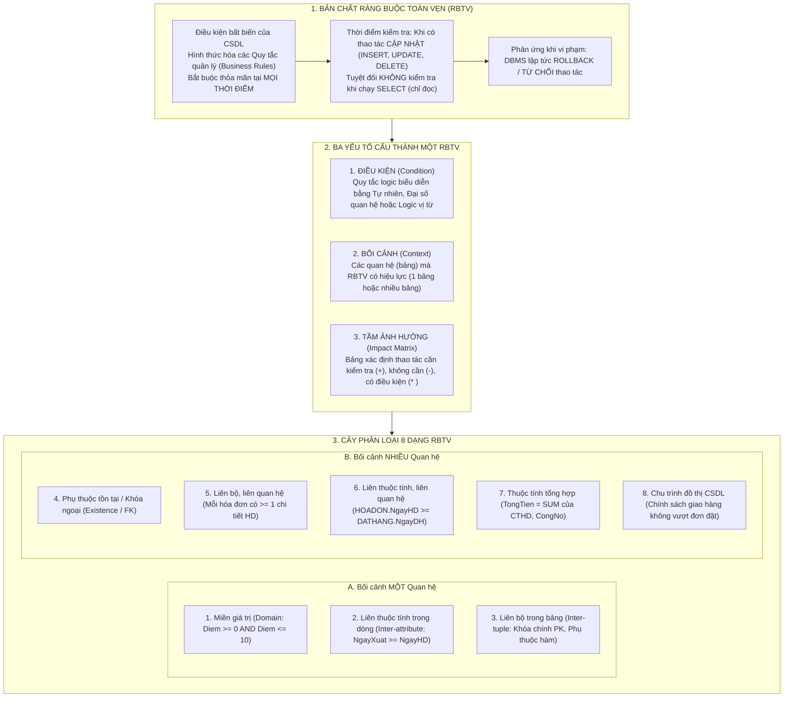

# CẨM NANG ÔN THI CẤP TỐC HỆ CƠ SỞ DỮ LIỆU
# CHƯƠNG 4: RÀNG BUỘC TOÀN VẸN (INTEGRITY CONSTRAINTS), 3 YẾU TỐ, BẢNG TẦM ẢNH HƯỞNG & LOGIC VỊ TỪ

> **Môn học**: Hệ Cơ sở Dữ liệu (Database Systems)  
> **Chương**: Chương 4 — Ràng buộc Toàn vẹn (Integrity Constraints)  
> **Mục tiêu**: Làm chủ bản chất 3 yếu tố cấu thành một RBTV (Điều kiện, Bối cảnh, Tầm ảnh hưởng), phân loại chính xác 8 loại RBTV (1 quan hệ vs nhiều quan hệ), thành thạo kỹ thuật lập Bảng Tầm Ảnh Hưởng (+, -, *) và viết chuẩn xác biểu thức hình thức bằng Logic Vị Từ.

---

## PHẦN I. BẢN ĐỒ KHÁI NIỆM CỐT LÕI (MINDMAP)

---

## PHẦN II. TÓM TẮT LÝ THUYẾT THỰC CHIẾN (CORE THEORY)

### 1. Định nghĩa & Bản chất Kỹ thuật của RBTV
- **Ràng buộc toàn vẹn (RBTV)** là những **điều kiện bất biến** mà mọi trạng thái hợp lệ của CSDL đều bắt buộc phải thỏa mãn ở **bất kỳ thời điểm nào**.
- Trong thực tế, RBTV chính là sự **hình thức hóa các quy tắc quản lý (Business Rules)** của thế giới thực vào bên trong CSDL.
- **Thời điểm kiểm tra**:
  - Được kích hoạt tự động **ngay khi có thao tác làm thay đổi dữ liệu**: `INSERT` (Thêm), `UPDATE` (Sửa), `DELETE` (Xóa).
  - ⚠️ **Lưu ý bẫy thi**: Các thao tác truy vấn chỉ đọc như `SELECT` **hoàn toàn không kích hoạt kiểm tra RBTV**!
- **Hành vi của DBMS khi phát hiện vi phạm**:
  - Lập tức **hủy bỏ thao tác (Abort/Rollback)**, khôi phục lại nguyên vẹn trạng thái nhất quán trước đó của CSDL và gửi thông báo lỗi chi tiết cho người dùng/ứng dụng.

---

### 2. Ba Yếu Tố Cấu Thành Một Ràng Buộc Toàn Vẹn

Mỗi RBTV được xác định đầy đủ và hoàn chỉnh bởi đúng **3 yếu tố**:

| Yếu tố | Ý nghĩa | Cách trình bày chuẩn |
| :--- | :--- | :--- |
| **1. Điều kiện (Condition)** | Nội dung quy tắc logic mà dữ liệu bắt buộc phải tuân theo. | Biểu diễn bằng **Ngôn ngữ tự nhiên** và công thức **Logic vị từ bậc nhất** ($\forall, \exists, \wedge, \vee, \implies$). |
| **2. Bối cảnh (Context)** | Danh sách các quan hệ (bảng) mà ràng buộc đó có hiệu lực. | Có thể là **MỘT quan hệ** (ví dụ: `SINHVIEN`) hoặc **NHIỀU quan hệ** (ví dụ: `HOADON`, `CTIET_HD`). |
| **3. Tầm ảnh hưởng (Impact)** | Xác định chính xác thao tác nào trên bảng nào có nguy cơ làm vi phạm ràng buộc. | Biểu diễn bằng **Bảng Tầm Ảnh Hưởng (Impact Matrix)** với 3 cột Thêm, Xóa, Sửa. |

#### Ý nghĩa 3 ký hiệu chuẩn trong Bảng Tầm Ảnh Hưởng:
- **Dấu `+` (Cần kiểm tra)**: Thao tác này có nguy cơ vi phạm ràng buộc $\rightarrow$ DBMS bắt buộc phải kích hoạt mã kiểm tra/Trigger để chặn lại nếu dữ liệu không hợp lệ.
- **Dấu `-` (Không cần kiểm tra)**: Thao tác này an toàn tuyệt đối, không bao giờ có thể làm vi phạm ràng buộc $\rightarrow$ DBMS bỏ qua bước kiểm tra để tối ưu hiệu năng I/O.
- **Dấu `+(*)` hoặc `-(*)` (Kiểm tra có điều kiện)**: Chỉ cần kiểm tra khi thuộc tính được cập nhật có tham gia trực tiếp vào biểu thức của RBTV.

---

### 3. Cây Phân Loại Toàn Diện 8 Dạng RBTV

#### NHÁNH A: Bối cảnh là MỘT quan hệ (Single-Relation Constraints)
1. **RBTV về Miền giá trị (Domain Constraint)**:
   - Ràng buộc áp đặt trên từng thuộc tính đơn lẻ.
   - *Ví dụ*: Điểm thi từ 0 đến 10 (`0 <= Diem <= 10`), Giới tính chỉ nhận 'Nam' hoặc 'Nu', Tuổi $\ge 18$.
   - ⚠️ *Bẫy*: Điều kiện `TamUng <= Luong` **KHÔNG PHẢI** miền giá trị (vì so sánh 2 cột với nhau).
2. **RBTV Liên thuộc tính trong cùng 1 dòng (Inter-Attribute Constraint)**:
   - Mối liên hệ so sánh giữa các thuộc tính khác nhau trong **cùng một bộ (dòng)**.
   - *Ví dụ*: Trong bảng `HOADON`, ngày xuất hàng phải sau hoặc bằng ngày lập hóa đơn:
     $$\forall hd \in \text{HOADON}: hd.\text{NgayXuat} \ge hd.\text{NgayHD}$$
   - *Ví dụ*: Trong bảng `NHANVIEN`, tiền tạm ứng không được vượt quá lương:
     $$\forall nv \in \text{NHANVIEN}: nv.\text{TamUng} \le nv.\text{Luong}$$
3. **RBTV Liên bộ trong cùng 1 bảng (Inter-Tuple Constraint)**:
   - Ràng buộc giữa các dòng khác nhau bên trong **cùng một quan hệ**.
   - Điển hình nhất: **Khóa chính (Primary Key)** — Hai dòng khác nhau không bao giờ được trùng khóa:
     $$\forall t_1, t_2 \in R, t_1 \neq t_2 \implies t_1[PK] \neq t_2[PK]$$
   - Các phụ thuộc hàm nghiệp vụ trong nội bộ bảng.

---

#### NHÁNH B: Bối cảnh là NHIỀU quan hệ (Multi-Relation Constraints)
4. **RBTV về Phụ thuộc tồn tại (Khóa ngoại - Foreign Key / Referential Integrity)**:
   - Sự tồn tại của một bản ghi ở bảng này (bảng con) phụ thuộc vào sự tồn tại của bản ghi ở bảng khác (bảng cha).
   - *Ví dụ*: Sinh viên trong bảng `SINHVIEN` phải thuộc về một khoa hợp lệ đã có trong bảng `KHOA`:
     $$\forall sv \in \text{SINHVIEN}: sv.\text{MaKhoa} \neq \text{NULL} \implies \exists k \in \text{KHOA}: k.\text{MaKhoa} = sv.\text{MaKhoa}$$
5. **RBTV Liên bộ, liên quan hệ**:
   - Ràng buộc giữa các nhóm bộ của nhiều bảng khác nhau.
   - *Ví dụ*: "Mỗi hóa đơn bán hàng bắt buộc phải có ít nhất một mặt hàng chi tiết":
     $$\forall hd \in \text{HOADON} \implies \exists ct \in \text{CTIET\_HD}: ct.\text{SoHD} = hd.\text{SoHD}$$
6. **RBTV Liên thuộc tính, liên quan hệ**:
   - So sánh giá trị giữa các thuộc tính nằm ở các bảng khác nhau.
   - *Ví dụ*: Ngày lập hóa đơn bán hàng phải sau hoặc bằng ngày khách đặt đơn hàng đó:
     $$\forall hd \in \text{HOADON}, \forall dh \in \text{DAT\_HANG}: hd.\text{SoDH} = dh.\text{SoDH} \implies hd.\text{NgayHD} \ge dh.\text{NgayDH}$$
7. **RBTV về Thuộc tính tổng hợp (Derived / Aggregate Attribute)**:
   - Một thuộc tính trong bảng được tính toán từ các thuộc tính của các bảng khác.
   - *Ví dụ*: Tiền công nợ của khách hàng bằng tổng tiền hóa đơn trừ đi tổng tiền các phiếu thu:
     $$kh.\text{CongNo} = \sum_{\text{HD}} hd.\text{TriGiaHD} - \sum_{\text{PT}} pt.\text{SoTien}$$
8. **RBTV do Chu trình trong đồ thị CSDL (Schema Cycle Graph)**:
   - Xuất hiện khi các mối liên kết giữa các bảng tạo thành một vòng khép kín (ví dụ: `DAT_HANG` $\leftrightarrow$ `HOA_DON` $\leftrightarrow$ `CTIET_HD`).
   - Phản ánh chính sách nghiệp vụ thực tế: "Một hóa đơn giải quyết cho một đơn đặt hàng chỉ được giao những mặt hàng khách đã đặt và **không bao giờ giao vượt quá số lượng khách yêu cầu**".

---

### 4. Bảng Ký Hiệu Logic Vị Từ Cốt Lõi

| Ký hiệu | Tên gọi toán học | Ý nghĩa trong biểu thức CSDL |
| :---: | :--- | :--- |
| $\forall$ | Với mọi (Universal Quantifier) | Áp dụng cho **tất cả các dòng** trong bảng. |
| $\exists$ | Tồn tại (Existential Quantifier) | Phải tìm thấy **ít nhất một dòng** thỏa mãn. |
| $\wedge$ | Phép Và (AND) | Tất cả các điều kiện đều phải đúng. |
| $\vee$ | Phép Hoặc (OR) | Chỉ cần ít nhất một điều kiện đúng. |
| $\implies$ | Phép Kéo theo (Implication / If...Then) | $A \implies B$ (Nếu $A$ xảy ra thì bắt buộc $B$ phải đúng). |
| $\neg$ | Phép Phủ định (NOT) | Ngược lại giá trị chân lý. |
| $t[A]$ hoặc $t.A$ | Giá trị thuộc tính $A$ của bộ $t$ | Tương tự cú pháp `record.field`. |

---

## PHẦN III. TRỌNG TÂM RA THI & BẪY KINH ĐIỂN (TRAP BUSTERS)

Trích xuất trực tiếp từ 2 bộ đề thi bẫy [`tong-hop-2-de-thi-bay-chuong-4-co-so-du-lieu.md`](file:///d:/TT%20HCM/tong-hop-2-de-thi-bay-chuong-4-co-so-du-lieu.md):

### 🎯 Bẫy 1: Thao tác SELECT có kiểm tra RBTV hay không?
- ⚠️ **Hiện tượng sập bẫy**: Đề hỏi: *"Thao tác nào sau đây KHÔNG BAO GIỜ kích hoạt cơ chế kiểm tra RBTV?"*
  - A. `INSERT`
  - B. `UPDATE`
  - C. `DELETE`
  - D. `SELECT` *(ĐÁP ÁN ĐÚNG)*
- ❌ **Sai lầm**: Nghĩ rằng đọc dữ liệu thì DBMS cũng phải kiểm tra xem dữ liệu có đúng không.
- 💡 **Mẹo 15 giây**: Dữ liệu trong CSDL đã được kiểm tra tính đúng đắn ngay từ lúc ghi vào đĩa rồi! Do đó lệnh đọc `SELECT` là **Read-only**, tuyệt đối không kiểm tra RBTV!

### 🎯 Bẫy 2: Nhầm lẫn giữa Ràng buộc Miền giá trị và Liên thuộc tính
- ⚠️ **Hiện tượng sập bẫy**: Cho điều kiện trong bảng `NHANVIEN`: *"Số tiền tạm ứng không được vượt quá số tiền lương (`TamUng <= Luong`)"*. Đề hỏi đây là loại RBTV nào?
  - Rất nhiều bạn chọn: Ràng buộc miền giá trị. $\longrightarrow$ **SAI!**
- 🎯 **Bản chất**: Miền giá trị là ràng buộc trên **chính một thuộc tính đơn lẻ** với một hằng số cố định (ví dụ: `Luong >= 0`). Còn so sánh giữa cột này với cột khác (`TamUng` với `Luong`) thì bản chất là **Liên thuộc tính**!
- 💡 **Mẹo 15 giây**: 
  - So sánh 1 cột với con số cố định $\longrightarrow$ **Miền giá trị**.
  - So sánh Cột $A$ với Cột $B$ $\longrightarrow$ **Liên thuộc tính**.

### 🎯 Bẫy 3: Quy tắc bất biến của Bảng Tầm Ảnh Hưởng đối với Khóa Ngoại (Foreign Key)
Đây là câu hỏi xuất hiện với tần suất 90% trong mọi đề thi:

$$\begin{array}{|l|c|c|c|}
\hline
\textbf{Quan hệ (Bảng)} & \textbf{Thêm (INSERT)} & \textbf{Xóa (DELETE)} & \textbf{Sửa (UPDATE)} \\
\hline
\textbf{Bảng CON (chứa FK - vd: SINHVIEN)} & \mathbf{+} & \mathbf{-} & \mathbf{+(*)} \\
\hline
\textbf{Bảng CHA (chứa PK - vd: KHOA)} & \mathbf{-} & \mathbf{+} & \mathbf{+(*)} \\
\hline
\end{array}$$

- 🔍 **Giải thích bản chất trong 30 giây**:
  - **Bảng CON (`SINHVIEN`)**:
    - `Thêm (+)`: Thêm một sinh viên mới $\rightarrow$ Phải kiểm tra xem `MaKhoa` của sinh viên đó có tồn tại ở bảng `KHOA` chưa!
    - `Xóa (-)`: Đuổi học một sinh viên $\rightarrow$ Hoàn toàn không ảnh hưởng gì đến sự tồn tại của khoa $\rightarrow$ An toàn tuyệt đối (`-`)!
    - `Sửa (+(*))`: Chỉ kiểm tra khi sửa đổi giá trị cột `MaKhoa`.
  - **Bảng CHA (`KHOA`)**:
    - `Thêm (-)`: Mở thêm một khoa mới toanh $\rightarrow$ Chưa có sinh viên nào theo học $\rightarrow$ An toàn tuyệt đối (`-`)!
    - `Xóa (+)`: Xóa sổ một khoa $\rightarrow$ Rất nguy hiểm! Nếu khoa đó đang có 500 sinh viên theo học thì 500 sinh viên đó sẽ bị "mồ côi" khoa $\rightarrow$ Bắt buộc phải kiểm tra (`+`)!
- 💡 **Mẹo 15 giây**: Nhớ câu thần chú: **"Con Thêm Cha Xóa"** $\longrightarrow$ Bảng Con mang dấu `+` ở cột Thêm; Bảng Cha mang dấu `+` ở cột Xóa!

### 🎯 Bẫy 4: Bảng Tầm Ảnh Hưởng của Khóa Chính (Primary Key)
Cho bảng `SINHVIEN` với khóa chính là `MaSV`.

$$\begin{array}{|l|c|c|c|}
\hline
\textbf{Quan hệ} & \textbf{Thêm} & \textbf{Xóa} & \textbf{Sửa} \\
\hline
\text{SINHVIEN (Khóa chính)} & \mathbf{+} & \mathbf{-} & \mathbf{+(*)} \\
\hline
\end{array}$$

- 💡 **Mẹo 15 giây**: Xóa một dòng thì không bao giờ làm trùng khóa chính $\rightarrow$ Xóa luôn mang dấu `-`! Thêm mới có nguy cơ bị trùng khóa $\rightarrow$ Thêm mang dấu `+`!

### 🎯 Bẫy 5: Nhận diện chiều suy luận trong biểu thức Logic Vị Từ của Khóa Ngoại
- ⚠️ **Hiện tượng sập bẫy**: Đề cho 2 biểu thức logic, hỏi biểu thức nào đúng:
  - (1) $\forall sv \in \text{SINHVIEN} \implies \exists k \in \text{KHOA}: k.\text{MaKhoa} = sv.\text{MaKhoa}$ *(ĐÚNG)*
  - (2) $\forall k \in \text{KHOA} \implies \exists sv \in \text{SINHVIEN}: sv.\text{MaKhoa} = k.\text{MaKhoa}$ *(SAI)*
- ❌ **Sai lầm**: Biểu thức (2) có nghĩa là "Mọi khoa bắt buộc phải có ít nhất một sinh viên", điều này không đúng với bản chất khóa ngoại (khoa mới mở có thể chưa có sinh viên nào).
- 💡 **Mẹo 15 giây**: Khóa ngoại xuất phát từ bảng nào thì dấu $\forall$ (với mọi) phải đặt ở bảng đó!

---

## PHẦN IV. BÀI TẬP MẪU TOÀN DIỆN: CSDL ĐỒ ÁN ĐỀ TÀI SINH VIÊN

### Lược đồ CSDL:
- $\mathbf{SINHVIEN}(\underline{\text{MaSV}}, \text{Hoten}, \text{Namsinh}, \text{QQ}, \text{Hocluc})$
- $\mathbf{DETAI}(\underline{\text{MaDT}}, \text{TenDT}, \text{Chunhiem}, \text{Kinhphi})$
- $\mathbf{SV\_DT}(\underline{\text{MaSV}, \text{MaDT}}, \text{NoiAD}, \text{KQ})$

---

### Bài toán 1: Đặc tả RBTV Khóa Chính trên bảng `SINHVIEN`
- **1. Bối cảnh**: `SINHVIEN`
- **2. Nội dung (Biểu diễn bằng Logic vị từ)**:
  "Không thể có hai sinh viên khác nhau mà lại trùng mã số sinh viên":
  $$\forall t_1, t_2 \in \text{SINHVIEN}, t_1 \neq t_2 \implies t_1.\text{MaSV} \neq t_2.\text{MaSV}$$
- **3. Bảng Tầm Ảnh Hưởng**:
  | Quan hệ | Thêm (INSERT) | Xóa (DELETE) | Sửa (UPDATE) |
  | :--- | :---: | :---: | :---: |
  | `SINHVIEN` | **$+$** | **$-$** | **$+^*(\text{MaSV})$** |

---

### Bài toán 2: Đặc tả RBTV Khóa Ngoại `MaSV` trong bảng `SV_DT`
- **1. Bối cảnh**: `SV_DT`, `SINHVIEN`
- **2. Nội dung (Biểu diễn bằng Logic vị từ)**:
  "Sinh viên tham gia thực hiện đề tài phải là sinh viên đang tồn tại trong danh sách sinh viên":
  $$\forall sd \in \text{SV\_DT} \implies \exists sv \in \text{SINHVIEN}: sv.\text{MaSV} = sd.\text{MaSV}$$
- **3. Bảng Tầm Ảnh Hưởng**:
  | Quan hệ | Thêm (INSERT) | Xóa (DELETE) | Sửa (UPDATE) |
  | :--- | :---: | :---: | :---: |
  | `SV_DT` *(Bảng con)* | **$+$** | **$-$** | **$+^*(\text{MaSV})$** |
  | `SINHVIEN` *(Bảng cha)* | **$-$** | **$+$** | **$+^*(\text{MaSV})$** |

---

### Bài toán 3: Đặc tả RBTV Miền Giá Trị của thuộc tính `Hocluc`
- **1. Bối cảnh**: `SINHVIEN`
- **2. Nội dung**: "Học lực của sinh viên chỉ được phép nhận một trong các giá trị: 'Xuat sac', 'Gioi', 'Kha', 'Trung binh', 'Yeu'":
  $$\forall sv \in \text{SINHVIEN}: sv.\text{Hocluc} \in \{\text{'Xuat sac'}, \text{'Gioi'}, \text{'Kha'}, \text{'Trung binh'}, \text{'Yeu'}\}$$
- **3. Bảng Tầm Ảnh Hưởng**:
  | Quan hệ | Thêm (INSERT) | Xóa (DELETE) | Sửa (UPDATE) |
  | :--- | :---: | :---: | :---: |
  | `SINHVIEN` | **$+$** | **$-$** | **$+^*(\text{Hocluc})$** |

---

### Bài toán 4: Đặc tả RBTV Liên Thuộc Tính Liên Quan Hệ (Nghiệp vụ Đề tài)
- **1. Bối cảnh**: `SINHVIEN`, `SV_DT`
- **2. Nội dung**: "Chỉ những sinh viên có học lực từ 'Kha' trở lên mới được tham gia thực hiện đề tài nghiên cứu khoa học":
  $$\forall sd \in \text{SV\_DT}, \forall sv \in \text{SINHVIEN}: sd.\text{MaSV} = sv.\text{MaSV} \implies sv.\text{Hocluc} \in \{\text{'Kha'}, \text{'Gioi'}, \text{'Xuat sac'}\}$$
- **3. Bảng Tầm Ảnh Hưởng**:
  | Quan hệ | Thêm (INSERT) | Xóa (DELETE) | Sửa (UPDATE) |
  | :--- | :---: | :---: | :---: |
  | `SV_DT` | **$+$** | **$-$** | **$+^*(\text{MaSV})$** |
  | `SINHVIEN` | **$-$** | **$-$** | **$+^*(\text{Hocluc})$** |
  *(Giải thích: Xóa sinh viên hay xóa đăng ký không thể làm biến sinh viên từ Kém thành Khá $\rightarrow$ Xóa mang dấu `-`)*.

---

## PHẦN V. BẢNG TRA CỨU CỨU SINH TRƯỚC GIỜ THI (CHEAT SHEET)

| Khái niệm / Quy tắc | Ký hiệu / Nguyên lý Chuẩn | Bẫy Cần Nhớ Tuyệt Đối |
| :--- | :--- | :--- |
| **Bản chất RBTV** | **Điều kiện bất biến tại mọi thời điểm**. | Phản ánh quy tắc quản lý, không phải dữ liệu ngẫu nhiên. |
| **Khi nào kiểm tra RBTV?** | Khi **INSERT, UPDATE, DELETE**. | Câu lệnh `SELECT` **KHÔNG BAO GIỜ** kiểm tra RBTV. |
| **Khi vi phạm RBTV?** | DBMS lập tức **Rollback / Từ chối**. | Không gán cờ cảnh báo hay tự sửa thành NULL. |
| **3 Yếu tố của RBTV** | **Điều kiện + Bối cảnh + Tầm ảnh hưởng**. | Bối cảnh là các bảng có liên quan. |
| **Ký hiệu Bảng Tầm Ảnh Hưởng** | `+`: Cần kiểm tra; `-`: Không kiểm tra; `*`: Có điều kiện. | Dấu `-` giúp tiết kiệm I/O hệ thống. |
| **Quy tắc Khóa Ngoại (FK)** | **Con Thêm ($+$) — Cha Xóa ($+$)** | Thêm con cần kiểm tra cha; Xóa cha cần kiểm tra con. |
| **Bảng Tầm Ảnh Hưởng Khóa Chính** | Thêm: `+`, Xóa: `-`, Sửa: `+*(PK)` | Xóa dòng không bao giờ làm trùng khóa chính. |
| **Miền giá trị vs Liên thuộc tính** | 1 cột với hằng số $\implies$ Miền giá trị; Cột này với cột kia $\implies$ Liên thuộc tính. | `TamUng <= Luong` là Liên thuộc tính, không phải miền giá trị. |
| **Logic vị từ Khóa Chính** | $\forall t_1, t_2 \in R, t_1 \neq t_2 \implies t_1[PK] \neq t_2[PK]$ | Hai dòng khác nhau thì khóa bắt buộc khác nhau. |
| **Logic vị từ Khóa Ngoại** | $\forall \text{Con} \implies \exists \text{Cha}: \text{Cha}[PK] = \text{Con}[FK]$ | Với mọi dòng con phải tìm thấy 1 dòng cha tương ứng. |
| **Chu trình CSDL** | Đồ thị vô hướng giữa các bảng tạo thành vòng khép kín. | Điển hình: Hóa đơn không bao giờ giao vượt đơn đặt hàng. |
