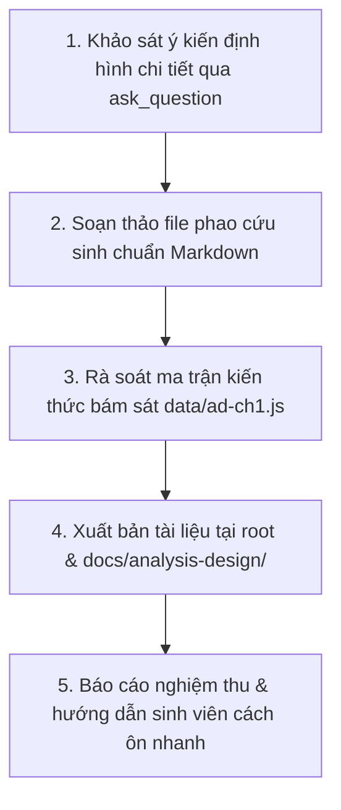

# KẾ HOẠCH TRIỂN KHAI: PHAO CỨU SINH ÔN NHANH TRƯỚC KHI THI (CHƯƠNG I)
## MÔN: PHÂN TÍCH THIẾT KẾ VÀ YÊU CẦU (`analysis-design` / `ad-ch1`)
### CHỦ ĐỀ: INTRODUCTION — INFORMATION SYSTEMS, THE BA ROLE & SDLC

---

## 1. MỤC TIÊU & ĐỊNH HƯỚNG SẢN PHẨM

- **Tên tài liệu dự kiến**: `phao-cuu-sinh-chuong-1-phan-tich-thiet-ke-yeu-cau.md`
- **Đối tượng thụ hưởng**: Sinh viên ôn thi cấp tốc, người chưa kịp học bài hoặc cần tổng duyệt kiến thức trong 10-15 phút trước giờ vào phòng thi.
- **Tiêu chí biên soạn**:
  - **"Bình dân học vụ" & Trực quan**: Dùng ngôn ngữ gãy gọn, ví dụ đời thường dí dỏm, loại bỏ các đoạn văn hàn lâm rườm rà.
  - **Nhìn là hiểu ngay (High-yield visual tables)**: Sử dụng các bảng so sánh 2 chiều, sơ đồ ASCII / Mermaid, công thức tóm tắt ngắn.
  - **Giải mã bẫy thi (Exam Trap Buster)**: Chỉ đích danh những chỗ đề thi hay gài bẫy (như nhầm lẫn giữa Data vs Information, Methodology vs Technique, TPS vs MIS vs ESS, Inception vs Elaboration).
  - **Mẹo nhớ siêu tốc (Mnemonics & Keyword Matching)**: Nhìn thấy từ khóa A trong câu hỏi thì 99% chọn đáp án B.

---

## 2. NỘI DUNG 5 TRỤ CỘT "CỨU SINH" CHƯƠNG I

### Khối 1: Bóc trần Hệ thống thông tin (Information Systems - IS)
1. **Bản chất IS**: Không phải chỉ là máy vi tính hay phần mềm; là sự kết hợp của 5 thành phần (Hardware, Software, Data, People, Procedures).
2. **Cấu trúc IPO**: Input (Dữ liệu đầu vào) $\to$ Process (Xử lý/Tính toán) $\to$ Output (Thông tin đầu ra) kèm Feedback loop.
3. **Chuỗi giá trị thông tin**:
   - **Data (Dữ liệu thô)**: Sự kiện rời rạc, chưa xử lý (ví dụ: số `39`).
   - **Information (Thông tin)**: Dữ liệu đã đặt vào ngữ cảnh và có ý nghĩa (ví dụ: `Nhiệt độ bệnh nhân là 39°C`).
   - **Knowledge (Tri thức)**: Thông tin kết hợp kinh nghiệm để ra quyết định (ví dụ: `Bệnh nhân đang sốt cao, cần uống thuốc hạ sốt ngay`).
4. **Kim tự tháp 3 tầng IS**:
   - **Cấp chiến lược (Strategic - Dành cho Giám đốc/CEO)**: **ESS / EIS** (Executive Support System) — Dữ liệu tổng hợp vĩ mô, dự báo dài hạn, thông tin từ bên ngoài.
   - **Cấp quản lý/chiến thuật (Tactical - Dành cho Trưởng phòng/Manager)**: **MIS** (Báo cáo định kỳ tóm tắt) & **DSS** (Hỗ trợ ra quyết định phi cấu trúc, phân tích What-If).
   - **Cấp tác nghiệp (Operational - Dành cho Nhân viên thu ngân/Kế toán viên)**: **TPS** (Transaction Processing System) — Xử lý khối lượng lớn giao dịch hàng ngày (quẹt thẻ, quét mã vạch, ghi nhận hóa đơn).

### Khối 2: Giải mã Nghề BA (The IT Business Analyst)
1. **BA là ai?**: Là "Người thông dịch viên chiến lược" — Bắc cầu nối giữa hai thế giới: **Business Stakeholders** (nói ngôn ngữ lợi nhuận, quy trình, khó khăn) và **Technical Team** (nói ngôn ngữ mã nguồn, cơ sở dữ liệu, kiến trúc).
2. **5 Chức năng & Trách nhiệm**: Elicit (Khơi gợi) $\to$ Analyze (Phân tích) $\to$ Specify (Đặc tả) $\to$ Validate (Xác thực) $\to$ Manage (Quản lý).
3. **4 Nhóm kỹ năng sống còn**:
   - *Technical Skills*: Hiểu biết công nghệ, SQL, UML, kiến trúc phần mềm.
   - *Business Skills*: Hiểu miền nghiệp vụ tài chính, logistics, bán lẻ.
   - *Analytical Skills*: Tư duy phản biện, giải quyết bài toán phức tạp.
   - *Interpersonal Skills*: Kỹ năng giao tiếp, lắng nghe, thuyết phục và hòa giải xung đột.
4. **Mức độ tham gia theo SDLC**: Tham gia cao nhất ở pha **Planning & Analysis**, giảm dần nhưng vẫn đồng hành ở **Design, Implementation** (hỗ trợ giải đáp yêu cầu) và **Support**.

### Khối 3: Bộ tứ quyền lực BA (Methodology – Model – Tool – Technique)
*Bảng phân biệt dập tan 100% bẫy đề thi:*
- **Methodology (Phương pháp luận)**: Triết lý & khung quy trình tổng thể (Waterfall, Agile/Scrum, Unified Process).
- **Model (Mô hình)**: Bản vẽ trừu tượng hóa hệ thống (Use Case Diagram, Activity Diagram, ERD, Class Diagram).
- **Tool (Công cụ)**: Phần mềm hỗ trợ thực hiện (Jira, Confluence, Draw.io, Enterprise Architect, Visual Paradigm).
- **Technique (Kỹ thuật)**: Cách thức / Biện pháp tác nghiệp cụ thể (Phỏng vấn - Interview, Hội thảo - JAD Workshop, Khảo sát - Survey, Quan sát - Observation, Làm mẫu - Prototyping).

### Khối 4: Vòng đời SDLC vs Unified Process (UP)
1. **Traditional SDLC (5 pha Thác nước)**: Planning (Why?) $\to$ Analysis (What?) $\to$ Design (How?) $\to$ Implementation (Build & Test) $\to$ Support (Operate).
   - *Đặc điểm*: Tuyến tính, cứng nhắc, chỉ bàn giao sản phẩm ở cuối cùng (Big-bang).
2. **Unified Process (UP - 4 pha lặp)**:
   - **Inception (Khởi động)**: Xác định phạm vi sơ bộ, tính khả thi kinh doanh, kết thúc bằng cột mốc **LCO** (Lifecycle Objective).
   - **Elaboration (Tinh chế)**: Đào sâu yêu cầu, chốt kiến trúc lõi, giảm thiểu rủi ro kỹ thuật, kết thúc bằng cột mốc **LCA** (Lifecycle Architecture).
   - **Construction (Xây dựng)**: Viết mã nguồn hàng loạt, kiểm thử, tích hợp các tính năng còn lại, kết thúc bằng cột mốc **IOC** (Initial Operational Capability).
   - **Transition (Chuyển giao)**: Triển khai lên hệ thống thực, đào tạo người dùng, bàn giao sản phẩm hoàn chỉnh (Product Release).

### Khối 5: Bảng tra cứu "Cứu nguy 30 giây" & 10 Cạm bẫy phòng thi
- Bảng đối chiếu từ khóa đề thi: Thấy từ khóa X $\to$ Chọn ngay đáp án Y.
- Cảnh báo 10 cạm bẫy kinh điển mà 80% sinh viên làm sai trong phòng thi.
- Bộ 5 câu trắc nghiệm "tủ" có tỷ lệ xuất hiện cực cao.

---

## 3. LỘ TRÌNH THỰC HIỆN

