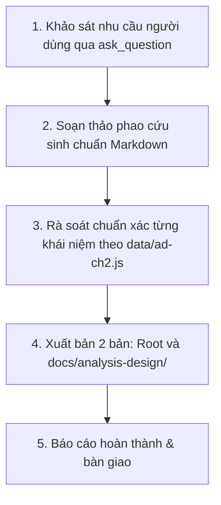

# KẾ HOẠCH TRIỂN KHAI: PHAO CỨU SINH ÔN NHANH TRƯỚC GIỜ THI (CHƯƠNG II)
## MÔN: PHÂN TÍCH THIẾT KẾ VÀ YÊU CẦU (`analysis-design` / `ad-ch2`)
### CHỦ ĐỀ: SYSTEMS DEVELOPMENT LIFE CYCLE (SDLC) & BUSINESS MODELING

---

## 1. MỤC TIÊU & ĐỊNH HƯỚNG TÀI LIỆU

- **Tên tài liệu dự kiến**: `phao-cuu-sinh-chuong-2-phan-tich-thiet-ke-yeu-cau.md`
- **Đối tượng phục vụ**: Sinh viên ôn thi cấp tốc, người chưa kịp học bài cần nắm vững toàn bộ kiến thức trọng tâm của Chương II chỉ trong **10-15 phút** trước giờ thi.
- **Tiêu chí biên soạn**:
  - **"Bình dân học vụ" & Trực quan**: Giải thích các khái niệm kỹ thuật bằng hình ảnh đời thường gần gũi (như xây nhà trọn gói kiểu Predictive vs xây từng tầng kiểu Adaptive; Business Worker là anh bồi bàn, Business Actor là thực khách gọi món).
  - **Bảng so sánh 10 giây (Quick Comparison Tables)**: Đối chiếu rạch ròi 6 khía cạnh Predictive vs Adaptive, 5 pha SDLC, 4 khái niệm Business Modeling.
  - **Giải mã cạm bẫy ký hiệu (Symbol Decoder)**: Hóa giải các ký hiệu dễ nhầm trong Activity Diagram (Fork vs Join, Decision vs Merge, Swimlanes) và ký hiệu gạch chéo `/` của Business Use Case.
  - **Bảng phản xạ 3 giây (Keywords Matching)**: Nhìn thấy từ khóa đặc trưng trong đề thi $\to$ khoanh ngay đáp án đúng trong nháy mắt.

---

## 2. NỘI DUNG 5 TRỤ CỘT "CỨU SINH" CHƯƠNG II

### Trụ cột 1: Đại chiến 2 trường phái — Predictive vs Adaptive SDLC
1. **SDLC Umbrella Concept**: SDLC là cái ô bao trùm (Khung vòng đời); Methodology (Thác nước, Scrum, UP) là cách thức triển khai cụ thể bên dưới.
2. **Predictive Approach (Tiếp cận dự đoán)**:
   - Triết lý: *"Plan the work, then work the plan"*.
   - Đặc điểm: Lập kế hoạch chi tiết từ đầu, bàn giao trọn gói một lần ở cuối (Big-bang), tài liệu đồ sộ, kiểm soát thay đổi khắt khe.
   - Thích hợp khi: Yêu cầu đã rõ ràng 100%, công nghệ quen thuộc, độ ổn định cao.
3. **Adaptive Approach (Tiếp cận thích ứng)**:
   - Triết lý: *"Embrace change, deliver early and often"*.
   - Đặc điểm: Lặp đi lặp lại và tăng dần (Iterative & Incremental), bàn giao phần mềm chạy được sau mỗi Sprint (2-4 tuần), khách hàng tham gia liên tục.
   - Thích hợp khi: Yêu cầu mơ hồ, thị trường biến động nhanh, công nghệ mới nổi.
4. **Bảng so sánh 6 chiều kích thước**: Mục tiêu, Kế hoạch, Quản lý thay đổi, Bàn giao, Khách hàng, Tài liệu.

### Trụ cột 2: Chi tiết 5 Pha SDLC — 5 Câu hỏi & Sản phẩm bàn giao (Deliverables)
1. **Pha 1: Planning (Lập kế hoạch)**:
   - Câu hỏi cốt lõi: *"Why build it?"* (Tại sao phải làm?).
   - Sản phẩm: Project Plan, Feasibility Study, Business Case.
2. **Pha 2: Analysis (Phân tích)**:
   - Câu hỏi cốt lõi: *"What is needed?"* (Hệ thống cần làm gì?).
   - Sản phẩm: System Proposal, Requirements Definition (FRs & NFRs), Use Case Model.
3. **Pha 3: Design (Thiết kế)**:
   - Câu hỏi cốt lõi: *"How will it work?"* (Hệ thống làm điều đó như thế nào?).
   - Sản phẩm: Architecture Design, Database Schema (ERD), UI Wireframes, Class Diagram.
4. **Pha 4: Implementation (Xây dựng & Triển khai)**:
   - Câu hỏi cốt lõi: *"Build & Deploy"* (Viết mã, kiểm thử và đưa vào chạy).
   - Sản phẩm: Working Software, Test Cases/Results, User Manuals, Training.
5. **Pha 5: Support (Vận hành & Bảo trì)**:
   - Câu hỏi cốt lõi: *"Keep it running"* (Giữ cho hệ thống luôn sống và tối ưu).
   - Sản phẩm: Maintenance Logs, Change Requests, Performance Monitoring.

### Trụ cột 3: Business Modeling — Mô hình hóa Doanh nghiệp trước Phần mềm
1. **Tại sao phải mô hình hóa doanh nghiệp trước?**: Tránh bẫy *"Automating a mess"* (tự động hóa một quy trình rác/lỗi thời).
2. **Bộ tứ khái niệm cốt lõi (Cực kỳ hay thi)**:
   - **Business Actor**: Tác nhân **BÊN NGOÀI** doanh nghiệp (Khách hàng, Đối tác, Nhà cung cấp, Cơ quan thuế).
   - **Business Worker**: Người/vai trò **BÊN TRONG** doanh nghiệp tham gia vận hành (Thu ngân, Nhân viên bán hàng, Thủ kho).
   - **Business Use Case**: Chuỗi hoạt động mang lại giá trị cho Business Actor (ví dụ: *Quy trình mua hàng, Quy trình bồi thường bảo hiểm*).
   - **Business Entity**: Vật thể, hồ sơ dữ liệu lưu trữ giá trị (Hóa đơn, Hợp đồng, Sản phẩm, Tài khoản).
3. **Ký hiệu đặc biệt**: Dấu gạch chéo `/` (Slash) trên hình người và hình elip để phân biệt với System Use Case.

### Trụ cột 4: Khởi động dự án (Initiation Phase) & Đánh giá tính khả thi 3 chiều
1. **Cổng kiểm soát Go / No-Go**: Quyết định sinh tử xem có nên rót tiền đầu tư dự án hay không.
2. **Phân tích tính khả thi 3 khía cạnh (Feasibility Analysis)**:
   - **Economic (Kinh tế)**: Có lời không? Tính toán ROI (Tỷ suất hoàn vốn), NPV (Giá trị hiện tại thuần), Payback Period (Thời gian hoàn vốn).
   - **Technical (Kỹ thuật)**: Đội ngũ có làm được không? Công nghệ có sẵn sàng không? Rủi ro tích hợp với hạ tầng cũ.
   - **Organizational / Operational (Tổ chức/Vận hành)**: Người dùng có chịu xài không? Văn hóa doanh nghiệp có đón nhận không? Quản trị thay đổi (Change Management).

### Trụ cột 5: Biểu đồ hoạt động (Activity Diagram) & 10 Cạm bẫy phòng thi
1. **Bảng giải mã ký hiệu Activity Diagram**:
   - Initial Node ($\bullet$), Action (Hình chữ nhật bo góc), Activity Final ($\odot$), Flow Final ($\otimes$).
   - **Decision vs Merge** (Hình quả trám $\diamond$): Decision là 1 vào nhiều ra có điều kiện Guard; Merge là nhiều nhánh gộp về 1.
   - **Fork vs Join** (Thanh ngang $\mathbf{—}$): Fork là 1 vào tách thành nhiều luồng chạy song song; Join là đồng bộ hóa, chờ tất cả các luồng song song xong mới đi tiếp.
   - **Swimlanes (Làn bơi)**: Phân định trách nhiệm của từng vai trò/phòng ban.
2. **Bảng từ khóa 3 giây (Keywords Matching)**: Gặp từ X $\to$ Khoanh ngay đáp án Y.
3. **10 Cạm bẫy phòng thi kinh điển** của Chương 2.

---

## 3. LỘ TRÌNH THỰC HIỆN

