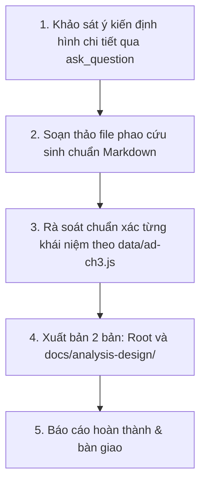

# KẾ HOẠCH TRIỂN KHAI: PHAO CỨU SINH ÔN NHANH TRƯỚC GIỜ THI (CHƯƠNG III)
## MÔN: PHÂN TÍCH THIẾT KẾ VÀ YÊU CẦU (`analysis-design` / `ad-ch3`)
### CHỦ ĐỀ: INITIATION PHASE — FROM BUSINESS EVENTS TO A SYSTEM USE CASE MODEL

---

## 1. MỤC TIÊU & ĐỊNH HƯỚNG TÀI LIỆU

- **Tên tài liệu dự kiến**: `phao-cuu-sinh-chuong-3-phan-tich-thiet-ke-yeu-cau.md`
- **Đối tượng phục vụ**: Sinh viên ôn thi cấp tốc, người chưa kịp học bài cần nắm trọn vẹn kiến thức trọng tâm của Chương III chỉ trong **10-15 phút** trước giờ thi.
- **Tiêu chí biên soạn**:
  - **"Bình dân học vụ" & Trực quan**: Giải thích sinh động (Event Decomposition giống như chia việc cho đầu bếp; Include là bắt buộc như đi ăn phở phải có nước dùng, Extend là tùy chọn như gọi thêm quẩy; Extension Point là chỗ nhúng quẩy vào bát phở).
  - **Bảng so sánh 10 giây (Quick Comparison Tables)**: Đối chiếu rạch ròi 3 loại Business Events (External, Temporal, State), 4 loại Actor (Primary, Supporting, Offstage, Internal), Quan hệ `<<include>>` vs `<<extend>>`.
  - **Giải mã cạm bẫy chiều mũi tên & Phân rã chức năng (Trap Buster)**: Hóa giải triệt để lỗi lộn ngược chiều mũi tên include/extend và cạm bẫy Functional Decomposition.
  - **Bảng phản xạ 3 giây (Keywords Matching)**: Nhìn thấy từ khóa đặc trưng trong đề thi $\to$ khoanh ngay đáp án đúng trong nháy mắt.

---

## 2. NỘI DUNG 5 TRỤ CỘT "CỨU SINH" CHƯƠNG III

### Trụ cột 1: Pha Khởi động (Inception / Initiation Phase) & Bản chất Use Case
1. **Vị trí của Inception trong UP**: Pha mở đầu, xác định phạm vi sơ bộ, mục tiêu kinh doanh, kết thúc bằng cột mốc **LCO (Lifecycle Objective Milestone)**.
2. **Định nghĩa kinh điển của Ivar Jacobson**:
   - Use Case là một tập hợp các chuỗi hành động mà hệ thống thực hiện nhằm mang lại **kết quả có giá trị quan sát được (Observable Result of Value)** cho một Actor cụ thể.
   - Thử nghiệm EBP (Elementary Business Process): Một người, một địa điểm, một thời điểm, đưa dữ liệu về trạng thái nhất quán.
3. **4 Thành phần cơ bản của Use Case Diagram**: Actor, Use Case, Association, System Boundary.

### Trụ cột 2: Kỹ thuật phân rã sự kiện (Event Decomposition) — Chìa khóa tìm Use Case
1. **Quy tắc vàng 1 Event : 1 Use Case**: Mỗi sự kiện nghiệp vụ sẽ tương ứng với một ca sử dụng của hệ thống.
2. **Ba loại Business Events (Bắt buộc phải thuộc)**:
   - **External Event (Sự kiện bên ngoài)**: Do tác nhân bên ngoài chủ động khởi phát (Khách hàng đặt hàng, Sinh viên nộp đơn đăng ký môn học).
   - **Temporal Event (Sự kiện thời gian)**: Kích hoạt tự động khi đồng hồ điểm một thời điểm xác định (Đến 0h ngày 1 hàng tháng tính lãi, Đến hạn đóng học phí).
   - **State Event (Sự kiện trạng thái)**: Kích hoạt tự động khi một điều kiện dữ liệu nội bộ thay đổi đạt ngưỡng (Lượng tồn kho rơi xuống dưới 10 $\to$ tự động sinh đơn nhập hàng).
3. **Bảng phân tích sự kiện (Event Table - 6 cột)**: Event $\to$ Trigger $\to$ Source $\to$ Use Case $\to$ Response $\to$ Destination.

### Trụ cột 3: Nhận diện Tác nhân (Identify Actors) & Quy tắc đặt tên Use Case
1. **Actor là ai?**: Đại diện cho VAI TRÒ (Role) chứ không đại diện cho một cá nhân cụ thể. Nằm BÊN NGOÀI System Boundary.
2. **Bốn loại Actor**:
   - **Primary Actor**: Người dùng chính khởi xướng ca sử dụng để đạt mục tiêu cá nhân.
   - **Supporting / Secondary Actor**: Hệ thống/dịch vụ bên ngoài hỗ trợ (Cổng thanh toán, Ngân hàng, Dịch vụ Email).
   - **Offstage Stakeholder**: Người quan tâm kết quả nhưng không trực tiếp bấm máy (Ban giám đốc, Thuế).
   - **Internal / System Actor**: Bộ lập lịch hệ thống (dành cho Temporal Events).
3. **Quy tắc đặt tên Use Case chuẩn mực**: `Động từ + Cụm danh từ` (`Verb + Noun Phrase`), ví dụ: *Register for Courses, Pay Tuition Fee, Generate Monthly Report*.

### Trụ cột 4: Tổ chức mô hình Use Case — Include vs Extend vs Generalization
*Phần gây "lú lẫn" nhiều nhất trong phòng thi:*
1. **Quan hệ `<<include>>` (Bắt buộc dùng chung)**:
   - Bản chất: Base Case bắt buộc phải thực thi Included Case. Tái sử dụng logic chung.
   - Mũi tên: Nét đứt trỏ từ **Base Use Case $\to$ Included Use Case**.
2. **Quan hệ `<<extend>>` (Mở rộng tùy chọn có điều kiện)**:
   - Bản chất: Extension Case chỉ chạy khi thỏa mãn điều kiện tại **Extension Point**. Base Case hoàn toàn ĐỘC LẬP và KHÔNG biết về Extension Case.
   - Mũi tên: Nét đứt trỏ ngược từ **Extension Use Case $\to$ Base Use Case**.
3. **Quan hệ Kế thừa (Generalization)**:
   - Biểu diễn mối quan hệ cha - con (`is-a`).
   - Mũi tên tam giác rỗng trỏ về ca sử dụng / Actor cha.

### Trụ cột 5: Bảng tra cứu 3 giây & 10 Cạm bẫy phòng thi kinh điển
1. **Bảng Keywords Matching**: Gặp cụm từ X $\to$ Khoanh ngay đáp án Y.
2. **10 Cạm bẫy phòng thi Chương 3**:
   - Bẫy nhầm mũi tên `<<include>>` và `<<extend>>`.
   - Bẫy phân rã chức năng (Functional Decomposition).
   - Bẫy biến 'Login' thành Use Case trung tâm nối include khắp nơi.
   - Bẫy nhầm lẫn giữa Temporal Event và State Event.
   - Bẫy nhầm luồng truyền dữ liệu (Data flow) với Use Case.

---

## 3. LỘ TRÌNH THỰC HIỆN

