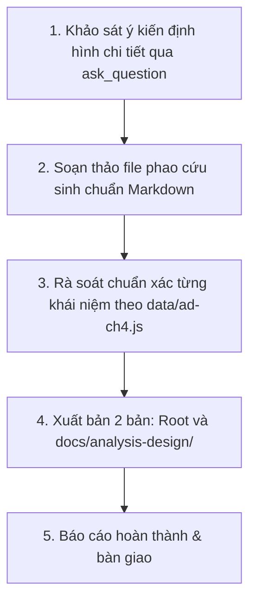

# KẾ HOẠCH TRIỂN KHAI: PHAO CỨU SINH ÔN NHANH TRƯỚC GIỜ THI (CHƯƠNG IV)
## MÔN: PHÂN TÍCH THIẾT KẾ VÀ YÊU CẦU (`analysis-design` / `ad-ch4`)
### CHỦ ĐỀ: DISCOVERY PHASE I — BASELINE, ELICITATION & USE CASE FOUNDATIONS

---

## 1. MỤC TIÊU & ĐỊNH HƯỚNG TÀI LIỆU

- **Tên tài liệu dự kiến**: `phao-cuu-sinh-chuong-4-phan-tich-thiet-ke-yeu-cau.md`
- **Đối tượng phục vụ**: Sinh viên ôn thi cấp tốc, người chưa kịp học bài cần nắm vững toàn bộ kiến thức trọng tâm của Chương IV chỉ trong **10-15 phút** trước giờ thi.
- **Tiêu chí biên soạn**:
  - **"Bình dân học vụ" & Trực quan**: Giải thích các thuật ngữ hàn lâm bằng hình ảnh đời thường hóm hỉnh (Baseline giống như cắm cọc mốc ranh giới đất; Discovery giống như bác sĩ khám bệnh tìm nguyên nhân; Brief Description giống như tóm tắt trailer phim, Fully-Dressed giống kịch bản quay phim chi tiết từng giây).
  - **Bảng so sánh 10 giây (Quick Comparison Tables)**: Đối chiếu 3 cấp độ Use Case Description (Brief vs Casual vs Fully-Dressed), Behavioral vs Structural Analysis, Borrow Book vs Reserve Book.
  - **Khuôn mẫu 9 trường vàng Fully-Dressed (Template Decoder)**: Hướng dẫn cách phân biệt Preconditions (bắt buộc đúng trước khi bắt đầu) vs Postconditions (cam kết đạt được sau khi xong), Happy Path vs Alternative vs Exception Flows.
  - **Bảng phản xạ 3 giây (Keywords Matching)**: Nhìn thấy từ khóa đặc trưng trong đề thi $\to$ khoanh ngay đáp án đúng trong nháy mắt.

---

## 2. NỘI DUNG 5 TRỤ CỘT "CỨU SINH" CHƯƠNG IV

### Trụ cột 1: Thiết lập mốc cơ sở (Set Baseline) & Kiểm soát Scope Creep
1. **Baseline là gì?**: Là một ảnh chụp trạng thái (Snapshot) đã được các bên liên quan chính thức thống nhất $\to$ Làm mốc tham chiếu ổn định (Stable Reference).
2. **3 Thành tố cấu thành**: Project Scope, Vision, Initial Requirements.
3. **4 Giá trị mục đích cốt lõi**:
   - Kiểm soát thay đổi & ngăn chặn hiện tượng phình to phạm vi (Scope Creep).
   - Thước đo tiến độ đáng tin cậy.
   - Căn chỉnh kỳ vọng giữa khách hàng và đội ngũ phát triển.
   - Cơ sở pháp lý và điều kiện nghiệm thu hợp đồng.
4. **Quy trình Change Control & CCB**: Sau khi chốt Baseline, mọi thay đổi phải qua Change Request (CR) và được Change Control Board (CCB) phê duyệt.

### Trụ cột 2: Giai đoạn Khám phá yêu cầu (Discovery Phase) & Chu trình 5 hoạt động
1. **Vị trí trong UP**: Giai đoạn bản lề chuyển tiếp giữa cuối Inception và đầu Elaboration.
2. **5 Mục tiêu cốt lõi**: Thấu hiểu problem domain, làm rõ yêu cầu, khám phá nhu cầu tiềm ẩn, giảm thiểu rủi ro, chuẩn bị đầu vào cho kiến trúc.
3. **Chu trình 5 hoạt động lặp (The Iterative Discovery Cycle)**:
   - **Elicit (Khơi gợi)**: Phỏng vấn (Interview), Hội thảo (Workshop), Quan sát (Observation), Khảo sát (Survey).
   - **Analyze (Phân tích)**: Tìm mâu thuẫn, bóc tách quy trình, phát hiện lỗ hổng logic.
   - **Specify (Đặc tả)**: Ghi lại thành Use Case Model, Use Case Descriptions, Supplementary Specs (NFRs).
   - **Validate (Xác thực)**: Đối chiếu lại với Stakeholders để bảo đảm *"Building the right system"*.
   - **Manage (Quản lý)**: Theo dõi thay đổi và bảo đảm tính truy vết (Requirements Traceability).

### Trụ cột 3: Phân tích hành vi (Behavioral Analysis) & Biểu đồ Use Case như "Mục lục"
1. **Behavioral Analysis (Phân tích hành vi - WHAT)**: Nhìn hệ thống dưới dạng Hộp đen (Black-box), chỉ quan tâm hệ thống làm CÁI GÌ phục vụ người dùng, không quan tâm bên trong cài đặt như thế nào (HOW).
2. **Structural Analysis (Phân tích cấu trúc - HOW)**: Hộp trắng (White-box), cấu trúc tĩnh, Classes, ERD, phương thức.
3. **Ý nghĩa "Mục lục" (Table of Contents)**: Use Case Diagram là Mục lục cuốn sách (cung cấp bức tranh toàn cảnh cấp cao); Use Case Descriptions là Nội dung chi tiết từng chương sách.

### Trụ cột 4: Ba cấp độ mô tả Use Case & Khuôn mẫu 9 trường Fully-Dressed
1. **3 Cấp độ mô tả (Alistair Cockburn & UP)**:
   - **Brief Description**: Đoạn văn ngắn 2-3 câu (Actor, Goal, Main flow).
   - **Casual Description**: Văn xuôi tự do nhiều đoạn văn bao quát các luồng.
   - **Fully-Dressed Description**: Khuôn mẫu cấu trúc bảng 9-10 trường chuẩn mực chi tiết nhất.
2. **Giải mã 9 trường Fully-Dressed**:
   - Name, Primary Actor, Stakeholders & Interests, Preconditions, Postconditions / Success Guarantees, Trigger, Main Success Scenario (Happy Path), Alternative Flows, Exception Flows.
3. **Nguyên lý tách rời Quy tắc nghiệp vụ (Business Rules Decoupling)**: Không nhúng cứng công thức tính thuế hay chính sách giảm giá vào từng bước của Use Case mà để riêng ra tài liệu Business Rules.

### Trụ cột 5: Bài tập Thư viện, Kỹ nghệ nâng cao & 10 Cạm bẫy phòng thi
1. **Bài toán Thư viện (Library System)**:
   - Patron (Độc giả), Librarian (Thủ thư).
   - Phân biệt rõ: **Borrow Book** (mượn trực tiếp sách có sẵn) vs **Reserve Book** (đặt trước khi sách đã bị mượn hết).
   - Precondition của Reserve Book: Sách phải ở trạng thái Checked Out (đã được mượn hết).
2. **Kỹ nghệ nâng cao**:
   - Named Extension Points: Điểm mở rộng được đặt tên rõ ràng trong Base Case.
   - Packaging Use Cases: Đóng gói các Use Case có liên quan thành các phân hệ nghiệp vụ (Subsystems) cho dự án lớn.
3. **Bảng từ khóa 3 giây & 10 Cạm bẫy phòng thi kinh điển của Chương 4**.

---

## 3. LỘ TRÌNH THỰC HIỆN

