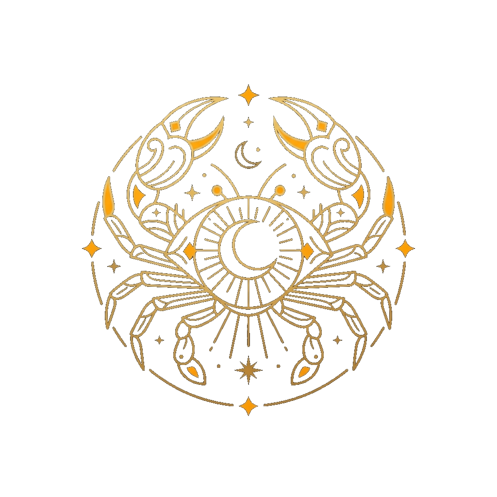
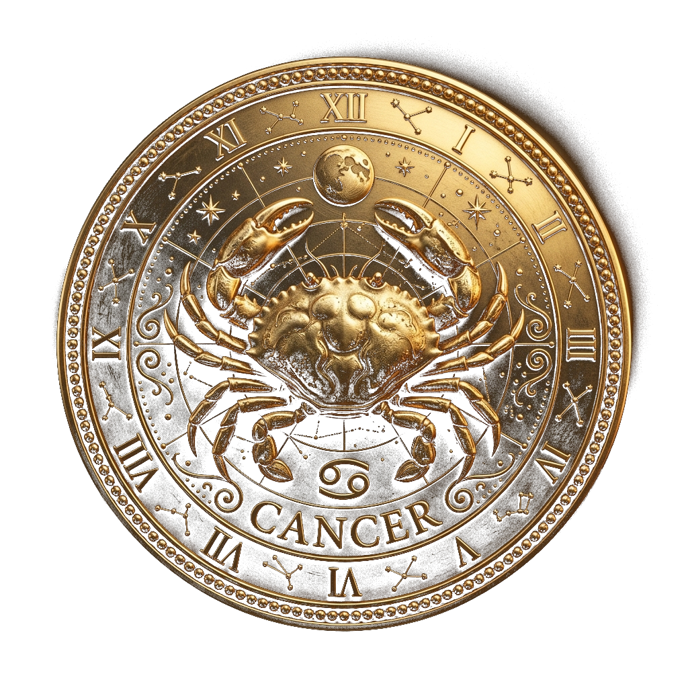

# Concept Review v1 — Cỗ máy tri thức Cự Giải

**Trạng thái:** `APPROVED WITH MUST/SHOULD/LATER — D02 DECIDED`

## 1. Hai nguồn nhận diện đặt cạnh nhau

| `logo.png` — nguồn A | `cancer_mascot_transparent.png` — nguồn B |
|---|---|
|  |  |
| Line-art phẳng, đối xứng, càng mở cao, tâm mặt trăng, vòng thiên văn thoáng | Huy hiệu 3D hiện thực, mai cua nặng, kim loại vàng, vòng đồng hồ dày và nhiều chi tiết |

## 2. Khác biệt và đề xuất giữ/bỏ

| Thuộc tính | Nguồn A | Nguồn B | Đề xuất synthesis v1 |
|---|---|---|---|
| Silhouette | Rõ ở kích thước nhỏ, càng mở tạo chữ V | Cua thật, thân bè và nhiều chân | Ưu tiên nhịp silhouette A; tăng độ dày có kiểm soát từ B |
| Tâm nhận diện | Trăng lưỡi liềm lớn | Mai cua thật + ký hiệu Cự Giải nhỏ | Giữ trăng/mark nhỏ như dấu ấn, không biến thành mặt nhân vật |
| Vòng | Mảnh, thoáng, có khoảng hở | Dày, đồng hồ La Mã, hạt viền | Hai vòng độc lập, mảnh hơn B; bỏ số La Mã và hạt dày |
| Vật liệu | Vàng line-art trên nền tối | Kim loại vàng/bronze có chiều sâu | Satin gold + matte charcoal, amber glow rất hạn chế |
| Chi tiết | Sao/quỹ đạo trang trí | Chòm sao, chữ CANCER, hoa văn dày | Giữ 3–5 điểm sáng lớn; bỏ chữ CANCER, số, chòm sao dày |
| Tính cách | Biểu tượng, thanh lịch | Hùng mạnh, hơi nặng | Điềm tĩnh, chính xác, hướng càng ra nội dung; tránh hung dữ |
| Web performance | Dễ giản lược | Tốn geometry/texture nếu sao chép | Hard-surface module hóa, ưu tiên form lớn và normal/bevel gọn |

### Phần giữ

- Hai càng mở và silhouette cua nhận ra ngay.
- Cấu trúc vòng/huy hiệu, nhưng tách thành `ring_inner` và `ring_outer`.
- Tâm thiên văn nhỏ, đối xứng và chất liệu vàng–than.
- Chiều sâu plate/khớp từ nguồn B để model không giống SVG đùn phẳng.

### Phần bỏ hoặc giản lược

- Chữ `CANCER`, số La Mã, bead border và constellation dày.
- Hoa văn siêu nhỏ không đọc được ở hero.
- Mai sinh học quá chi tiết, chân/càng sắc mang cảm giác tấn công.
- Mắt hoạt hình, biểu cảm mặt, walking rig và glow/bloom mạnh.

## 3. Concept sheet v1 để duyệt

File: [`cancer-knowledge-machine-concept-v1.png`](../../artifacts/homepage-3d/concept/cancer-knowledge-machine-concept-v1.png)

Concept sheet thể hiện hướng front, three-quarter, side, exploded components và swatch vật liệu. Đây là ảnh định hướng do ImageGen tạo từ hai reference, chưa phải blueprint tỷ lệ, topology, số chân/node hay model đã duyệt.

### Đánh giá nội bộ v1

- **Đạt hướng:** nhận ra cua, vật liệu đúng palette, vòng có thể tách, exploded view hữu ích cho blockout.
- **Cần khóa khi duyệt:** độ dày thân, số/nhịp chân, mức giữ biểu tượng trăng và pose thu gọn.
- **Cần sửa ở blockout bằng dữ liệu:** pivot càng, khoảng hở hai vòng, bounds và self-intersection; không dựa vào ảnh AI để suy ra topology.
- **Không giữ mặc định:** hai antenna-like stalk phía trên thân nếu người dùng thấy làm cua giống côn trùng.

## 4. Design DNA v1

- **System:** Ivory `#FAF8F4`, Charcoal `#2C2A26`, Gold `#D97706`, Glow `#F59E0B`; border/spacing/DOM typography dùng token hiện có.
- **Style:** premium educational technology, calm mechanical precision, symmetry có chủ đích, không occult spectacle.
- **Effects:** satin highlight, parallax nhỏ, ring separation theo scroll; không bloom mạnh/particle dày.
- **Motion character:** càng chào một lần và guide nhẹ; vòng quay chậm; main transform thuộc GSAP, idle thuộc child group R3F.

## 5. Kết quả duyệt 2026-09-13

- **MUST:** bỏ râu; 8 chân đối xứng và khóa trong contract; thân cong có chiều sâu; trăng tiết chế; hai vòng độc lập; concept không phải blueprint.
- **SHOULD:** giản lược trang trí, giữ khoảng hở, pose compact chứng minh thu gọn trong khung hẹp.
- **LATER:** hoa văn, material/lighting final và motion phức tạp sau proof web.

D02 đã khóa; B3 được phép bắt đầu. Nếu blockout buộc phải thay đổi đáng kể nhận diện, dừng và báo trước khi chọn hướng khác.

## 6. Thông tin tạo ảnh

- Công cụ: built-in ImageGen, chế độ reference-based concept generation.
- Reference 1: `logo.png` — primary silhouette/identity.
- Reference 2: `cancer_mascot_transparent.png` — secondary material/depth.
- Prompt mục tiêu: concept sheet hard-surface nhẹ cho Blender→GLB, bốn view + exploded view, không chữ/số La Mã/bead border/watermark.
