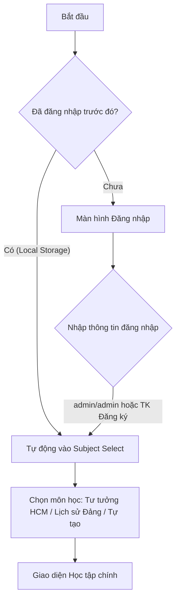
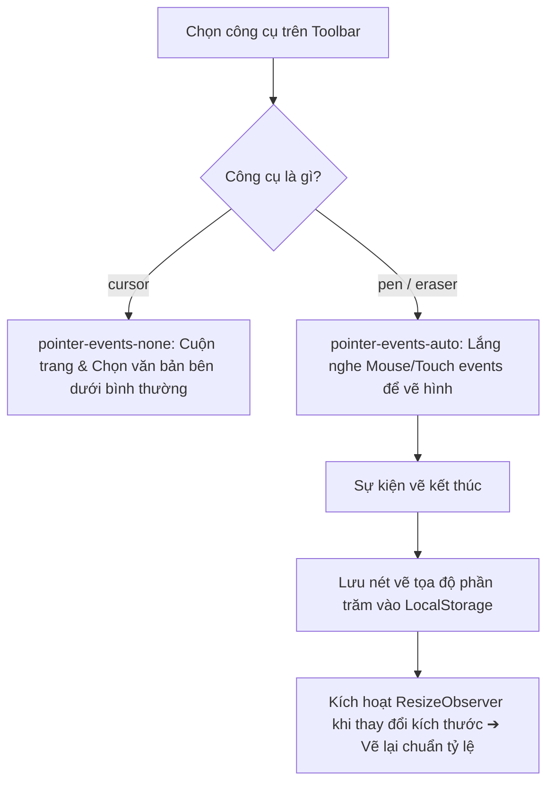

# Kiến trúc Hệ thống (System Architecture)

Tài liệu này mô tả chi tiết kiến trúc, cấu trúc thư mục, luồng dữ liệu, và cách thức hoạt động của hệ thống **StudyMaster** để người đọc có thể dễ dàng hiểu và bảo trì mã nguồn trong tương lai.

---

## 🏗️ Tổng quan Kiến trúc

Dự án StudyMaster được phát triển trên nền tảng **Next.js 15+ (App Router)** và **React 19**, kết hợp với **TailwindCSS v4** cho giao diện người dùng. Hệ thống áp dụng mô hình **Single Page App (SPA)** với bộ quản lý trạng thái tập trung (State Orchestrator) tại trang gốc.

### Các Tính năng Cốt lõi:
1. **Quản lý Định hướng (Client-side Routing)**: Điều phối trạng thái hiển thị bằng một máy trạng thái đơn giản (`login` ➔ `subject-select` ➔ `study`).
2. **Khung Vẽ Ghi chú (Interactive Canvas)**: Lớp canvas vẽ trực tiếp chồng lên tài liệu học tập, hỗ trợ lưu trữ nội dung ghi chú tự động.
3. **Mô-đun Trắc nghiệm (Quiz System)**: Hỗ trợ hai chế độ chấm điểm (ngay lập tức và nộp bài cuối giờ), lưu tiến độ học tập và tích hợp bảng xếp hạng trực tuyến.
4. **Cơ sở Dữ liệu Cloud Firestore**: Lưu trữ thông tin kết quả thi trắc nghiệm của sinh viên.

---

## 📁 Cấu trúc Thư mục

Dưới đây là sơ đồ tổ chức thư mục của dự án và vai trò của từng phần:

```
TT HCM/
├── app/                      # Cấu trúc Next.js App Router
│   ├── layout.js             # Layout chung (Fonts, Theme Provider)
│   ├── page.js               # Trang gốc điều phối toàn bộ State hệ thống
│   └── globals.css           # Cấu hình thiết kế CSS, biến chủ đề (Light/Dark)
├── components/               # Các component React giao diện
│   ├── Sidebar.js            # Thanh điều hướng mục lục chương học & cấu hình
│   ├── ContentRenderer.js    # Hiển thị nội dung bài học & highlight, mẹo nhớ
│   ├── DrawingCanvas.js      # Lớp phủ canvas trong suốt để ghi chú, vẽ tay
│   ├── NoteToolbar.js        # Thanh công cụ ghi chú (bút vẽ, tẩy, chọn màu)
│   └── Quiz.js               # Giao diện & Logic làm bài trắc nghiệm
├── data/                     # Nội dung học tập & Ngân hàng câu hỏi
│   ├── chuong-mo-dau.js      # Nội dung Chương Mở đầu Tư tưởng HCM
│   ├── chuong-1.js           # Nội dung Chương 1 Tư tưởng HCM
│   ├── lich-su-dang.js       # Nội dung Lịch sử Đảng
│   ├── questions-mo-dau.js   # Bộ câu hỏi trắc nghiệm
│   └── index.js              # Cổng xuất dữ liệu học tập hợp nhất
├── lib/                      # Các thư viện & API dùng chung
│   └── firebase.js           # Cấu hình & Khởi tạo kết nối Google Firebase
├── public/                   # Thư mục chứa các tài nguyên tĩnh
│   └── assets/               # Chứa ảnh nền login & logo linh vật Học viện
└── legacy_vanilla/           # Phiên bản PWA thuần (HTML/JS) dùng để đối chiếu
```

---

## 🧩 Mô tả Chi tiết các Component

### 1. [app/page.js](file:///c:/Users/Admin/Desktop/TT%20HCM/app/page.js) (State Orchestrator)
Đóng vai trò là "Bộ điều phối trạng thái trung tâm". Hầu hết các trạng thái quan trọng của phiên học được lưu giữ tại đây và truyền xuống các component con:
* **Trạng thái Điều hướng (`appStep`)**: Điều hướng người dùng qua các màn hình (`login`, `subject-select`, `study`).
* **Trạng thái Tài khoản (`currentUser`)**: Lưu tên người dùng sau khi đăng nhập thành công. Hỗ trợ ghi nhớ đăng nhập thông qua `localStorage`.
* **Trình tự Quản lý Chủ đề**: Người dùng có thể chọn các môn học có sẵn (Tư tưởng HCM, Lịch sử Đảng) hoặc tạo thêm chủ đề tự định nghĩa thông qua modal tạo môn học.
* **Bộ điều khiển Ghi chú & Nút Tẩy**: Đồng bộ hóa công cụ vẽ (`activeTool`), mã màu (`activeColor`) và danh sách hình vẽ nổi bật (`highlights`).

### 2. [components/Sidebar.js](file:///c:/Users/Admin/Desktop/TT%20HCM/components/Sidebar.js)
Thanh bên trái màn hình học tập, hỗ trợ:
* Danh sách mục lục bài học được hiển thị dạng cây (Accordion) cho phép đóng/mở linh hoạt theo Chương ➔ Phần ➔ Tiểu mục.
* Tự động đóng mở nhóm chương cha chứa mục con đang được chọn (`activeSubsectionId`).
* Tích hợp bộ chuyển đổi giao diện Sáng/Tối (`next-themes`).
* Nút chuyển đổi qua lại giữa giao diện Học bài (Study Mode) và Làm trắc nghiệm (Quiz Mode).

### 3. [components/ContentRenderer.js](file:///c:/Users/Admin/Desktop/TT%20HCM/components/ContentRenderer.js)
Đảm nhiệm phân tích cú pháp dữ liệu học tập và hiển thị giao diện học tập chuẩn học thuật:
* Trình bày văn bản rõ ràng, phân biệt tiêu đề chính/phụ.
* Tự động phát hiện và tô màu trực quan các hộp thông tin đặc biệt:
  * **Hộp Mẹo nhớ (Mnemonic)**: Màu vàng/cam nhạt có biểu tượng bóng đèn giúp ghi nhớ nhanh.
  * **Hộp Tóm tắt (Summary)**: Màu lục nhạt tổng hợp kiến thức trọng tâm.
  * **Hộp Tài liệu tham khảo (Reference)**: Màu lam nhạt trích dẫn tài liệu gốc.

### 4. [components/DrawingCanvas.js](file:///c:/Users/Admin/Desktop/TT%20HCM/components/DrawingCanvas.js) & [components/NoteToolbar.js](file:///c:/Users/Admin/Desktop/TT%20HCM/components/NoteToolbar.js)
Giải pháp ghi chú đồ họa trực tiếp trên tài liệu:
* **Lớp phủ trong suốt**: `DrawingCanvas` là một thẻ `<canvas>` tuyệt đối nằm đè lên khung văn bản nội dung bài học. Khi người dùng chọn công cụ Bút vẽ (`pen`) hoặc Tẩy (`eraser`), lớp phủ này sẽ bật tính năng nhận sự kiện chuột/chạm (`pointer-events-auto`) để bắt đầu vẽ. Khi chọn Con trỏ (`cursor`), lớp phủ này sẽ nhường quyền bấm chuột (`pointer-events-none`) để sinh viên cuộn trang hoặc chọn văn bản bên dưới.
* **Tự động lưu trữ**: Mọi nét vẽ (`paths`) được ghi lại dưới dạng danh sách các điểm tọa độ và màu sắc, tự động lưu vào `localStorage`.
* **Thuật toán Co giãn Nét vẽ (Resizing Auto-scale)**: 
  Để các nét vẽ không bị lệch vị trí khi cửa sổ trình duyệt thay đổi kích thước hoặc chuyển đổi thiết bị (điện thoại/máy tính):
  * **Tọa độ Chuẩn hóa**: Khi vẽ, tọa độ các điểm $(X, Y)$ không lưu dưới dạng pixel tĩnh mà lưu dưới dạng tỷ lệ phần trăm so với chiều rộng và chiều cao của canvas tại thời điểm đó (giá trị từ `0.0` đến `1.0`).
  * **Vẽ lại động**: Khi cửa sổ resize hoặc ResizeObserver kích hoạt thay đổi chiều rộng/chiều cao canvas, hàm `drawPaths` sẽ lấy tọa độ phần trăm nhân ngược lại với chiều rộng/chiều cao mới để vẽ lại chính xác vị trí tương đối.

### 5. [components/Quiz.js](file:///c:/Users/Admin/Desktop/TT%20HCM/components/Quiz.js)
Mô-đun kiểm tra trắc nghiệm nâng cao:
* **Bộ cấu hình ban đầu**: Cho phép thiết lập chương học muốn thi (hoặc tất cả các câu hỏi), số lượng câu hỏi và chế độ chấm điểm:
  * **Chế độ Luyện tập (Immediate feedback)**: Hiển thị đáp án đúng/sai ngay lập tức sau khi nhấn chọn phương án, đính kèm lời giải thích chi tiết.
  * **Chế độ Thi cử (Submit at end)**: Lưu lại các lựa chọn và chỉ hiển thị điểm số cùng bảng tổng sắp đáp án sau khi nộp bài.
* **Khôi phục phiên làm bài (State Recovery)**: Trạng thái bài kiểm tra được lưu định kỳ vào `localStorage`. Nếu sinh viên vô tình làm mới trình duyệt, hệ thống sẽ nhận diện và hỏi xem sinh viên có muốn làm tiếp bài thi đang dở hay không.
* **Xếp hạng trực tuyến**: Kết quả thi của sinh viên sẽ được ghi nhận và lưu lên bảng xếp hạng Firestore trực tuyến để so sánh điểm số và thời gian hoàn thành.

---

## 🗄️ Thiết kế Dữ liệu & Firestore

### 1. Dữ liệu bài học (`data/`)
Nội dung bài học được tổ chức dưới dạng mảng cấu trúc JSON:
```javascript
export const chapters = [
  {
    id: "chuong-1",
    title: "Chương I: ...",
    sections: [
      {
        id: "section-1-1",
        title: "1.1. ...",
        subsections: [
          {
            id: "sub-1-1-1",
            title: "a. ...",
            content: "Nội dung văn bản học tập...",
            summary: "Bản tóm tắt ý chính...",
            mnemonic: "Mẹo nhớ..."
          }
        ]
      }
    ]
  }
]
```

### 2. Firestore Collection: `rankings`
Bảng xếp hạng lưu trữ trên Firebase Firestore sử dụng cấu trúc tài liệu sau:
* **Tên tài liệu**: Tự động sinh bởi Firebase SDK.
* **Các trường dữ liệu (Fields)**:
  * `name` (String): Tên của học viên tham gia thi.
  * `score` (Number): Điểm số đạt được (số câu đúng).
  * `totalQuestions` (Number): Tổng số câu hỏi trong bài thi.
  * `chapterId` (String): Định danh chương học đã thi (ví dụ: `all` hoặc `chuong-mo-dau`).
  * `elapsedTime` (Number): Thời gian làm bài tính bằng giây.
  * `timestamp` (Timestamp): Thời điểm nộp bài.

---

## 🔄 Quy trình Luồng hoạt động Chính

### Luồng Đăng nhập & Điều phối Trang:


### Luồng Hoạt động của Khung vẽ Ghi chú:

