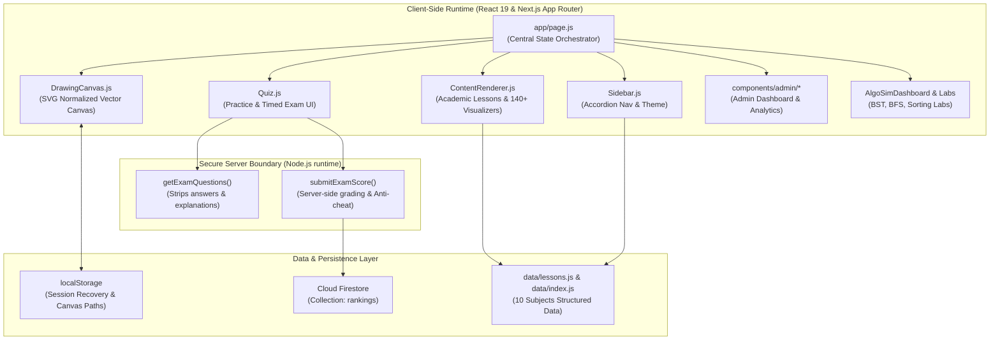
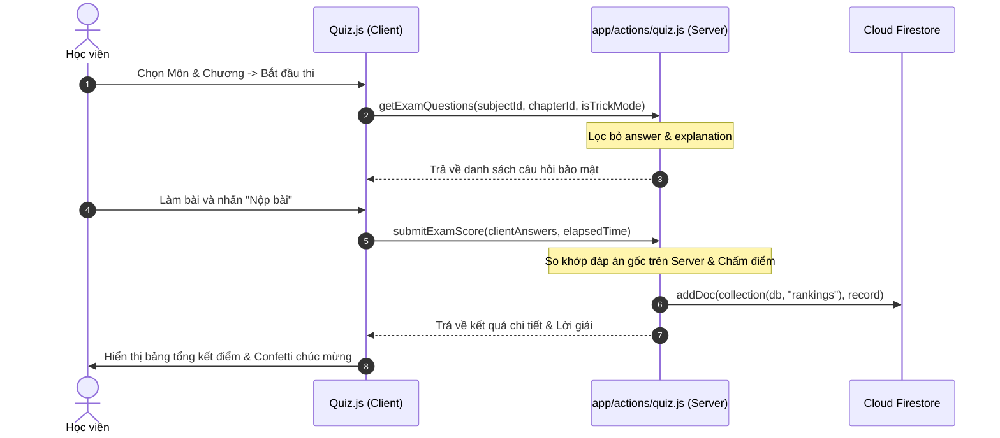

# Kiến trúc Hệ thống (System Architecture)

Tài liệu này mô tả chi tiết kiến trúc kỹ thuật, cấu trúc thư mục, luồng dữ liệu và cách thức hoạt động của hệ sinh thái **StudyMaster** để phục vụ công tác bàn giao, vận hành và mở rộng trong tương lai.

---

## 🏗️ 1. Tổng quan Kiến trúc

Dự án StudyMaster được xây dựng trên nền tảng **Next.js 16 (App Router)** và **React 19**, kết hợp với **TailwindCSS v4** và **GSAP 3**. Hệ thống áp dụng mô hình **Single Page App (SPA)** với bộ quản lý trạng thái tập trung (**Central State Orchestrator**) tại trang gốc kết hợp các **Server Actions** để bảo mật việc chấm điểm và phân quyền.


```mermaid
graph TB
    subgraph Client_Side ["Client-Side Runtime (React 19 & Next.js App Router)"]
        Orchestrator["app/page.js<br>(Central State Orchestrator)"]
        Sidebar["Sidebar.js<br>(Accordion Nav & Theme)"]
        Renderer["ContentRenderer.js<br>(Academic Lessons & 140+ Visualizers)"]
        Canvas["DrawingCanvas.js<br>(SVG Normalized Vector Canvas)"]
        QuizUI["Quiz.js<br>(Practice & Timed Exam UI)"]
        Admin["components/admin/*<br>(Admin Dashboard & Analytics)"]
        AlgoLabs["AlgoSimDashboard & Labs<br>(BST, BFS, Sorting Labs)"]
    end

    subgraph Server_Actions ["Secure Server Boundary (Node.js runtime)"]
        ActionGet["getExamQuestions()<br>(Strips answers & explanations)"]
        ActionGrade["submitExamScore()<br>(Server-side grading & Anti-cheat)"]
    end

    subgraph Data_Persistence ["Data & Persistence Layer"]
        LocalCache["localStorage<br>(Session Recovery & Canvas Paths)"]
        Firestore["Cloud Firestore<br>(Collection: rankings)"]
        Curriculum["data/lessons.js & data/index.js<br>(10 Subjects Structured Data)"]
    end

    Orchestrator --> Sidebar
    Orchestrator --> Renderer
    Orchestrator --> Canvas
    Orchestrator --> QuizUI
    Orchestrator --> Admin
    Orchestrator --> AlgoLabs

    Renderer --> Curriculum
    Sidebar --> Curriculum
    Canvas <--> LocalCache

    QuizUI --> ActionGet
    QuizUI --> ActionGrade
    ActionGrade --> Firestore
```

---

## 📁 2. Cấu trúc Thư mục Dự án

```
TT HCM/
├── app/                              # Next.js App Router & Server Actions
│   ├── actions/
│   │   └── quiz.js                   # Server Actions chấm điểm độc lập & bảo mật đề thi
│   ├── layout.js                     # Root layout, Fonts, Global Head metadata
│   ├── page.js                       # State Orchestrator điều phối toàn bộ ứng dụng
│   ├── globals.css                   # Thiết kế CSS Tokens, Tailwind v4
│   └── favicon.ico                   # App icon
├── components/                       # Kho giao diện & Visualizers (~140+ components)
│   ├── admin/                        # Phân hệ Quản trị viên (12 sub-components)
│   │   ├── AdminDashboard.js         # Khung điều phối Dashboard trung tâm
│   │   ├── AdminUnifiedHero.js       # Hero banner hiển thị Live KPIs & Quick Actions
│   │   ├── AdminOverviewTab.js       # Tab Tổng quan: Biểu đồ SVG Bézier & Donut
│   │   ├── AdminUsersTab.js          # Tab Quản lý Học viên & Xuất Excel
│   │   ├── AdminQuestionsTab.js      # Tab Ngân hàng Câu hỏi & Kiểm định ΔL ≤ 15
│   │   ├── AdminLeaderboardTab.js    # Tab Bảng xếp hạng & Vinh danh Top học viên
│   │   ├── AdminUserDrawer.js        # Drawer hồ sơ & Biểu đồ Radar năng lực
│   │   └── AdminModals.js            # Hộp thoại Thêm học viên, Đổi mật khẩu
│   ├── Sidebar.js                    # Thanh điều hướng mục lục dạng Accordion đa tầng
│   ├── ContentRenderer.js            # Bộ dựng bài học cấu trúc & Visualizer Loader
│   ├── Quiz.js                       # Giao diện luyện tập, thi thử và phân tích bẫy tư duy
│   ├── DrawingCanvas.js              # Khung vẽ ghi chú vector tự co giãn theo tỷ lệ
│   ├── AlgoSimDashboard.js           # Bảng điều khiển phòng thí nghiệm thuật toán
│   ├── DiagramSimDashboard.js        # Studio sơ đồ phân tích thiết kế UML với Fullscreen Lightbox
│   ├── BubbleSortLab.js              # Phòng Lab sắp xếp nổi bọt (kèm âm thanh gõ phím)
│   ├── MergeSortLab.js               # Phòng Lab sắp xếp trộn (2 cửa sổ so sánh song song)
│   ├── SelectionSortLab.js           # Phòng Lab sắp xếp chọn
│   ├── InsertionSortLab.js           # Phòng Lab sắp xếp chèn
│   ├── BinarySearchLab.js            # Phòng Lab tìm kiếm nhị phân
│   ├── BfsLab.js & BstLab.js         # Phòng Lab duyệt đồ thị & cây nhị phân
│   ├── RecursionLab.js               # Phòng Lab ngăn xếp đệ quy (Tháp Hà Nội, Fibonacci)
│   ├── ProfileModal.js               # Modal hồ sơ cá nhân & đổi avatar linh vật
│   └── ErrorBoundary.js              # Bắt lỗi runtime React tránh crash trang
├── data/                             # Cơ sở dữ liệu 10 môn học & Ngân hàng đề thi
│   ├── index.js                      # Metadata cây thư mục phục vụ Sidebar & QuestionsMap
│   ├── lessons.js                    # Cổng nạp dữ liệu bài học động (findSubsectionContent)
│   ├── chuong-1.js .. chuong-6.js    # Giáo trình 6 Chương Tư tưởng Hồ Chí Minh
│   ├── lich-su-dang*.js              # Giáo trình Lịch sử Đảng (Mở đầu, C1-C3, Kết luận)
│   ├── oop.js                        # Giáo trình Lập trình Hướng đối tượng Java
│   ├── dsa.js                        # Giáo trình Cấu trúc dữ liệu & Giải thuật
│   ├── database*.js                  # Giáo trình Hệ Cơ sở dữ liệu (Chương 1 đến Chương 8)
│   ├── analysis-design.js & ad-ch*.js# Giáo trình Phân tích Thiết kế HTTT
│   ├── basic-general.js              # Giáo trình Đại hội Đảng & Kiến thức nền tảng
│   └── questions-*.js                # Ngân hàng hàng nghìn câu hỏi trắc nghiệm & đề bẫy
├── lib/                              # Thư viện & Cấu hình SDK
│   └── firebase.js                   # Kết nối Google Firebase Firestore & Auth
├── public/                           # Tài nguyên tĩnh
│   ├── assets/                       # Logo, linh vật trong suốt (`cancer_mascot_transparent.png`), sơ đồ UML
│   ├── images/admin/                 # Ảnh minh họa bối cảnh trong Admin Dashboard
│   └── manifest.json                 # Cấu hình PWA
├── scripts/                          # Script tiện ích & Sinh metadata
│   ├── generate-metadata.mjs         # Script tạo tự động `data/index.js`
│   └── verify_admin_test_cases.js    # Script kiểm thử chất lượng Admin Dashboard
├── AGENTS.md                         # Quy tắc bắt buộc của toàn bộ dự án cho AI Agent
├── setup.md                          # Hướng dẫn cài đặt & môi trường
├── system_architecture.md            # Tài liệu kiến trúc kỹ thuật này
└── README.md                         # Tài liệu giới thiệu tổng quan dự án
```

---

## 🧩 3. Chi tiết các Phân hệ Cốt lõi

### 1. Central State Orchestrator ([app/page.js](file:///d:/TT%20HCM/app/page.js))
Đóng vai trò là trung tâm điều phối trạng thái của toàn bộ ứng dụng:
* **State máy trạng thái (`appStep`)**: Điều khiển luồng màn hình (`login` ➔ `register` ➔ `subject-select` ➔ `study` ➔ `quiz`).
* **Phiên người dùng (`currentUser`, `currentUserAvatar`)**: Lưu giữ danh tính học viên, đồng bộ trạng thái đăng nhập với `localStorage` và Firebase Auth.
* **Bộ điều khiển ghi chú**: Đồng bộ công cụ đang chọn (`activeTool`: `cursor`, `pen`, `highlighter`, `eraser`), bảng màu (`activeColor`) và danh sách nét vẽ.

### 2. Bộ Dựng Bài học Cấu trúc ([components/ContentRenderer.js](file:///d:/TT%20HCM/components/ContentRenderer.js))
* Truy xuất dữ liệu với hàm `findSubsectionContent(subjectId, activeSubsectionId)` từ bộ nhớ RAM với độ trễ $0\text{ms}$.
* Tự động nhận diện và tạo kiểu giao diện chuẩn học thuật:
  - **Hộp Mẹo nhớ (Mnemonic Box)**: Tóm tắt điểm mấu chốt và mẹo ghi nhớ nhanh.
  - **Hộp Tóm tắt (Summary Box)**: Tổng hợp luận điểm trọng tâm.
  - **Hộp Trích dẫn (Quote Box)**: Trích dẫn văn kiện và lời Bác dạy.
* **Tích hợp 140+ Visualizers**: Tự động render sơ đồ tương tác, cây nhị phân, thuật toán sắp xếp hoặc dòng thời gian lịch sử tương ứng với từng tiểu mục bài học.

### 3. Khung Vẽ Ghi chú Tự co giãn ([components/DrawingCanvas.js](file:///d:/TT%20HCM/components/DrawingCanvas.js))
* **Lớp phủ Vector trong suốt**: Thẻ `<canvas>` nằm đè lên nội dung học tập. Khi ở chế độ `cursor`, canvas chuyển sang `pointer-events-none` để người dùng cuộn trang và chọn văn bản tự nhiên. Khi chọn `pen`/`eraser`, canvas chuyển sang `pointer-events-auto` để nhận nét vẽ.
* **Thuật toán Co giãn Nét vẽ Chuẩn hóa (Normalized Auto-scale)**:
  - Tọa độ nét vẽ không lưu bằng pixel cứng mà lưu theo tỷ lệ phần trăm $(x_{norm}, y_{norm}) \in [0.0, 1.0]$ so với chiều rộng/cao của canvas.
  - Khi kích thước màn hình thay đổi (Resize/Rotate), `ResizeObserver` kích hoạt vẽ lại chính xác theo tỷ lệ mới:
    $$\begin{cases} X_{new} = x_{norm} \times Width_{new} \\ Y_{new} = y_{norm} \times Height_{new} \end{cases}$$

### 4. Hệ thống Trắc nghiệm Bảo mật & Chống đoán bừa ([components/Quiz.js](file:///d:/TT%20HCM/components/Quiz.js) & [app/actions/quiz.js](file:///d:/TT%20HCM/app/actions/quiz.js))
* **2 Chế độ kiểm tra**:
  - **Luyện tập (Practice)**: Hiển thị ngay đáp án đúng/sai, lời giải thích và nguyên nhân bẫy tư duy (`whyTrapped`, `trickWord`, `citation`, `tip`).
  - **Thi thử tính giờ (Timed Exam)**: Sử dụng Server Action `getExamQuestions` để lọc bỏ hoàn toàn đáp án và giải thích ở phía client. Sau khi làm xong, Server Action `submitExamScore` chấm điểm độc lập trên máy chủ và ghi nhận vào Firestore collection `rankings`.
* **Luật Cân bằng Chiều dài Đáp án (Equal Option Length Balance)**:
  - Trong cùng 1 câu hỏi, độ lệch giữa phương án dài nhất và ngắn nhất luôn thỏa mãn $\Delta L = L_{\max} - L_{\min} \le 15$ ký tự để chống đoán bừa theo trực giác.

### 5. Phân hệ Quản trị ([components/admin/](file:///d:/TT%20HCM/components/admin))
* **AdminOverviewTab**: Hiển thị Live KPIs, biểu đồ SVG Bézier lượt thi theo ngày và biểu đồ Donut tỷ trọng môn học.
* **AdminUsersTab**: Quản lý học viên, khóa/mở tài khoản, đổi mật khẩu và xuất file Excel qua `ExcelJS`.
* **AdminQuestionsTab**: Tự động chạy thuật toán quét và kiểm định độ lệch $\Delta L \le 15$ ký tự của toàn bộ ngân hàng câu hỏi.
* **AdminLeaderboardTab**: Bảng xếp hạng vinh danh Top 1, Top 2, Top 3 với hiệu ứng ánh kim lấp lánh.

---

## 🗄️ 4. Thiết kế Dữ liệu & Firestore Schema

### Collection: `rankings`
Bảng xếp hạng lưu trữ trên Cloud Firestore:
* `name` (String): Tên học viên tham gia thi.
* `subjectId` (String): Mã môn học (`tu-tuong-hcm`, `lich-su-dang`, v.v.).
* `chapterId` (String): Mã chương học đã thi.
* `examSetId` (String): Mã đề thi hoặc `"trick"`.
* `score` (Number): Điểm số đạt được (số câu đúng).
* `total` (Number): Tổng số câu hỏi trong bài thi (ví dụ: 40 hoặc 50).
* `time` (Number): Thời gian hoàn thành tính bằng giây.
* `date` (String): Thời điểm nộp bài theo chuẩn ISO 8601.

---

## 🔄 5. Luồng Hoạt động Tổng thể

### Luồng Trắc nghiệm & Chấm điểm Bảo mật:

```mermaid
sequenceDiagram
    autonumber
    actor Student as Học viên
    participant Client as Quiz.js (Client)
    participant Action as app/actions/quiz.js (Server)
    participant DB as Cloud Firestore

    Student->>Client: Chọn Môn & Chương -> Bắt đầu thi
    Client->>Action: getExamQuestions(subjectId, chapterId, isTrickMode)
    Note over Action: Lọc bỏ answer & explanation
    Action-->>Client: Trả về danh sách câu hỏi bảo mật
    Student->>Client: Làm bài và nhấn "Nộp bài"
    Client->>Action: submitExamScore(clientAnswers, elapsedTime)
    Note over Action: So khớp đáp án gốc trên Server & Chấm điểm
    Action->>DB: addDoc(collection(db, "rankings"), record)
    Action-->>Client: Trả về kết quả chi tiết & Lời giải
    Client->>Student: Hiển thị bảng tổng kết điểm & Confetti chúc mừng
```

